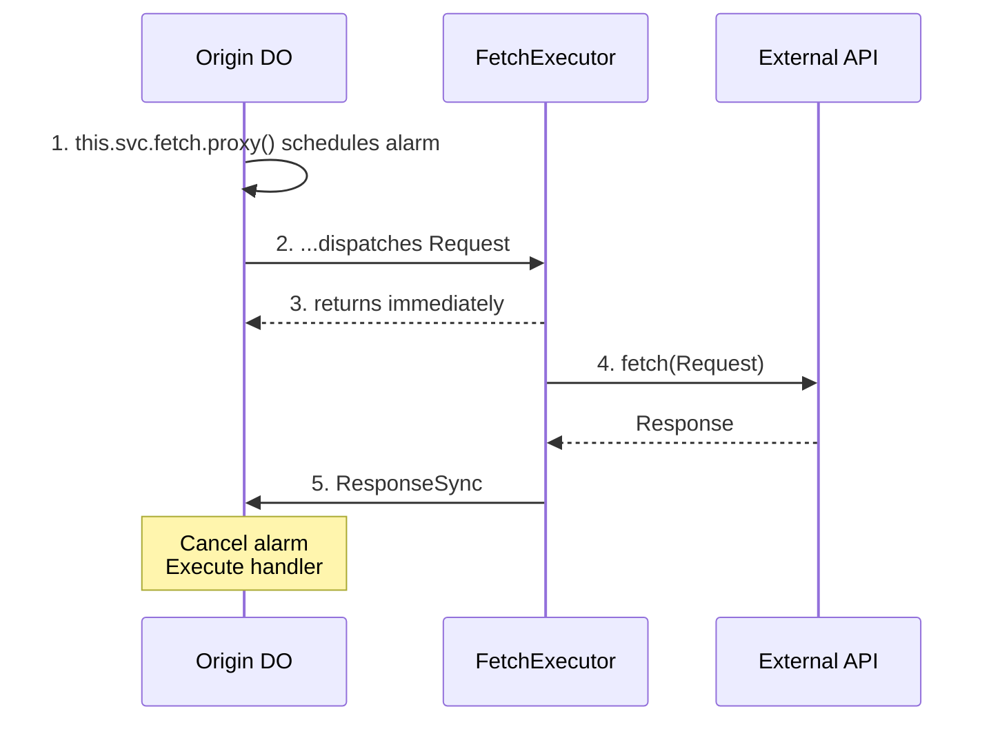
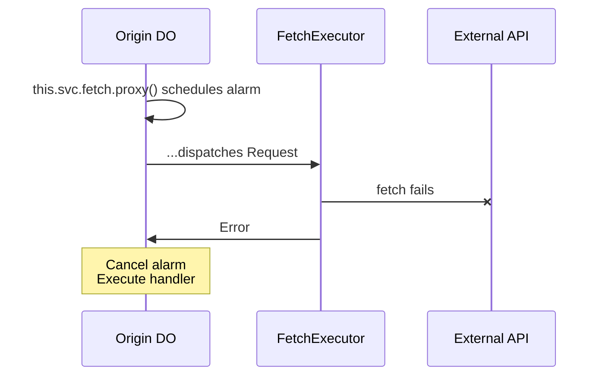
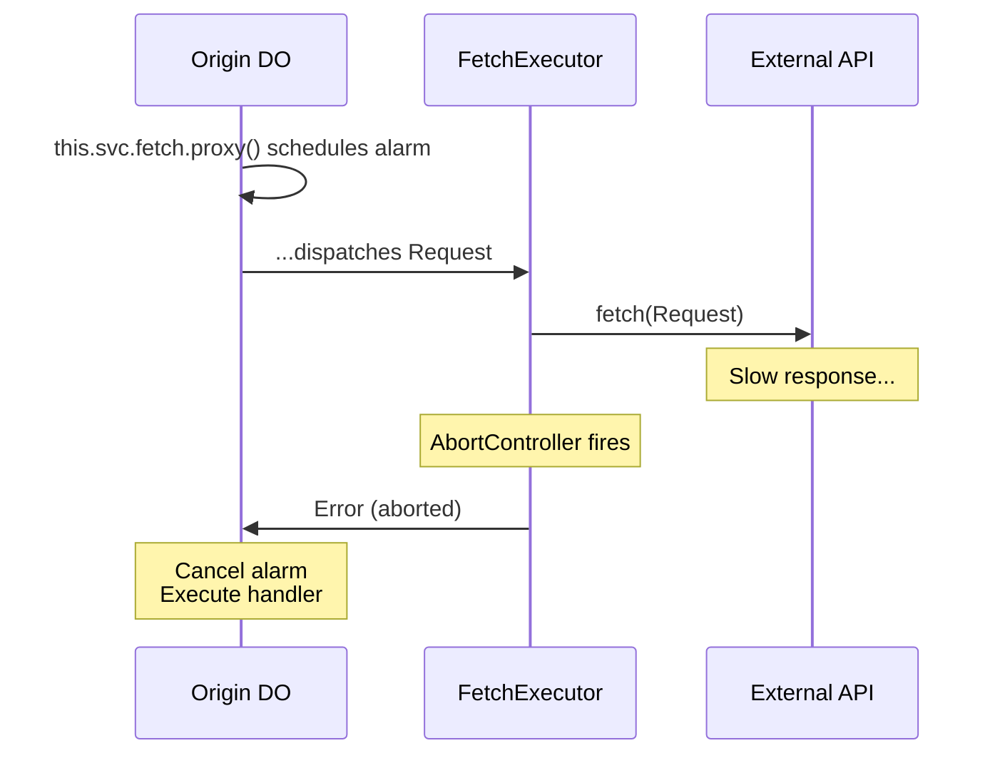
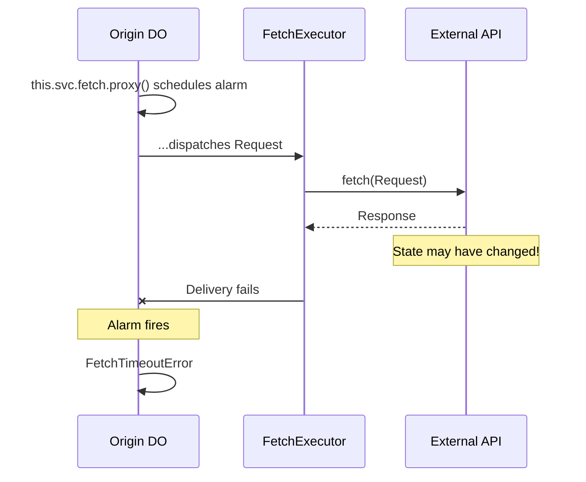

# Architecture & Failure Modes

## Design Highlights

1. **Origin DO controls retry** — Your DO decides error handling and retry strategy
2. **Executor performs fetch** — FetchExecutor makes the actual HTTP request
3. **Result guaranteed** — Uses alarms to assure handler always sees response or failure
4. **Timeout is ambiguous** — A `FetchTimeoutError` may or may not mean the fetch was processed by the callee

## Known Architectural Flaw

:::danger[Structural — not a bug to be patched]

This package is experimental. The issue below is a design flaw, not an implementation bug; closing it likely means a redesign or a replacement.

:::

The delivery guarantee rests on a **single alarm timer doing double duty**: it is both the *fetch timeout* (how long the external call may take) and the *executor-liveness backstop* (the fallback if the Executor crashes or its result-delivery call is lost). Those two concerns want opposite settings, and coupling them onto one timer produces three failure modes:

1. **A dead Executor isn't detected until the entire fetch budget elapses.** The backstop fires at `now + timeout`, the same horizon as the fetch itself. Allow a 5-minute external call and a crashed Executor costs you 5 minutes of silence before the handler sees `FetchTimeoutError`. A liveness check should be short and independent of how long the fetch is allowed to run.

2. **Past-budget fetches are preempted, and a late success is silently dropped.** The alarm and the Executor's `AbortController` fire at ~the same instant, so a fetch that runs to the edge of its budget races its own timeout. A success delivered *after* the alarm has fired finds the schedule already cancelled and is discarded — so you can get a `FetchTimeoutError` *and* throw away a good response.

3. **Concurrent in-flight fetches share one physical alarm.** A Durable Object has exactly one alarm. The mesh alarm service multiplexes multiple logical schedules by `reqId` onto it, processed earliest-first on wake — but DO alarm wake accuracy is coarse, so timeout precision degrades under concurrency. This path is unproven under load.

**What is sound:** the bare two-one-way pattern (DO fires a one-way call to a Worker, the Worker fetches, the Worker fires the result back) needs no alarm at all — see the analytics example in the [Mesh calls guide](/docs/mesh/calls). `@lumenize/fetch`'s only addition over that is the delivery guarantee, which is the part built on the alarm backstop. If you don't need the guarantee, prefer the bare pattern.

## Happy Path

## Failure Scenarios

### HTTP Error (4xx/5xx)

Same flow as happy path, but handler receives `ResponseSync` with `!result.ok`. Check `result.status` to decide what to do (retry, throw, etc.).

### Network Error

Handler receives `Error` — fetch definitely failed, safe to retry.

### Fetch AbortController Timeout

Handler receives `Error` — fetch was aborted, safe to retry.

### Delivery Timeout (Alarm Fires)

**Critical:** Handler receives `FetchTimeoutError`, but the external API **may have processed the request**. For non-idempotent operations, check external state before retrying.

## Race Condition Free

The alarm cancellation and handler execution are protected by Cloudflare's [output gates](https://developers.cloudflare.com/durable-objects/best-practices/rules-of-durable-objects/#understand-how-input-and-output-gates-work), which ensure storage writes are durably committed before any outgoing messages are sent. This eliminates race conditions between the success and timeout paths.
