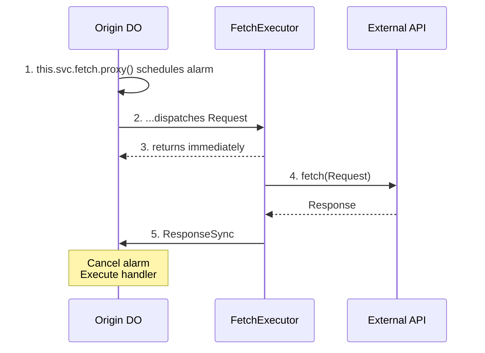
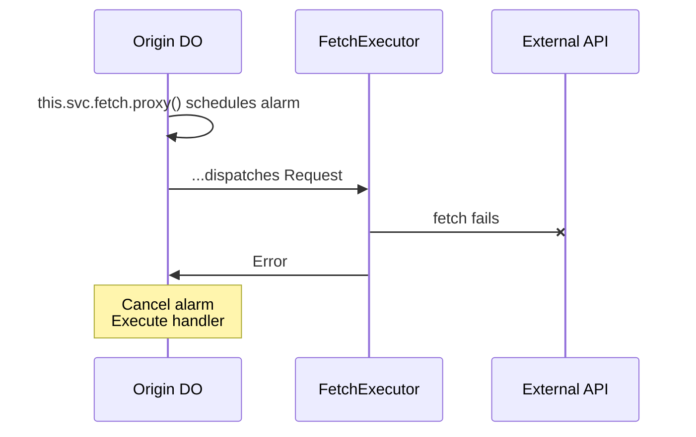
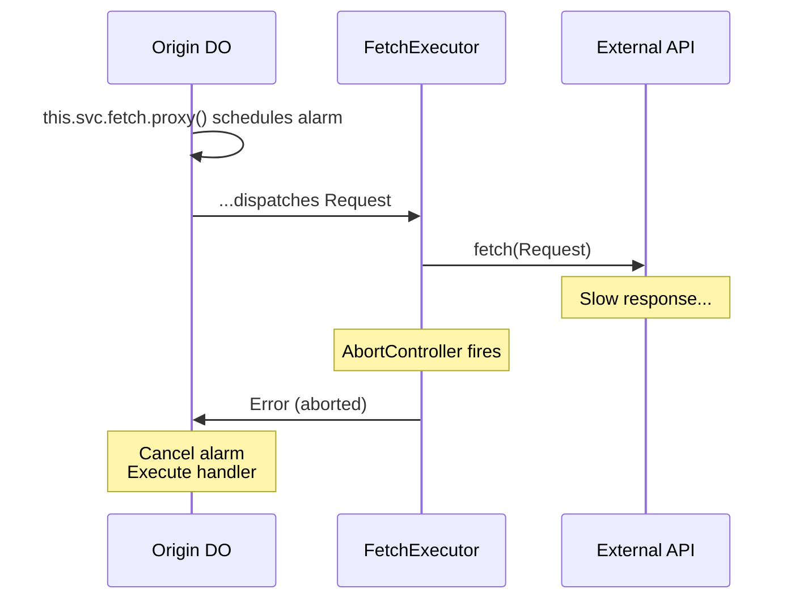
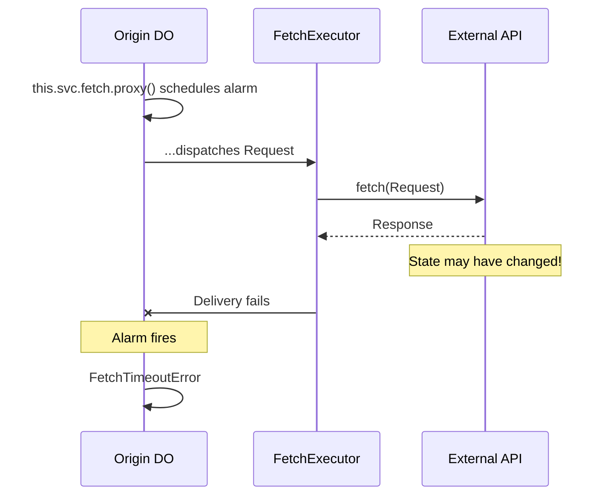

# Architecture & Failure Modes

## Design Highlights

1. **Origin DO controls retry** — Your DO decides error handling and retry strategy
2. **Executor performs fetch** — FetchExecutor makes the actual HTTP request
3. **Result guaranteed** — Uses alarms to assure handler always sees response or failure
4. **Timeout is ambiguous** — A `FetchTimeoutError` may or may not mean the fetch was processed by the callee

## Happy Path

## Failure Scenarios

### HTTP Error (4xx/5xx)

Same flow as happy path, but handler receives `ResponseSync` with `!result.ok`. Check `result.status` to decide what to do (retry, throw, etc.).

### Network Error

Handler receives `Error` — fetch definitely failed, safe to retry.

### Fetch AbortController Timeout

Handler receives `Error` — fetch was aborted, safe to retry.

### Delivery Timeout (Alarm Fires)

**Critical:** Handler receives `FetchTimeoutError`, but the external API **may have processed the request**. For non-idempotent operations, check external state before retrying.

## Race Condition Free

The alarm cancellation and handler execution are protected by Cloudflare's [output gates](https://developers.cloudflare.com/durable-objects/best-practices/rules-of-durable-objects/#understand-how-input-and-output-gates-work), which ensure storage writes are durably committed before any outgoing messages are sent. This eliminates race conditions between the success and timeout paths.
