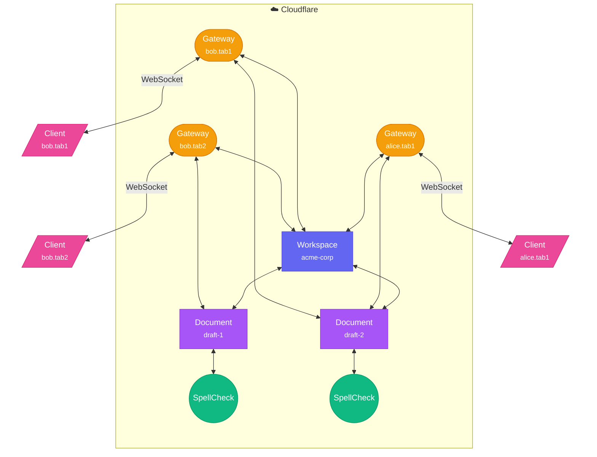

# Lumenize Mesh

The **Lumenize Mesh** is an actor-model network where nodes communicate via `this.lmz.call()`. Each node is a **true peer** — able to both make and receive calls. While Cloudflare's native RPC is also actor-like, Lumenize Mesh adds critical security, race-condition safety, and de✨light✨fulness.

## Lumenize Mesh "Actor" Nodes

| Node Type | Runs In | Storage | Use Case |
|-----------|---------|---------|----------|
| **LumenizeDO** | Cloudflare DO | SQL/KV | Stateful server-side capability |
| **LumenizeWorker** | Cloudflare Worker | none | Stateless server-side capability |
| **LumenizeClient** | Browser/Node.js | Local | Client applications |

## Other Lumenize Mesh Elements

| Element | Type | Use Case |
|---------|------|----------|
| **LumenizeClientGateway** | Cloudflare DO | Bridges client ↔ mesh (zero storage) |
| **createLumenizeRouter** | Factory function | Creates Worker fetch handler with auth + gateway routing |

## Illustration



## Concepts

### Automatic Identity Propagation

DO and Worker instances don't know their own binding names. DO instances don't know their instance name (i.e. `getByName('my-instance')`) while they do know their id. Without knowing their own full identity, it is impossible for a caller to say, "Hey, do this thing for me and when you are done, call me back at this address." On the other hand, while the callee doesn't inherently know its own identity, anything calling it, by necessity, must know its identity. So we leverage that necessity to automatically propagate identity throughout the mesh. Every call into the mesh as well as every call within the mesh includes the callee identity information and every node stores that to use when it needs to provide some other node with a return address.

### Zero Trust

Every node in the mesh is responsible for its own access control. Authentication information flows through the entire call chain via `this.lmz.callContext`.

#### Authentication

LumenizeClient integrates with `@lumenize/auth`. On connection, access tokens are passed via WebSocket subprotocol and refresh tokens are in a cookie — no URL exposure, no header limitations. If connection is successful, the Gateway stores the authentication and "session" information in an attachment associated with the connection. After that, it's added to the envelope for each call from the client. JWT token expiration is checked on each call coming in through a LumenizeClientGateway so other mesh nodes don't ever need to reconfirm authentication. See [Auth Integration](./auth-integration) for token refresh patterns and call context propagation.

#### Call Context Propagation

When a client makes a call, authentication info is included in the call envelope. This context **automatically propagates** through the entire call chain:

```
Client (alice) → DocumentDO → SpellCheckWorker
                     ↓              ↓
            callContext has    callContext has
            alice's auth       alice's auth (propagated!)
```

Every node can access `this.lmz.callContext` to see who originated the request and make access control decisions. See [Auth Integration](./auth-integration#call-context) for details.

#### Access Control

Lumenize provides **secure-by-default** defense-in-depth:

| Layer | Mechanism | What It Does |
|-------|-----------|--------------|
| **Capability Trust** | Automatic | Once an Entry Point passes `@mesh(handler)` check, the returned object's public interface is fully trusted for that chain. (Note: every nested call on `this` is treated as a separate Entry Point). |
| **Class-wide** | `onBeforeCall()` hook | Focuses on WHO can call (auth, audit, rate limiting). Can also populate `callContext.state`. |
| **Method Exposure** | `@mesh(handler?)` | **Required Entry Point**. The mandatory "gate" that grants a caller access to an object. |

```typescript
import { LumenizeDO, mesh } from '@lumenize/mesh';

class DocumentDO extends LumenizeDO {
  // Class-level: all callers must be authenticated
  onBeforeCall(callContext: CallContext) {
    super.onBeforeCall(callContext);  // Maintains base default restrictions
    if (!callContext.originAuth?.userId) {
      throw new Error('Authentication required');
    }

    // 💡 Tip: Populate callContext.state for use in @mesh handlers or methods
    callContext.state.user = this.ctx.storage.kv.get(`user-${callContext.originAuth.userId}`);
  }
  
  // ✅ Exposed + Custom permission check
  @mesh((callContext) => {
    // Use the user already fetched in onBeforeCall
    if (!callContext.state.user.canEdit) {
      throw new Error('Edit permission required');
    }
  })
  update(changes: DocumentChange) {
    // ... apply changes
  }
  
  // ✅ Exposed to mesh + default class-level auth
  @mesh
  getContent(): string {
    return this.#content;
  }

  // ❌ NOT EXPOSED (missing @mesh)
  _internalHelper() { /* ... */ }
  handler() { /* ... */ }
  #jsPrivate() { /* ... */ }
}
```

See [Auth Integration: Access Control](./auth-integration#access-control) for complete documentation.

[TODO: Example of using a subscription-specific token]
[TODO: Example showing LumenizeOrg style access control]

## The `this.lmz` API

Every mesh node (LumenizeDO, LumenizeWorker, LumenizeClient) has access to `this.lmz` — the unified API for identity and communication.

### Identity

```typescript
this.lmz.type          // 'LumenizeDO' | 'LumenizeWorker' | 'LumenizeClient'
this.lmz.bindingName   // e.g., 'DOCUMENT_DO' (auto-propagated from caller)
this.lmz.instanceName  // e.g., 'draft-1' (auto-propagated from caller)
```

These properties are populated automatically via [identity propagation](#automatic-identity-propagation). Your node knows who it is because a prior caller told it.

### Making Calls

**Fire-and-forget** — no response handler:

```typescript
this.lmz.call(
  'DOCUMENT_DO',                          // Binding name
  documentId,                             // Instance name or id (undefined for Workers)
  this.ctn<DocumentDO>().update(changes)  // Remote continuation
);
```

**With response handler** — handle the result locally:

```typescript
this.lmz.call(
  'SPELLCHECK_WORKER',
  undefined,
  this.ctn<SpellCheckWorker>().check(content),      // Remote continuation
  this.ctn().handleSpellCheckResult()               // Local handler continuation
);

// Handler receives result OR Error
handleSpellCheckResult(result: SpellError[] | Error) {
  if (result instanceof Error) {
    console.error('Spell check failed:', result);
    return;
  }
  this.applySpellErrors(result);
}
```

**Passing context to handlers** — include additional data alongside `$result` in any parameter position:

```typescript
this.lmz.call(
  'DOCUMENT_DO',
  documentId,
  this.ctn<DocumentDO>().getContent(),
  this.ctn().handleContent(documentId, this.ctn().$result, userId)
);

// Handler receives result + context
handleContent(documentId: string, content: string | Error, userId: string) {
  // ...
}
```

### Building Continuations

Use `this.ctn<T>()` to build type-safe continuations. See [Continuations](/docs/concepts/continuations) for the full guide.

```typescript
// Type-safe method chain on remote node
this.ctn<DocumentDO>().update(changes)

// Self-referencing for handlers
this.ctn().handleResult(this.ctn().$result)

// The $result placeholder is replaced with actual result at runtime
```

## Quick Start

This example builds the document editing app shown in the illustration above.

### 1. Define a Document DO (LumenizeDO)

Stateful server-side logic with persistent storage:

```typescript
import { LumenizeDO } from '@lumenize/mesh';

class DocumentDO extends LumenizeDO {
  // Called by clients to update the document
  @mesh
  update(changes: DocumentChange) {
    const content = this.ctx.storage.kv.get('content') ?? '';
    const newContent = applyChanges(content, changes);
    this.ctx.storage.kv.put('content', newContent);
    
    // Notify all connected clients about the change
    this.notifyCollaborators(changes);
    
    // Trigger spell check
    this.lmz.call(
      'SPELLCHECK_WORKER',
      undefined,  // Workers don't have instance names
      this.ctn<SpellCheckWorker>().check(newContent),
      this.ctn().handleSpellCheckResult()
    );
  }
  
  // Response handler for spell check results
  handleSpellCheckResult(errors: SpellError[]) {
    this.ctx.storage.kv.put('spellErrors', errors);
    this.notifyCollaborators({ type: 'spell_errors', errors });
  }
  
  // Push changes to all collaborators
  notifyCollaborators(change: DocumentChange) {
    for (const clientId of this.getConnectedClients()) {
      this.lmz.call(
        'LUMENIZE_CLIENT_GATEWAY',
        clientId,
        this.ctn<EditorClient>().handleDocumentChange(change)
      );
    }
  }
}
```

### 2. Define a SpellCheck Worker (LumenizeWorker)

Conceptual stateless proxy to external service. Note: to avoid DO wall-clock billing, use `this.svc.fetch.proxy()` or refactor as two one-way calls.

```typescript
import { LumenizeWorker } from '@lumenize/mesh';

class SpellCheckWorker extends LumenizeWorker {
  @mesh
  async check(content: string): Promise<SpellError[]> {
    const response = await fetch('https://api.spellcheck.example/check', {
      method: 'POST',
      body: JSON.stringify({ text: content }),
    });
    return response.json();
  }
}
```

### 3. Define a Client (LumenizeClient)

Browser-side mesh participant:

```typescript
import { LumenizeClient } from '@lumenize/mesh';

class EditorClient extends LumenizeClient {  
  // Called by DocumentDO when content changes
  @mesh
  handleDocumentChange(change: DocumentChange) {
    this.editor.applyChange(change);
  }
}
```

### 4. Connect and Edit

```typescript
using client = new EditorClient({
  baseUrl: 'wss://app.example.com',
  instanceName: `${userId}.${tabId}`,
  accessToken: jwt,
});

// User types in the editor - send changes to the document
client.lmz.call(
  'DOCUMENT_DO',
  documentId,
  client.ctn<DocumentDO>().update({ type: 'insert', text: 'Hello' })
);
```

[TODO: Either remove LumenizeClient and LumenizeClientGateway sections below or add other mesh actors and elements (LumenizeDO, etc.)]

## LumenizeClient

The browser/Node.js mesh participant with automatic connection management:

- **Auto-reconnect**: Reconnects automatically after network glitches
- **Re-subscribe after grace period**: After the 5-second grace period, clients must re-subscribe to any DO subscriptions (the Gateway notifies DOs with `ClientDisconnectedError` so they can clean up)
- **Resource cleanup**: Use `using` keyword for automatic disposal

```typescript
using client = new EditorClient({
  baseUrl: 'wss://app.example.com',
  instanceName: `${userId}.${tabId}`,
  accessToken: jwt,
});

// Only called when reconnecting AFTER grace period expired
// (Gateway informs client when subscriptions are lost)
client.onSubscriptionsLost = () => {
  // TODO: Refactor after we add explicit subscription support
  client.lmz.call('DOCUMENT_DO', documentId, client.ctn<DocumentDO>().subscribe());
};
```

## LumenizeClientGateway

The LumenizeClientGateway is a **zero-storage Durable Object** that bridges the mesh and WebSocket clients:

- **1:1 relationship**: Each LumenizeClient connects to its own gateway instance
- **Call proxying**: Calls pass through the gateway to another mesh destination
- **Zero cost when idle**: No storage = no charges when client is disconnected
- **Graceful reconnection**: Handle short-term (< 5s) network glitches
- **Connection feedback**: After grace period, callers get `ClientDisconnectedError` so they can clean up subscriptions/resources

### How Gateway Routing Works

1. Client connects to Gateway DO at `.../LUMENIZE_CLIENT_GATEWAY/${userId}.${tabId}`
2. Gateway accepts hibernatable WebSocket connection
3. Outgoing calls from client → WebSocket → Gateway → Target DO/Worker
4. Incoming calls to client: Source DO → Gateway → WebSocket → Client

### Client-to-Client Communication

:::caution Security Note
**Peer-to-peer calls are rejected by default.** `LumenizeClient` implements `onBeforeCall` to reject calls from other clients. This minimizes attack surface for applications that don't need client-to-client communication.
:::

You enable peer calls for collaborative features by overriding `onBeforeCall` in your client class. Then LumenizeClients can call each other through the mesh:

```
Client A  →  Gateway A  →  Gateway B  →  Client B
   ↑                                         │
   └──────── Gateway A  ←  Gateway B  ←──────┘
                    ~60ms round-trip
```

```typescript
// Override LumenizeClient default onBeforeCall
onBeforeCall(callContext: CallContext) {
  // Don't call super.onBeforeCall()
  if (!callContext.originAuth?.userId) {
    throw new Error('Authentication required');
  }
}

// From Client A: Call Client B
client.lmz.call(
  'LUMENIZE_CLIENT_GATEWAY',
  `${otherUserId}.${otherTabId}`,
  client.ctn<OtherClient>().handleCollabCursor({ x: 100, y: 200 })
);
```

See [Client API: Access Control](./client-api#access-control) for details.
