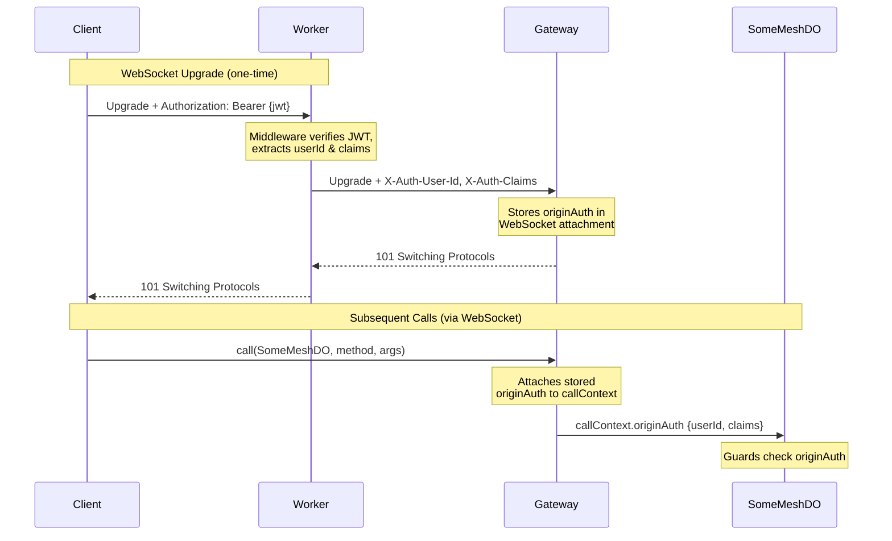

# Identity & Access Control

Authentication has two parts:

1. **Identity verification** — "You are who you say you are" — handled by auth middleware ([`@lumenize/auth`](/docs/auth), Auth0, Stytch, etc.) *before* requests reach the mesh
2. **Identity propagation** — "The mesh knows who you are throughout the call chain" — handled by headers flowing through the Gateway into `callContext.originAuth`

This page covers the second of those, **identity propagation**, as well as **access control** (enforcing permissions via guards). For the first of those, identity verification, see your auth provider's docs or [`@lumenize/auth`](/docs/auth). If you're using a third-party provider like Auth0, Clerk, Stytch, etc. see [Integrating Alternative Auth](#integrating-alternative-auth) for the header contract that serves as the bridge between 1 and 2 above.

## Architecture Overview



The key insight: **`Authorization: Bearer {jwt}` is the *input* to auth middleware; `X-Auth-User-Id`** (and optionally `X-Auth-Claims`) **is the *output*.** The mesh cares about verified identity, not tokens to verify.

## WebSocket Authentication

Unlike HTTP where each request carries its own token, WebSocket connections are long-lived. The token is sent once during the upgrade handshake, then identity is stored in the connection attachment.

Browsers don't allow custom headers on WebSocket upgrades, so `LumenizeClient` smuggles the token in the subprotocol list:

```
Sec-WebSocket-Protocol: lmz, lmz.access-token.eyJhbGciOiJF...
```

Here's how each component handles it:

1. **Worker middleware** extracts the token from `lmz.access-token.{jwt}` in the subprotocol header
2. **Worker middleware** verifies JWT signature and expiration
3. **Worker middleware** sets `X-Auth-User-Id` and `X-Auth-Claims` headers on the upgrade request
4. **Gateway** receives the upgrade with verified headers, stores `originAuth` in WebSocket attachment
5. **Gateway** responds with `Sec-WebSocket-Protocol: lmz`
6. **On each call**, Gateway checks the stored expiration — if expired, closes with `4401`
7. **On 4401**, client refreshes via HTTP and reconnects automatically

The Gateway never sees or verifies the token — it trusts the identity headers set by Worker middleware. This is the same trust boundary shown in the [Architecture Overview](#architecture-overview) diagram.

:::note Access Token vs Refresh Token
**Access tokens** are short-lived (15 min) and kept in memory — if stolen, damage is time-limited. **Refresh tokens** are long-lived (30 days) and stored in HTTP-only cookies — JavaScript can't access them, protecting against XSS. This is the standard [OAuth 2.0 refresh token pattern](https://oauth.net/2/refresh-tokens/).
:::

### Client Configuration

See [LumenizeClient: Authentication](./lumenize-client#authentication) for configuration options including `accessToken` and `refresh`.

### Handling Login Required

Access token expiration (4401) is handled automatically — the client refreshes via HTTP and reconnects transparently. `onLoginRequired` only fires when the refresh token itself has expired or been revoked (HTTP 401 from the refresh endpoint), meaning the user must re-login:

```typescript @check-example('packages/mesh/test/for-docs/security/index.test.ts')
  onLoginRequired: (error) => {
    // Only fires when refresh fails — user must re-login
    console.log('Login required:', error.code, error.reason);
    // ...
  },
```

### Auth Close Codes

You should never have to deal with these unless you are writing your own custom auth, but the Gateway uses this WebSocket close code for auth issues:

| Code | Meaning | Action |
|------|---------|--------|
| `4401` | Token expired | Refresh and reconnect (automatic) |

Other auth failures (missing identity, invalid signature) are rejected by Worker middleware before the WebSocket is established, resulting in HTTP 401/403 errors rather than WebSocket close codes.

## Access Control

### Three-Layer Access Control Model

| Layer | Mechanism | Purpose |
|-------|-----------|---------|
| **Class-wide** | `onBeforeCall()` hook | WHO can call (authentication) |
| **Entry Point** | `@mesh()` decorator | WHAT is exposed (method allowlist) |
| **Capability Trust** | Automatic | Returned objects trusted for that chain |

Methods without the `@mesh()` decorator behave as if they don't exist — callers receive a generic error. Errors thrown by guards or `onBeforeCall` pass through unchanged, preserving your domain-specific error types. See [Making Calls: Error Handling](./calls#error-handling) for details.

### Class-Level: `onBeforeCall()`

Override to enforce class-wide policies:

```typescript @check-example('packages/mesh/test/for-docs/security/protected-do.ts')
export class ProtectedDO extends LumenizeDO<Env> {
  onBeforeCall() {
    super.onBeforeCall();

    // Require authentication
    if (!this.lmz.callContext.originAuth?.sub) {
      throw new Error('Authentication required');
    }
  }
  // ...
}
```

### Method-Level: `@mesh(guard)`

Guards receive the instance, providing access to instance state. The correct `lmz.callContext` is also available in the guard. This works for all node types (`LumenizeDO`, `LumenizeWorker`, `LumenizeClient`):

```typescript @check-example('packages/mesh/test/for-docs/security/team-doc-do.ts')
  // Check `callContext.originAuth.claims` to determine access
  @mesh((instance: TeamDocDO) => {
    if (!instance.lmz.callContext.originAuth?.claims?.isAdmin) {
      throw new Error('Admin only');
    }
  })
  adminMethod(): string {
    // Only admins reach here
    // ...
  }
```

```typescript @check-example('packages/mesh/test/for-docs/security/team-doc-do.ts')
  // Check instance state to determine access
  @mesh((instance: TeamDocDO) => {
    const userId = instance.lmz.callContext.originAuth?.sub;
    if (!instance.allowedEditors.has(userId!)) {
      throw new Error('Not an allowed editor');
    }
  })
  updateDocument(changes: DocumentChange): { updated: true; content: string } {
    // Only allowed editors reach here
    // ...
  }
```

### Reusable Guards

Extract common access checks into standalone functions and pass them to `@mesh()`. This `requireSubscriber` guard combines JWT identity (`originAuth.sub`) with instance state (a `subscribers` Set in storage):

```typescript @check-example('packages/mesh/test/for-docs/security/team-doc-do.ts')
function requireSubscriber(instance: TeamDocDO) {
  const sub = instance.lmz.callContext.originAuth?.sub;
  if (!sub || !instance.subscribers.has(sub)) {
    throw new Error('Subscriber access required');
  }
}
```

Then reuse it across multiple methods:

```typescript @check-example('packages/mesh/test/for-docs/security/team-doc-do.ts')
  @mesh(requireSubscriber)
  editDocument(changes: DocumentChange): { edited: true; content: string } {
    // ...
  }

  @mesh(requireSubscriber)
  addComment(comment: string): { commented: true } {
    // ...
  }
```

### State-Based Access

The `callContext.state` object is a mutable `Record<string, unknown>` that:
- Starts **empty** (`{}`) for initial incoming mesh call
- **Persists through the call chain** — method guards and handlers see the same state even when the call chain hops from mesh node to mesh node
- **Propagates back on return** — if DO2 modifies state, DO1's result handler continuation sees those changes
- Is often **populated in `onBeforeCall()`** after verifying authentication, but can be added to by any call in the call chain
- Is **isolated per-request** via AsyncLocalStorage (concurrent calls don't interfere)

Use it to attach computed data (like user records or permissions) so method guards don't need to re-load/re-compute:

```typescript @check-example('packages/mesh/test/for-docs/security/team-doc-do.ts')
  onBeforeCall() {
    super.onBeforeCall();
    const callContext = this.lmz.callContext;
    if (!callContext.originAuth?.sub) throw new Error('Auth required');

    // Populate state for use by method guards
    const session = this.loadSession(callContext.originAuth.sub);
    callContext.state.session = session;
    callContext.state.permissions = this.computePermissions(session);
  }
```

```typescript @check-example('packages/mesh/test/for-docs/security/team-doc-do.ts')
  @mesh((instance: TeamDocDO) => {
    // ...
    if (!permissions?.canEdit) {
      throw new Error('Edit permission required');
    }
  })
  editWithStateCheck(changes: DocumentChange): { edited: true; byUser: string } {
    // ...
  }
```

:::note Per-Request Isolation
Each request gets its own `callContext` instance with its own `state` object, even when multiple requests hit the same DO concurrently. This isolation is provided by AsyncLocalStorage under the hood — you don't need to worry about concurrent requests overwriting each other's state.
:::

## Integrating Alternative Auth (Advanced)

The mesh reads identity from HTTP headers — it doesn't care how authentication happens. If you're using Auth0, Clerk, Supabase Auth, Stytch, etc. or a custom solution, your middleware just needs to set the right headers.

### Header Contract

The mesh requires these headers to be set by your middleware:

| Header | Required | Description |
|--------|----------|-------------|
| `X-Auth-User-Id` | Yes | Verified user ID (typically from JWT `sub` claim) |
| `X-Auth-Claims` | No | JSON-encoded object with additional claims |

The presence of `X-Auth-User-Id` indicates successful authentication. If authentication fails, the request should never reach the LumenizeClientGateway, but if for some reason it does, a missing `X-Auth-User-Id` will cause it to be rejected there.

Additionally, [`routeDORequest`](/docs/utils/route-do-request) automatically adds routing context headers that the mesh requires:

| Header | Description |
|--------|-------------|
| `X-Lumenize-DO-Binding-Name` | The binding name used to access this DO |
| `X-Lumenize-DO-Instance-Name-Or-Id` | The instance name or ID from the URL path |

These headers allow DOs to know their own identity, which is essential for participating in mesh calls. If you're not using `routeDORequest`, you must set these headers yourself.

:::warning Never trust client-provided identity headers
Your middleware must **set** `X-Auth-User-Id` after verification — never pass through what the client sent. Attackers can send any headers they want.
:::

:::note Why its secure for the Gateway to trust these headers
The Gateway doesn't re-verify JWTs — it trusts that your middleware already did. This is secure because:

1. **Your middleware *sets* these headers, not trusts them** — Even if an attacker sends a forged `X-Auth-User-Id`, your middleware overwrites it with the verified value (or returns 401)
2. **DOs are only reachable through your Worker** — There's no way to bypass the middleware and call a DO binding directly
:::

### How Headers Map to callContext

```typescript @skip-check-approved('conceptual - shows mapping between middleware headers and callContext')
// Your middleware sets headers
request.headers.set('X-Auth-User-Id', 'user-123');
request.headers.set('X-Auth-Claims', JSON.stringify({
  roles: ['editor'],
  orgId: 'org-456'
}));

// In your mesh handlers, access via callContext
@mesh()
someMethod() {
  const { originAuth } = this.lmz.callContext;
  console.log(originAuth.sub);            // 'user-123'
  console.log(originAuth.claims.roles);  // ['editor']
  console.log(originAuth.claims.orgId);  // 'org-456'
}
```

### Example: Auth0 Integration

This example shows how to create WebSocket auth middleware for Auth0. It follows the same contract as `@lumenize/auth`, so it works as a drop-in replacement for `onBeforeConnect` in `routeDORequest`. Browsers can't set custom headers on WebSocket upgrades, so `LumenizeClient` smuggles the token in the subprotocol header.

```typescript @skip-check-approved('requires Auth0 account to test')
import { jwtVerify, importSPKI } from 'jose';
import type { RouteDORequestHooksContext } from '@lumenize/utils';

async function createAuth0WebSocketMiddleware(env: Env) {
  const publicKey = await importSPKI(env.AUTH0_PUBLIC_KEY, 'RS256');

  return async (request: Request, context: RouteDORequestHooksContext): Promise<Request | Response> => {
    // Extract token from subprotocol header (e.g., "lmz, lmz.access-token.eyJ...")
    const protocols = request.headers.get('Sec-WebSocket-Protocol')?.split(',').map(p => p.trim()) ?? [];
    const tokenProtocol = protocols.find(p => p.startsWith('lmz.access-token.'));
    const token = tokenProtocol?.replace('lmz.access-token.', '');
    if (!token) return new Response('Unauthorized', { status: 401 });

    try {
      const { payload } = await jwtVerify(token, publicKey, {
        issuer: `https://${env.AUTH0_DOMAIN}/`,
        audience: env.AUTH0_AUDIENCE
      });

      const enhanced = new Request(request);
      enhanced.headers.set('X-Auth-User-Id', payload.sub);
      enhanced.headers.set('X-Auth-Claims', JSON.stringify({
        roles: payload['https://myapp.com/roles'] ?? [],
        email: payload.email
      }));
      return enhanced;
    } catch {
      return new Response('Invalid token', { status: 401 });
    }
  };
}

// Usage in Worker fetch handler
const wsAuth = await createAuth0WebSocketMiddleware(env);

routeDORequest(request, env, {
  onBeforeConnect: wsAuth
});
```
