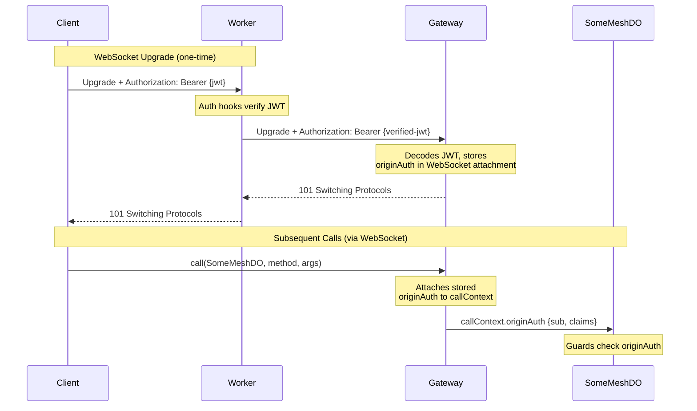

# Identity & Access Control

Authentication has two parts:

1. **Identity verification** — "You are who you say you are" — handled by auth checks ([`@lumenize/auth` auth hooks](/docs/auth/getting-started#createroutedorequestauthhooks), Auth0, Stytch, etc.) *before* requests reach the mesh
2. **Identity propagation** — "The mesh knows who you are throughout the call chain" — handled by headers flowing through the Gateway into `callContext.originAuth`

This page covers the second of those, **identity propagation**, as well as **access control** (enforcing permissions via guards). For the first of those, identity verification, see your auth provider's docs or [`@lumenize/auth`](/docs/auth). If you're using a third-party provider like Auth0, Clerk, Stytch, etc. see [Integrating Alternative Auth](#integrating-alternative-auth-advanced) for the contract that bridges identity verification and propagation.

## Architecture Overview



The key insight: **auth hooks *verify* the JWT and forward it** via `Authorization: Bearer {jwt}`. The Gateway decodes the verified JWT to extract `sub` and claims into `originAuth`. The mesh cares about verified identity, not raw tokens.

## WebSocket Authentication

Unlike HTTP where each request carries its own token, WebSocket connections are long-lived. The token is sent once (smuggled in on the WebSocket protocol list) during the upgrade handshake, then identity is stored in the connection attachment.

Here's how each component handles it:

1. **[Auth hooks](/docs/routing/route-do-request#hooks)** verify JWT signature and expiration
2. **Auth hooks** forward the verified JWT via `Authorization: Bearer {jwt}` header
3. **Gateway** decodes the JWT payload to extract `sub`, `exp`, and claims — stores as `originAuth` in WebSocket attachment
4. **Gateway** validates that JWT `sub` matches the Gateway instance name prefix (prevents hijacking)
5. **On each call**, Gateway checks the stored expiration — if expired, closes with `4401`
6. **On 4401**, client refreshes via HTTP and reconnects automatically

The Gateway doesn't re-verify the JWT signature — it trusts that the auth hooks already did. This is the same trust boundary shown in the [Architecture Overview](#architecture-overview) diagram.

:::note Access Token vs Refresh Token
**Access tokens** are short-lived (15 min) and kept in memory — if stolen, damage is time-limited. **Refresh tokens** are long-lived (30 days) and stored in HTTP-only cookies — JavaScript can't access them, protecting against XSS. This is the standard [OAuth 2.0 refresh token pattern](https://oauth.net/2/refresh-tokens/).
:::

### Client Configuration

See [LumenizeClient: Authentication](./lumenize-client#authentication) for configuration options including `onLoginRequired`, `accessToken`, and `refresh`.

### How the JWT Maps to callContext

```typescript @skip-check-approved('conceptual - shows mapping between JWT claims and callContext')
// Your onBeforeConnect hook verifies and forwards the JWT
// JWT payload: { sub: 'user-123', emailVerified: true, isAdmin: false, ... }
const enhanced = new Request(request);
enhanced.headers.set('Authorization', `Bearer ${verifiedJwt}`);

// In your mesh handlers, access via callContext
@mesh()
someMethod() {
  const { originAuth } = this.lmz.callContext;
  console.log(originAuth.sub);                       // 'user-123'
  console.log(originAuth.claims.emailVerified);      // true
}
```

## Access Control

### Three-Layer Access Control Model

| Layer | Mechanism | Purpose |
|-------|-----------|---------|
| **Class-wide** | `onBeforeCall()` hook | WHO can call (authentication) |
| **Entry Point** | `@mesh()` decorator | WHAT is exposed (method allowlist) |
| **Capability Trust** | Automatic | Returned objects trusted if returned from an already-checked call |

Methods without the `@mesh()` decorator behave as if they don't exist — callers receive a not found error. Errors thrown by guards or `onBeforeCall` pass through unchanged, preserving your domain-specific error types. See [Making Calls: Error Handling](./calls#error-handling) for details.

### Class-Level: `onBeforeCall()`

Override to enforce class-wide policies:

```typescript @check-example('packages/mesh/test/for-docs/security/user-profile-do.ts')
export class UserProfileDO extends LumenizeDO<Env> {
  onBeforeCall() {
    super.onBeforeCall();

    const { originAuth } = this.lmz.callContext;
    const isOwner = originAuth?.sub === this.lmz.instanceName;
    const isAdmin = originAuth?.claims?.isAdmin;

    if (!isOwner && !isAdmin) {
      throw new Error('Access denied');
    }
  }
  // ...
}
```

### Method-Level: `@mesh(guard)`

Guards receive the instance, providing access to instance state. The correct `lmz.callContext` is also available in the guard. This works for all node types (`LumenizeDO`, `LumenizeWorker`, `LumenizeClient`):

```typescript @check-example('packages/mesh/test/for-docs/security/team-doc-do.ts')
  // Check `callContext.originAuth.claims` to determine access
  @mesh((instance: TeamDocDO) => {
    if (!instance.lmz.callContext.originAuth?.claims?.isAdmin) {
      throw new Error('Admin only');
    }
  })
  adminMethod(): string {
    // Only admins reach here
    // ...
  }
```

### Reusable Guards

Extract common access checks into standalone functions and pass them to `@mesh()` (similar to middleware in Express or Koa). This `requireSubscriber` guard combines JWT identity (`originAuth.sub`) with instance state (a `subscribers` Set in storage):

```typescript @check-example('packages/mesh/test/for-docs/security/team-doc-do.ts')
function requireSubscriber(instance: TeamDocDO) {
  const sub = instance.lmz.callContext.originAuth?.sub;
  if (!sub || !instance.subscribers.has(sub)) {
    throw new Error('Subscriber access required');
  }
}
```

Then reuse it across multiple methods:

```typescript @check-example('packages/mesh/test/for-docs/security/team-doc-do.ts')
  @mesh(requireSubscriber)
  editDocument(changes: DocumentChange): { edited: true; content: string } {
    // ...
  }

  @mesh(requireSubscriber)
  addComment(comment: string): { commented: true } {
    // ...
  }
```

### Call Context State

The `callContext.state` object is a mutable `Record<string, unknown>` that persists through the call chain. Use it to compute data once and access it in multiple guards or even method code:

```typescript @check-example('packages/mesh/test/for-docs/security/team-doc-do.ts')
  onBeforeCall() {
    super.onBeforeCall();
    // Compute once, use in multiple guards
    const sub = this.lmz.callContext.originAuth!.sub;
    this.lmz.callContext.state.isEditor = this.allowedEditors.has(sub);
  }

  @mesh((instance: TeamDocDO) => {
    if (!instance.lmz.callContext.state.isEditor) {
      throw new Error('Editor access required');
    }
  })
  editWithStateCheck(changes: DocumentChange): { edited: true; byUser: string } {
    // ...
  }
```

State propagates through the entire call chain — if DO1 calls DO2, DO2's guards see the same `state` object. However, different but interleaved concurrent requests each get their own isolated `state` via AsyncLocalStorage.

## Integrating Alternative Auth (Advanced)

The Gateway reads identity from a verified JWT in the `Authorization: Bearer {jwt}` header — it doesn't care how authentication happens. If you're using Auth0, Clerk, Supabase Auth, Stytch, etc. or a custom solution, your `onBeforeConnect` hook just needs to verify the token and forward it in the Authorization header.

### Auth Header Contract

The Gateway requires this header to be set by your `onBeforeConnect` hook:

| Header | Required | Description |
|--------|----------|-------------|
| `Authorization` | Yes | `Bearer {jwt}` — a verified JWT with at least a `sub` claim |

The Gateway decodes the JWT payload (without re-verifying the signature) and extracts:
- **`sub`** (required) — becomes `originAuth.sub`
- **`exp`** — stored for per-message expiration checks
- **Claims** (`emailVerified`, `adminApproved`, `isAdmin`, `act`) — become `originAuth.claims`

If the `Authorization` header is missing or the JWT lacks a `sub` claim, the Gateway rejects the WebSocket upgrade with 401.

**Instance name format requirement**: The Gateway instance name must follow the format `{sub}.{tabId}`, where `sub` matches the JWT subject claim. The Gateway validates this — if the instance name prefix doesn't match the JWT `sub`, the connection is rejected with 403. This helps prevent connection hijacking where an attacker with a valid token for their own `sub` tries to connect to someone else's Gateway instance.

:::warning Never trust client-provided tokens
Your `onBeforeConnect` hook must **verify** the JWT before forwarding — never pass through an unverified token. Attackers can send any token they want.
:::

:::note Why it's secure for the Gateway to trust the forwarded JWT
The Gateway doesn't re-verify JWT signatures — it trusts that your auth hooks already did. This is secure because:

1. **Your `onBeforeConnect` hook *verifies then forwards* the token** — Even if an attacker sends a forged JWT, the hook rejects it (returns 401) before it reaches the Gateway
2. **DOs are only reachable through your Worker** — There's no way to bypass the hooks and call a DO binding directly
:::

### Example: Auth0 Integration

This example shows how to create an `onBeforeConnect` hook for Auth0. It follows the same contract as `@lumenize/auth` — verify the JWT and forward it via `Authorization: Bearer`.

```typescript @skip-check-approved('requires Auth0 account to test')
import { jwtVerify, importSPKI } from 'jose';
import type { RouteDORequestHooksContext } from '@lumenize/routing';

async function createAuth0WebSocketHooks(env: Env) {
  const publicKey = await importSPKI(env.AUTH0_PUBLIC_KEY, 'RS256');

  return async (request: Request, context: RouteDORequestHooksContext): Promise<Request | Response> => {
    // Extract token from subprotocol header (e.g., "lmz, lmz.access-token.eyJ...")
    const protocols = request.headers.get('Sec-WebSocket-Protocol')?.split(',').map(p => p.trim()) ?? [];
    const tokenProtocol = protocols.find(p => p.startsWith('lmz.access-token.'));
    const token = tokenProtocol?.replace('lmz.access-token.', '');
    if (!token) return new Response('Unauthorized', { status: 401 });

    try {
      // Verify JWT — ensures sub, exp, and signature are valid
      await jwtVerify(token, publicKey, {
        issuer: `https://${env.AUTH0_DOMAIN}/`,
        audience: env.AUTH0_AUDIENCE
      });

      // Forward the verified JWT — Gateway will decode sub and claims
      const enhanced = new Request(request);
      enhanced.headers.set('Authorization', `Bearer ${token}`);
      return enhanced;
    } catch {
      return new Response('Invalid token', { status: 401 });
    }
  };
}

// Usage in Worker fetch handler
const wsAuth = await createAuth0WebSocketHooks(env);

routeDORequest(request, env, {
  prefix: 'gateway',
  onBeforeConnect: wsAuth
});
```

:::note Implementation Detail

<details>
<summary>How LumenizeClient smuggles tokens past browser restrictions</summary>

Browsers don't allow custom headers on WebSocket upgrades. `LumenizeClient` works around this by encoding the token in the subprotocol list:

```
Sec-WebSocket-Protocol: lmz, lmz.access-token.eyJhbGciOiJF...
```

The auth hooks extract the token from this subprotocol, verify it, and forward it via the standard `Authorization: Bearer` header. The Gateway only sees the header — it never touches the subprotocol.

If you're writing a custom client, you'll need to use this same subprotocol convention (or find another way to get the token to your auth hooks).

</details>

:::
