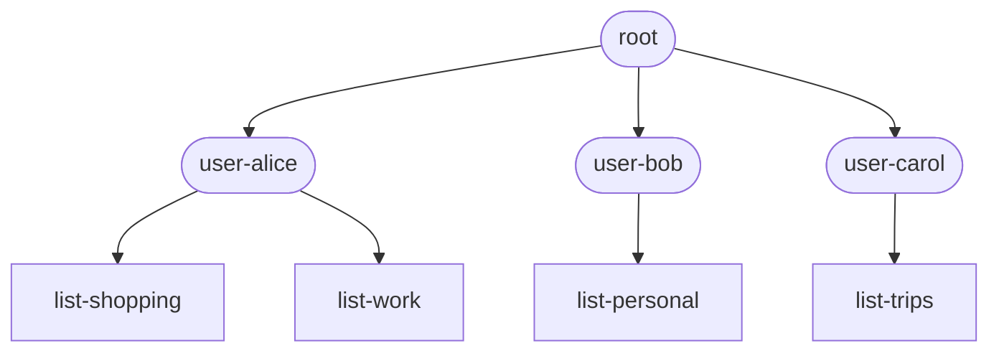
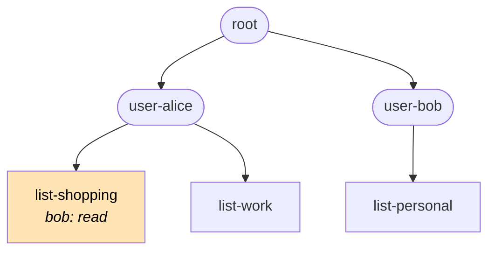
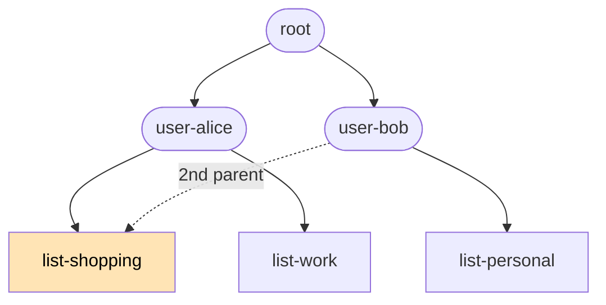
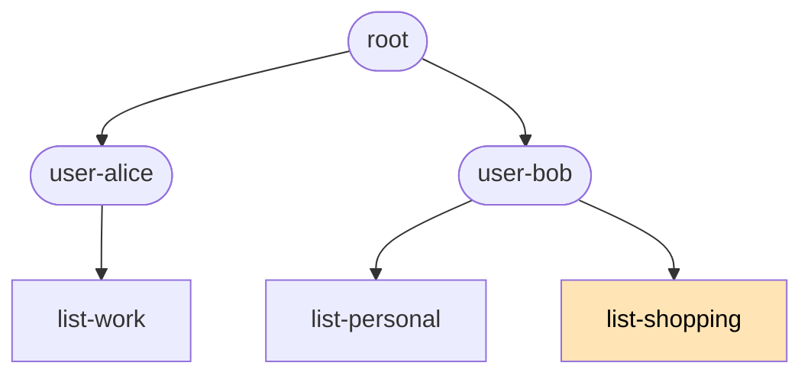

# Access control

Every resource is attached to a node in your app's **org/permission tree**. The attachment happens at create time: `OperationDescriptor.create` carries a `nodeId: number` field naming the node the new resource lives under. After creation, the attachment can be changed with `op: 'move'`.

## What "org" means here

"Org tree" pulls in two directions:

1. **Mimicking your organization's structure.** For an internal HR or project-management tool, the tree might literally mirror your business: company → divisions → teams → individuals. People in higher-up subtrees get grants that cascade to everything below.
2. **Organizing data for permissioning.** Equally common: the tree has nothing to do with your business and is just a way to group resources so permissions can be granted in bulk. A consumer SaaS app might use it to give every user their own subtree, with no real-world "org" anywhere in sight.

Both uses get the same mechanics. The "org" in "org tree" reads more as a verb (to organize) than a noun.

## Permissions table and resolution

Each node carries a per-user permissions table — `sub` (the subject claim from the user's JWT, a bare UUID minted by nebula-auth) → `'admin' | 'write' | 'read'`. Grants are matched by exact string equality against the JWT `sub`. Effective permission for `(sub, nodeId)` is the **highest grant found on any ancestor path** from the resource's attached node up to root.

```typescript @skip-check
// Conceptual — actual API surface lives on client.orgTree. Keys are bare-UUID
// JWT subs (aliceSub etc. shown as variables for readability).
node.permissions = new Map([
  [aliceSub, 'admin'],
  [bobSub,   'write'],
]);
```

Three properties follow:

- **Permissions cascade additively.** A grant on a parent applies to every descendant. Lower nodes can grant more, never less. To narrow access, attach the resource to a deeper node where only the right users have grants on the ancestors.
- **The whole tree — structure *and* the full permissions table — is universally visible.** Every connected client gets the entire tree at `store.lmz.orgTree.value`, including every node's grants (`sub → tier`). Visibility isn't restricted because the permission UX wants every client to resolve, locally, *who to ask*: climb from a node you can't reach to the nearest ancestor with an `admin` grant and request access from them — no server round-trip. Resource **values** are still gated by permission at every read and write; the **structure and the grant table** are universal.
  - **Grant keys are opaque user IDs** — `sub` is a bare UUID, not a name or email — so the table exposes *who-can-do-what by ID*, not by identity. Mapping a `sub` to a person needs a separate lookup the tree doesn't carry.
  - **Every node's `label`/`slug` is visible to every client** — the whole node set ships to everyone, not just nodes you can reach (it has to: requesting access to a node you *can't* reach means seeing what it is). So labels, not the opaque grant keys, are the real identity surface — a node labeled `user-alice` whose admin grant is some `sub` lets anyone deduce who that `sub` is. **Accepted known risk:** higher-permissioned users are discoverable, and the protection relied upon is **tenant segmentation** (members already share an organization). Apps that want to reduce it further can use opaque per-person slugs and render human names only to those who should see them — but that's optional hardening, not required.
  - **The `permissions` map shows DAG grants only — it is not the complete admin picture.** Galaxy- and Universe-level scope admins have effective admin on the whole tree, but that's a property of their JWT (`claims.access.admin`), not a node grant, so they do **not** appear in the map. Treat the map as "who was explicitly granted what," and check `claims.access.admin` separately for scope admins (see [Coding your UI § Gating admin-only UI](./coding-your-ui.md#gating-admin-only-ui)).
- **Permission checks run on every transaction.** The server resolves the effective permission for the calling user against each affected resource's attached node before applying any op. A failed check returns `{ kind: 'permission-denied' }` for that resource in the per-type [`onTransactionResourceResolution`](./resources.md#per-resource-behavior--the-ontransactionresourceresolution-handler) handler. Tier by op: `create` needs `write` on the target `nodeId`; `put` / `delete` need `write` on the resource's attached node; `move` needs `write` on **both** the source and destination nodes; `read` / `subscribe` need `read` on the attached node.
- **Read permission is checked at subscribe time, not per fanout.** Revoking a subscriber's grant doesn't sever a live subscription instantly — it takes effect on their next reconnect / resubscribe or the next deploy (which clears subscriptions). Acceptable for the optimistic-UX model; instant per-fanout revocation is out of scope.

## Worked example: sharing in a todo-list app

Suppose you're building a todo app. Each user has many lists; some are private; some get shared with other users. The natural starting tree:



Alice has `admin` on `user-alice`; that grant cascades to both her lists and to every todo attached under them. Bob has `admin` on `user-bob` only — by default he can't see anything in Alice's subtree.

Now Alice wants to share `list-shopping` with Bob. There are **two ways** to express that — each illustrates a property of the underlying structure.

### Approach 1: Grant a permission on the shared node — for limited-access sharing

This is the right approach when Alice wants to give Bob **limited** access — typically read-only. She grants `bob: read` (or `write` — her choice) on the `list-shopping` node:



Bob's effective permission on `list-shopping` is now exactly the tier Alice picked — independent of whatever rights he has on his own subtree. The list stays in Alice's subtree; Alice remains the owner; Bob has the narrow access she granted him.

**Use this when:**
- You want to share **read-only** — let someone view but not edit.
- You want to share `write` while keeping `admin` (control over deletion, sharing, etc.) to yourself.
- The relationship is asymmetric: one clear owner, one collaborator with limited rights.

**Tradeoff:** the shared list stays in the owner's subtree, so the sharee's UI has to surface it via a "shared with me" view that pulls from outside their natural subtree.

### Approach 2: Add a second parent — for co-ownership

This is the right approach when Alice and Bob should be **true co-owners** of `list-shopping`: `user-bob` becomes a second parent of the list.

Adding a parent edge is an access grant in structural clothing — everyone with grants on or above the new parent gains cascaded access to the child's subtree — so `addEdge` requires `write` on the new parent **and `admin` on the child** (the same tier `setPermission` demands). Neither party holds both (Alice has no `write` on `user-bob`; Bob starts with no `admin` on the list), and that's the point: co-ownership takes both the owner's consent and the recipient's acceptance. The flow is a two-step share-accept:

1. **Alice offers** — grants Bob `admin` on the list (Approach 1 mechanics, at the top tier): `setPermission(listShoppingId, bobSub, 'admin')`.
2. **Bob accepts** — adds the edge into his own subtree: `addEdge(userBobNodeId, listShoppingId)`. He holds `write` on `user-bob` and, since step 1, `admin` on the list.
3. **Optional cleanup** — the direct grant is now redundant (Bob's `admin` on `user-bob` cascades to the list through the new edge): `revokePermission(listShoppingId, bobSub)` keeps the permissions table minimal.



After cleanup, no direct grant on `list-shopping` remains. Effective-permission resolution climbs **all** ancestor paths and takes the maximum: Bob has `admin` via `user-bob`, Alice via `user-alice`. **Both users have full admin over the list.**

The flexibility to give one node multiple parents is what makes the underlying structure technically a **DAG** (directed acyclic graph) rather than a strict tree. The "tree" in "org/permission tree" is a friendly shorthand; the actual graph type is a DAG, with all the extra modeling power that brings.

**Co-ownership is real, not nominal.** If Alice later "removes the list from her account" — which in UI terms means deleting her parent edge — the list doesn't disappear:



`list-shopping` still exists under `user-bob`, who retains full admin. Symmetric: if Bob removes his edge instead, Alice keeps full admin. **Either party can leave; the other keeps everything.**

**Use this when:**
- You want both parties to have the same rights — e.g., a shared household to-do list both partners can edit and reshare equally.
- You want either party to be able to leave the relationship without disrupting the other.
- You want the shared item to appear in the second user's natural subtree, with no "shared with me" framing.
- You want to give a whole group access by attaching a single edge — e.g., add `team-eng` as a second parent of every team project, and every member's grants on `team-eng` cascade in automatically.

**Tradeoffs:**
- You can't grant narrower-than-admin access this way. The sharee gets whatever they have on their own subtree, which is usually admin. For read-only sharing, Approach 1 is the right tool.
- Mental model is harder: the same node appears in two places.
- Cycles are still forbidden — if Alice tried to make `list-shopping` a parent of `user-bob`, the cycle detector at [dag-ops.ts](https://github.com/lumenize/lumenize/blob/main/apps/nebula/src/dag-ops.ts) would reject it.

### When to use which

| Goal | Approach 1 (grant) | Approach 2 (second parent) |
|---|---|---|
| Read-only sharing | ✓ the right tool | ✗ — sharee gets full admin |
| Share `write` while keeping `admin` for yourself | ✓ the right tool | ✗ |
| True co-ownership (both have admin, either can leave) | awkward to express | ✓ the right tool |
| Either party can leave without taking the resource with them | ✗ — owner's delete is the resource's delete | ✓ — leaving = deleting only your edge |
| Resource appears in sharee's natural subtree | ✗ | ✓ |
| Grant to a whole group via a single edge | ✗ — per-resource grants | ✓ — one parent edge per resource |

The two approaches **compose freely** — a real app uses both. Grants for "show this list read-only to my accountant"; second-parent edges for "this shared household list belongs to all the roommates equally."

See [Coding your UI § Worked example: rendering the built-in tree](./coding-your-ui.md#worked-example-rendering-the-built-in-tree) for the client-side patterns that render this structure (including the **multi-parent rendering** case — a node with two parents shows up under each one in the tree view).
