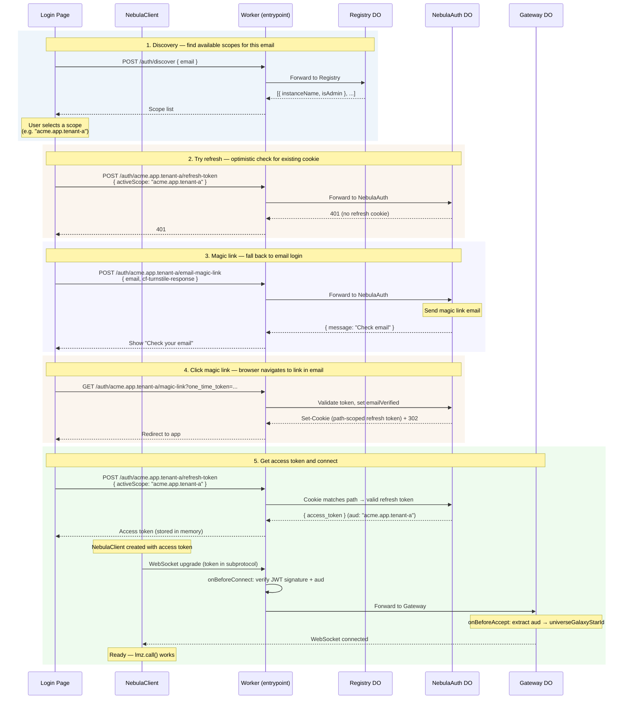
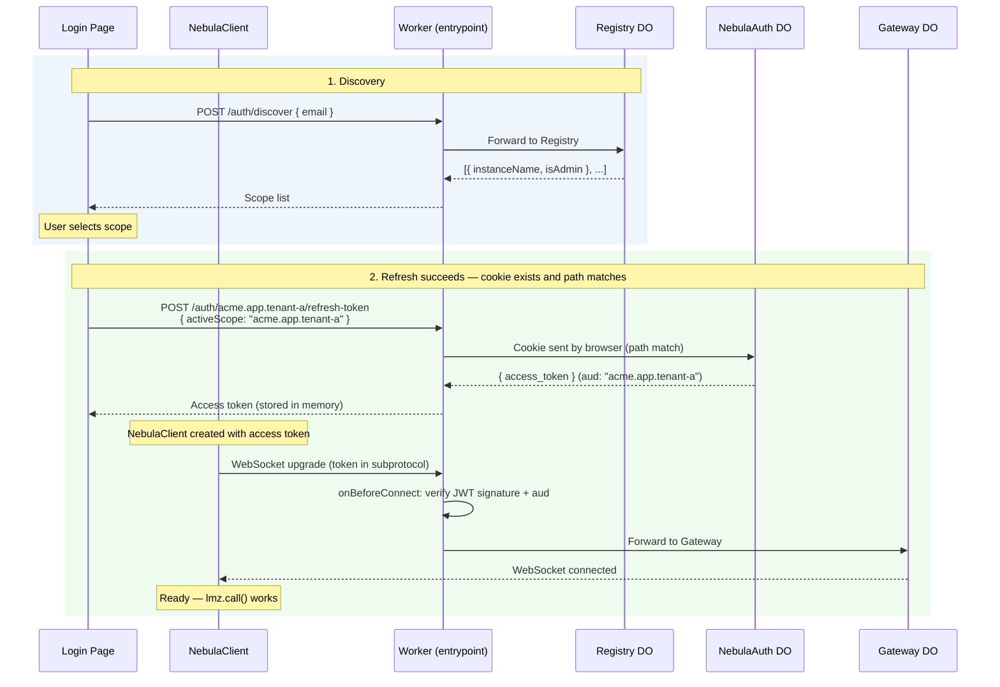
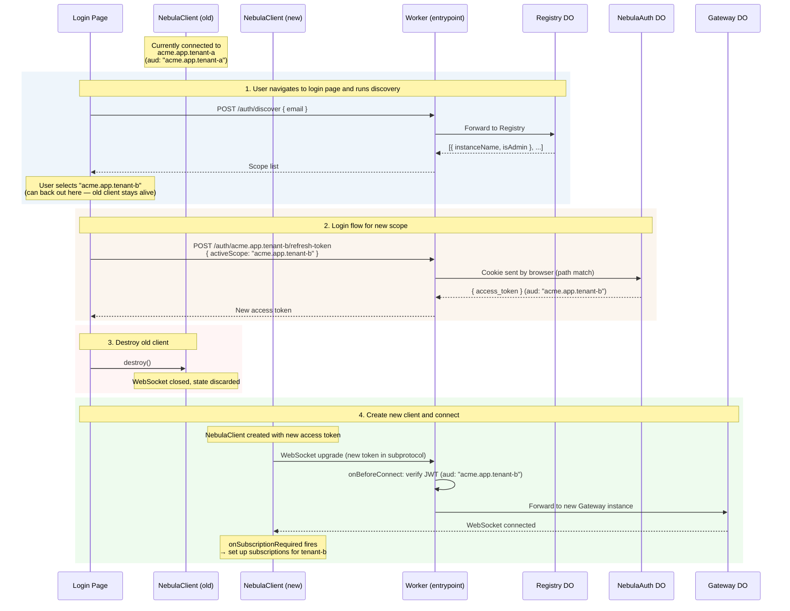
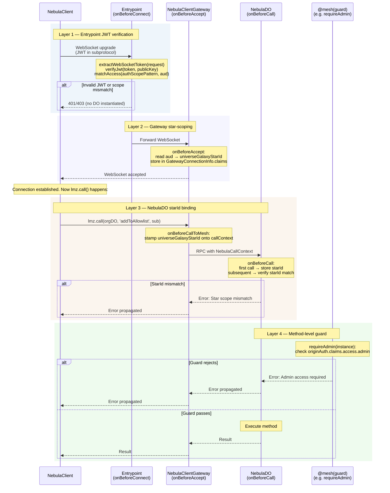
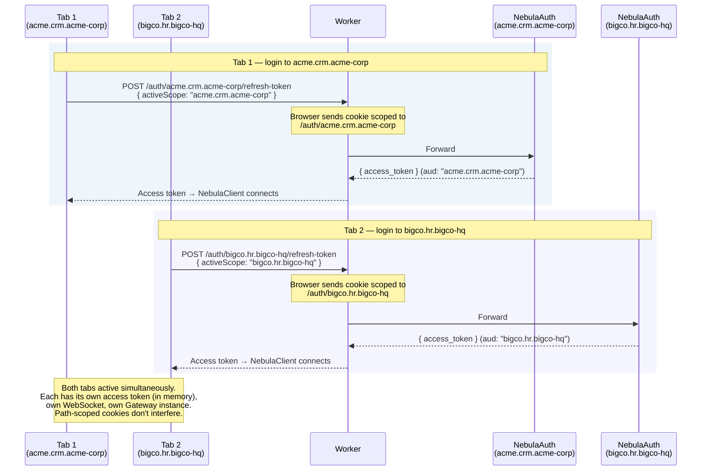

# Auth Flows

Nebula uses [nebula-auth](/docs/auth) for passwordless authentication with a two-scope model: **auth scope** (determines the refresh cookie path) and **active scope** (baked into the JWT `aud` claim). This page shows the end-to-end sequences from the UI perspective.

:::info Implementation note
Diagrams reference `NebulaClient` — the client-side class that manages connections. These annotations help during development and testing; they may be simplified before release.
:::

## First-Time Login

A new user arrives at the login page with no existing refresh cookie. The full flow is: discovery, scope selection, magic link email, and finally a connected `NebulaClient`.

## Returning User

A user with a valid refresh cookie (not expired, not revoked) returns to the app. The cookie is `HttpOnly`, so the client can't check for it — it makes the refresh call and lets the browser send the cookie if the path matches.

:::tip Bookmarked URLs
If the user arrives via a bookmarked URL that encodes the scope (e.g. `https://app.example.com/acme/app/tenant-a/dashboard`), the client already knows the active scope. It can skip discovery and try refresh directly, falling back to the full login flow only if refresh fails.
:::

## Scope Switching

An admin (or any user with access to multiple scopes) wants to switch from one star to another. Scope switching is a **full re-login, not an in-place reconnect** — the old `NebulaClient` is destroyed and a new one is created.

The key insight: `NebulaClient` is ephemeral; the refresh cookie is the durable credential. Each access token has a single `aud` (active scope), so switching scope requires a new token.

:::note When refresh fails
If the refresh call returns 401 (cookie expired or doesn't exist for the new scope's path), the flow falls back to magic link — same as the [first-time login](#first-time-login) flow starting at step 3. The old client stays alive until the magic link completes.
:::

## Security Layers During Connection

Every `NebulaClient` connection passes through four security layers before any `lmz.call()` reaches a Nebula DO. This diagram shows what happens at each layer for a single connection attempt.

## Multi-Tab (Coach Carol Scenario)

Coach Carol manages multiple client organizations. She opens each in a separate browser tab. Path-scoped refresh cookies let tabs coexist without interfering.

Key properties:
- **Shared cookie jar** — both tabs are same-origin, so refresh cookies coexist (different paths)
- **Independent access tokens** — stored in memory per tab, not shared
- **Independent WebSockets** — each `NebulaClient` has its own Gateway connection
- **No cross-talk** — updates arrive only on the correct tab's connection
