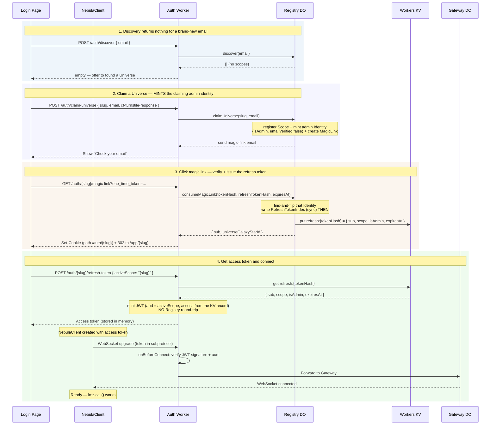
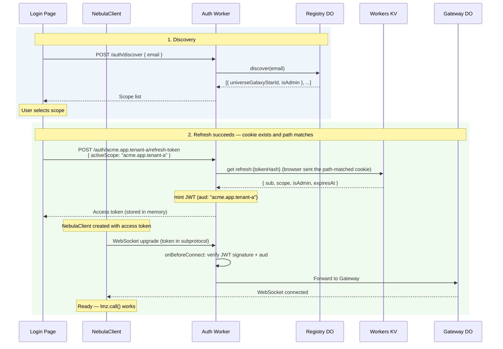
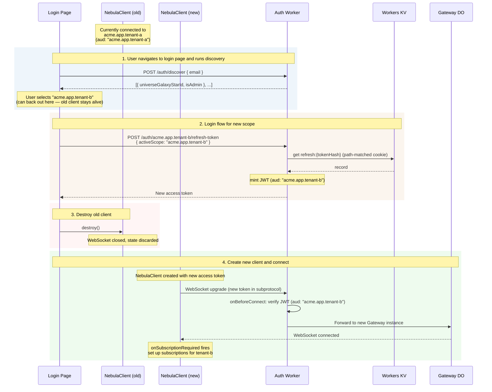
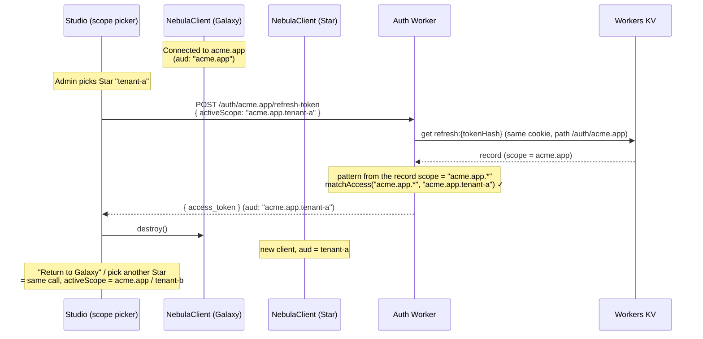
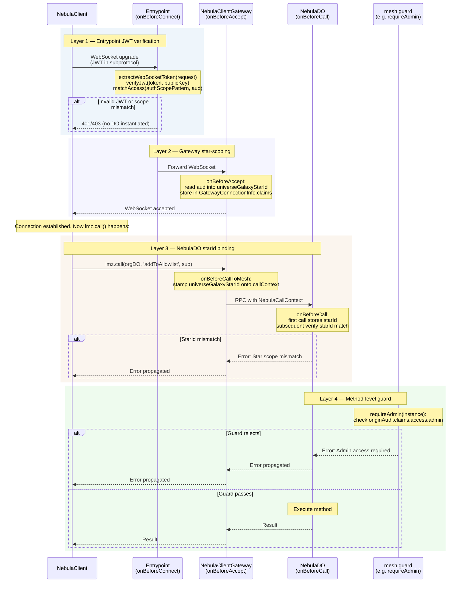
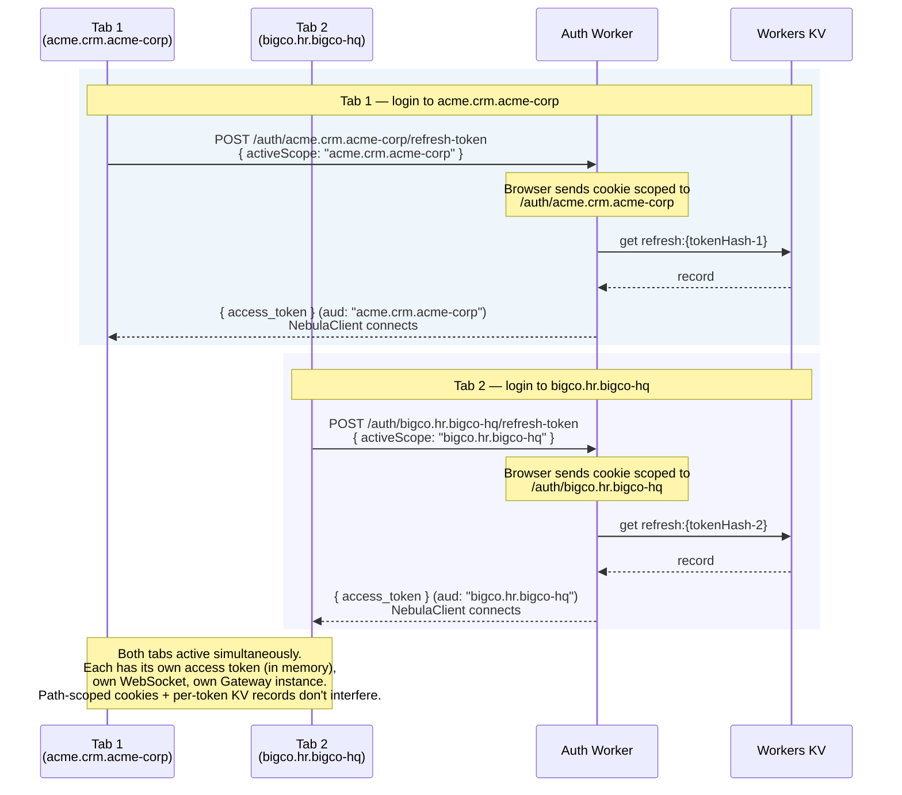

# Auth flows

Nebula uses [nebula-auth](/docs/auth) for passwordless authentication with a two-scope model: **auth scope** (determines the refresh cookie path) and **active scope** (baked into the JWT `aud` claim). This page shows the end-to-end sequences from the UI perspective.

:::info[Where the pieces live]

There is **no per-scope auth DO**. Identity and all durable auth state live in one **singleton Registry DO** (the identity authority + single writer); the login/token flows (`email-magic-link`, `magic-link`, `accept-invite`, `refresh-token`, `logout`, `invite`, `mint-narrower-token`) run in the **default Worker** (`routeNebulaAuthRequest`); and the refresh record lives in **Workers KV** (`refresh:{tokenHash}`), read at the edge on refresh with **no Registry round-trip**. Identity is keyed by a registry-minted surrogate **`sub`** (never the email). Diagrams reference `NebulaClient`, the client-side class that manages connections.

:::

## Cross-origin browser deploys

By default Nebula serves the UI and the API from the same origin (e.g. `https://lumenize.com`), so no [CORS](/docs/routing/cors-support) configuration is required. For deployments where the browser app and the Nebula worker live on different origins — custom-domain deploys (`https://apps.acme.com` calling `https://nebula.lumenize.com`), real-browser test rigs hitting a miniflare worker on a different localhost port, etc. — set the `LUMENIZE_APPROVED_ORIGINS` env binding in `wrangler.jsonc` (`vars`) to a comma-separated allowlist:

```jsonc
"vars": {
  "LUMENIZE_APPROVED_ORIGINS": "https://apps.acme.com,https://admin.acme.com"
}
```

The Nebula entrypoint parses this once and threads it as a single `cors` config through both the `/auth/*` router (`routeNebulaAuthRequest`) and the `/gateway/*` router (`routeDORequest`), so a browser frontend at an approved origin can hit both magic-link / refresh-token endpoints and the WebSocket mesh with the same allowlist. Empty or unset → no CORS headers (safe default).

## Who can create a scope (identity is minted only at authority points)

Login **never mints** an identity. A magic-link login *verifies* an already-existing identity (find-and-flip its `emailVerified`) and is **rejected** if none exists — this is what closes stranger-self-join. Identities are minted only at authority points:

- **Universe** — open self-signup: `claim-universe` mints the claiming admin identity (`isAdmin=true`) + the scope.
- **Galaxy / Star** — the parent-scope admin creates the child (`create-galaxy` / `create-star`, admin-gated); the child is **wildcard-managed** (no local admin stamped — the parent admin's `{u}.*` / `{u}.g.*` token reaches it). There is no open, identity-minting star self-signup.
- **Invite** — an admin invites an email into an existing scope; issuance pre-creates the invitee identity (`isAdmin=false`), and `accept-invite` flips its `emailVerified`.

## First-time login (self-signup — founding a Universe)

A new user arrives with no existing refresh cookie and no identity yet. Discovery returns nothing, so they found a Universe (`claim-universe`), which mints the claiming admin identity and emails a magic link; clicking it issues the refresh cookie.


```mermaid
sequenceDiagram
    participant UI as Login Page
    participant NC as NebulaClient
    participant W as Auth Worker
    participant R as Registry DO
    participant KV as Workers KV
    participant GW as Gateway DO

    rect rgba(200, 220, 240, 0.3)
        Note over UI,R: 1. Discovery returns nothing for a brand-new email
        UI->>W: POST /auth/discover { email }
        W->>R: discover(email)
        R-->>W: [] (no scopes)
        W-->>UI: empty — offer to found a Universe
    end

    rect rgba(220, 220, 255, 0.3)
        Note over UI,R: 2. Claim a Universe — MINTS the claiming admin identity
        UI->>W: POST /auth/claim-universe { slug, email, cf-turnstile-response }
        W->>R: claimUniverse(slug, email)
        Note over R: register Scope + mint admin Identity<br/>(isAdmin, emailVerified false) + create MagicLink
        R-->>W: send magic-link email
        W-->>UI: Show "Check your email"
    end

    rect rgba(240, 220, 200, 0.3)
        Note over UI,KV: 3. Click magic link — verify + issue the refresh token
        UI->>W: GET /auth/{slug}/magic-link?one_time_token=...
        W->>R: consumeMagicLink(tokenHash, refreshTokenHash, expiresAt)
        Note over R: find-and-flip that Identity<br/>write RefreshTokenIndex (sync) THEN
        R->>KV: put refresh:{tokenHash} = { sub, scope, isAdmin, expiresAt }
        R-->>W: { sub, universeGalaxyStarId }
        W-->>UI: Set-Cookie (path /auth/{slug}) + 302 to /app/{slug}
    end

    rect rgba(200, 240, 200, 0.3)
        Note over UI,GW: 4. Get access token and connect
        UI->>W: POST /auth/{slug}/refresh-token { activeScope: "{slug}" }
        W->>KV: get refresh:{tokenHash}
        KV-->>W: { sub, scope, isAdmin, expiresAt }
        Note over W: mint JWT (aud = activeScope, access from the KV record)<br/>NO Registry round-trip
        W-->>UI: Access token (stored in memory)
        Note over NC: NebulaClient created with access token
        NC->>W: WebSocket upgrade (token in subprotocol)
        W->>W: onBeforeConnect: verify JWT signature + aud
        W->>GW: Forward to Gateway
        GW-->>NC: WebSocket connected
        Note over NC: Ready — lmz.call() works
    end
```

:::note[Joining an existing scope]

An invited user follows the same shape but via `GET /auth/{scope}/accept-invite?invite_token=...` — the invite (single-use) is consumed, the pre-created invitee identity is flipped verified, and the same refresh cookie is issued. `email-magic-link` is only for **re-logging-in an identity that already exists** — it cannot create membership.

:::

## Returning user

A user with a valid refresh cookie (not expired, not revoked) returns to the app. The cookie is `HttpOnly`, so the client can't check for it — it makes the refresh call and lets the browser send the cookie if the path matches.


```mermaid
sequenceDiagram
    participant UI as Login Page
    participant NC as NebulaClient
    participant W as Auth Worker
    participant R as Registry DO
    participant KV as Workers KV
    participant GW as Gateway DO

    rect rgba(200, 220, 240, 0.3)
        Note over UI,R: 1. Discovery
        UI->>W: POST /auth/discover { email }
        W->>R: discover(email)
        R-->>W: [{ universeGalaxyStarId, isAdmin }, ...]
        W-->>UI: Scope list
        Note over UI: User selects scope
    end

    rect rgba(200, 240, 200, 0.3)
        Note over UI,GW: 2. Refresh succeeds — cookie exists and path matches
        UI->>W: POST /auth/acme.app.tenant-a/refresh-token<br/>{ activeScope: "acme.app.tenant-a" }
        W->>KV: get refresh:{tokenHash} (browser sent the path-matched cookie)
        KV-->>W: { sub, scope, isAdmin, expiresAt }
        Note over W: mint JWT (aud: "acme.app.tenant-a")
        W-->>UI: Access token (stored in memory)
        Note over NC: NebulaClient created with access token
        NC->>W: WebSocket upgrade (token in subprotocol)
        W->>W: onBeforeConnect: verify JWT signature + aud
        W->>GW: Forward to Gateway
        GW-->>NC: WebSocket connected
        Note over NC: Ready — lmz.call() works
    end
```

:::tip[Bookmarked URLs]

If the user arrives via a bookmarked URL that encodes the scope (e.g. `https://app.example.com/acme/app/tenant-a/dashboard`), the client already knows the active scope. It can skip discovery and try refresh directly, falling back to a re-login (`email-magic-link`, since the identity already exists) only if refresh fails.

:::

:::note[Refresh is a pure KV read]

The refresh token gets a fixed 30-day TTL at login — there is no per-refresh rotation and no slide, so `refresh-token` is a pure Workers-KV read plus a JWT mint, with **zero writes** and the Registry never on the path. (Defensive fallback: on a rare KV read-your-write miss, the Worker falls back once to the Registry's strongly-consistent index, which reconstructs and self-heals the KV record.) `logout` deletes the KV record + its index entry; because KV is eventually consistent, revocation propagates within the KV window plus the short access-token TTL.

:::

## Scope switching

An admin (or any user with access to multiple scopes) wants to switch from one star to another. Scope switching is a **full re-login, not an in-place reconnect** — the old `NebulaClient` is destroyed and a new one is created. This section's diagram covers **separately-held** scopes (each with its own path-scoped cookie); admins with a wildcard grant use the lighter flow in [Admin active-scope switching](#admin-active-scope-switching-within-a-wildcard-grant) below.

The key insight: `NebulaClient` is ephemeral; the refresh cookie is the durable credential. Each access token has a single `aud` (active scope), so switching scope requires a new token.


```mermaid
sequenceDiagram
    participant UI as Login Page
    participant NC1 as NebulaClient (old)
    participant NC2 as NebulaClient (new)
    participant W as Auth Worker
    participant KV as Workers KV
    participant GW as Gateway DO

    Note over NC1: Currently connected to<br/>acme.app.tenant-a<br/>(aud: "acme.app.tenant-a")

    rect rgba(200, 220, 240, 0.3)
        Note over UI,W: 1. User navigates to login page and runs discovery
        UI->>W: POST /auth/discover { email }
        W-->>UI: [{ universeGalaxyStarId, isAdmin }, ...]
        Note over UI: User selects "acme.app.tenant-b"<br/>(can back out here — old client stays alive)
    end

    rect rgba(240, 220, 200, 0.3)
        Note over UI,KV: 2. Login flow for new scope
        UI->>W: POST /auth/acme.app.tenant-b/refresh-token<br/>{ activeScope: "acme.app.tenant-b" }
        W->>KV: get refresh:{tokenHash} (path-matched cookie)
        KV-->>W: record
        Note over W: mint JWT (aud: "acme.app.tenant-b")
        W-->>UI: New access token
    end

    rect rgba(255, 220, 220, 0.3)
        Note over UI,NC1: 3. Destroy old client
        UI->>NC1: destroy()
        Note over NC1: WebSocket closed, state discarded
    end

    rect rgba(200, 240, 200, 0.3)
        Note over UI,GW: 4. Create new client and connect
        Note over NC2: NebulaClient created with new access token
        NC2->>W: WebSocket upgrade (new token in subprotocol)
        W->>W: onBeforeConnect: verify JWT (aud: "acme.app.tenant-b")
        W->>GW: Forward to new Gateway instance
        GW-->>NC2: WebSocket connected
        Note over NC2: onSubscriptionRequired fires<br/>set up subscriptions for tenant-b
    end
```

:::note[When refresh fails]

If the refresh call returns 401 (cookie expired or doesn't exist for the new scope's path), the flow falls back to `email-magic-link` re-login (the identity already exists → find-and-flip). The old client stays alive until the login completes.

:::

### Admin active-scope switching (within a wildcard grant)

A **Galaxy or Universe admin** holds a single wildcard grant covering the parent scope *and every scope beneath it*, so switching the active scope needs neither discovery nor a new cookie — only a refresh with a different `activeScope`.

An admin logged in at the Galaxy `acme.app`:

- holds **one** refresh cookie, path-scoped to `/auth/acme.app`;
- has scope pattern `acme.app.*` (Galaxy → wildcard), which `matchAccess` resolves to the Galaxy itself **and** every Star under it.

Every switch is the *same* request — `POST /auth/acme.app/refresh-token`, **same cookie** — varying only the body's `activeScope`. The Worker validates the requested `activeScope` against the pattern **derived from the KV record's own scope** (server-trusted), never the request path or body:

| Goal | `activeScope` | covered by `acme.app.*`? |
| --- | --- | --- |
| Work directly in the Galaxy (Studio) | `acme.app` | ✓ (wildcard matches its own prefix) |
| Activate a child Star | `acme.app.tenant-a` | ✓ |
| Switch to a different child Star | `acme.app.tenant-b` | ✓ |
| Return to the Galaxy | `acme.app` | ✓ |

The admin's **`authScope` never changes** (the cookie stays at `/auth/acme.app`); only **`activeScope`** (the JWT `aud`) moves. Each new `aud` is a new token, so the old `NebulaClient` is destroyed and a new one created — but there is **no magic link and no discovery**: the admin's cookie already authorizes the whole subtree. (A Universe admin is the same one tier up: cookie at `/auth/acme`, pattern `acme.*`, reaching any Galaxy or Star beneath.)


```mermaid
sequenceDiagram
    participant UI as Studio (scope picker)
    participant NC1 as NebulaClient (Galaxy)
    participant NC2 as NebulaClient (Star)
    participant W as Auth Worker
    participant KV as Workers KV

    Note over NC1: Connected to acme.app<br/>(aud: "acme.app")

    Note over UI: Admin picks Star "tenant-a"
    UI->>W: POST /auth/acme.app/refresh-token<br/>{ activeScope: "acme.app.tenant-a" }
    W->>KV: get refresh:{tokenHash} (same cookie, path /auth/acme.app)
    KV-->>W: record (scope = acme.app)
    Note over W: pattern from the record scope = "acme.app.*"<br/>matchAccess("acme.app.*", "acme.app.tenant-a") ✓
    W-->>UI: { access_token } (aud: "acme.app.tenant-a")
    UI->>NC1: destroy()
    Note over NC2: new client, aud = tenant-a
    Note over UI: "Return to Galaxy" / pick another Star<br/>= same call, activeScope = acme.app / tenant-b
```

**UI shape (Studio).** A Galaxy admin sees a scope picker showing the current active scope plus the selectable children (the Stars under the Galaxy, with a "Galaxy (Studio)" entry to return to the parent). Selecting one re-creates the client at that `aud`. Most of the time the admin works directly in the Galaxy, where Studio lives; activating a Star is for inspecting or operating inside a tenant's data.

:::note[Switching scope ≠ acting as another user]

Activating a Star gives the admin a token whose **`aud`** is that Star, but the **`sub` stays the admin's own** — actions are attributed to the admin, with their admin rights cascading. Impersonating another user (carrying a different `sub`) is a **separate** mechanism — the admin-only `mint-narrower-token` endpoint, which takes `{ subOfNarrowerToken, activeScope }` and mints a token whose `sub` is that person and whose `act.sub` is the caller — not active-scope switching.

:::

## Security layers during connection

Every `NebulaClient` connection passes through four security layers before any `lmz.call()` reaches a Nebula DO. This diagram shows what happens at each layer for a single connection attempt. (These are the mesh **connection** layers, independent of the token flow above.)


```mermaid
sequenceDiagram
    participant C as NebulaClient
    participant EP as Entrypoint<br/>(onBeforeConnect)
    participant GW as NebulaClientGateway<br/>(onBeforeAccept)
    participant DO as NebulaDO<br/>(onBeforeCall)
    participant M as mesh guard<br/>(e.g. requireAdmin)

    rect rgba(200, 220, 240, 0.3)
        Note over C,EP: Layer 1 — Entrypoint JWT verification
        C->>EP: WebSocket upgrade<br/>(JWT in subprotocol)
        Note over EP: extractWebSocketToken(request)<br/>verifyJwt(token, publicKey)<br/>matchAccess(authScopePattern, aud)
        alt Invalid JWT or scope mismatch
            EP-->>C: 401/403 (no DO instantiated)
        end
    end

    rect rgba(220, 220, 255, 0.3)
        Note over EP,GW: Layer 2 — Gateway star-scoping
        EP->>GW: Forward WebSocket
        Note over GW: onBeforeAccept:<br/>read aud into universeGalaxyStarId<br/>store in GatewayConnectionInfo.claims
        GW-->>C: WebSocket accepted
    end

    Note over C: Connection established. Now lmz.call() happens:

    rect rgba(240, 220, 200, 0.3)
        Note over C,DO: Layer 3 — NebulaDO starId binding
        C->>GW: lmz.call(orgDO, 'addToAllowlist', sub)
        Note over GW: onBeforeCallToMesh:<br/>stamp universeGalaxyStarId onto callContext
        GW->>DO: RPC with NebulaCallContext
        Note over DO: onBeforeCall:<br/>first call stores starId<br/>subsequent verify starId match
        alt StarId mismatch
            DO-->>GW: Error: Star scope mismatch
            GW-->>C: Error propagated
        end
    end

    rect rgba(200, 240, 200, 0.3)
        Note over DO,M: Layer 4 — Method-level guard
        Note over M: requireAdmin(instance):<br/>check originAuth.claims.access.admin
        alt Guard rejects
            M-->>DO: Error: Admin access required
            DO-->>GW: Error propagated
            GW-->>C: Error propagated
        else Guard passes
            Note over DO: Execute method
            DO-->>GW: Result
            GW-->>C: Result
        end
    end
```

## Multi-tab (Coach Carol scenario)

Coach Carol manages multiple client organizations. She opens each in a separate browser tab. Path-scoped refresh cookies let tabs coexist without interfering — and because refresh is a keyed Workers-KV read (one record per refresh token), there is no per-scope DO for the tabs to contend on.


```mermaid
sequenceDiagram
    participant T1 as Tab 1<br/>(acme.crm.acme-corp)
    participant T2 as Tab 2<br/>(bigco.hr.bigco-hq)
    participant W as Auth Worker
    participant KV as Workers KV

    rect rgba(200, 220, 240, 0.3)
        Note over T1,KV: Tab 1 — login to acme.crm.acme-corp
        T1->>W: POST /auth/acme.crm.acme-corp/refresh-token<br/>{ activeScope: "acme.crm.acme-corp" }
        Note over W: Browser sends cookie scoped to<br/>/auth/acme.crm.acme-corp
        W->>KV: get refresh:{tokenHash-1}
        KV-->>W: record
        W-->>T1: { access_token } (aud: "acme.crm.acme-corp")<br/>NebulaClient connects
    end

    rect rgba(220, 220, 255, 0.3)
        Note over T2,KV: Tab 2 — login to bigco.hr.bigco-hq
        T2->>W: POST /auth/bigco.hr.bigco-hq/refresh-token<br/>{ activeScope: "bigco.hr.bigco-hq" }
        Note over W: Browser sends cookie scoped to<br/>/auth/bigco.hr.bigco-hq
        W->>KV: get refresh:{tokenHash-2}
        KV-->>W: record
        W-->>T2: { access_token } (aud: "bigco.hr.bigco-hq")<br/>NebulaClient connects
    end

    Note over T1,T2: Both tabs active simultaneously.<br/>Each has its own access token (in memory),<br/>own WebSocket, own Gateway instance.<br/>Path-scoped cookies + per-token KV records don't interfere.
```

Key properties:
- **Shared cookie jar** — both tabs are same-origin, so refresh cookies coexist (different paths)
- **Independent access tokens** — stored in memory per tab, not shared
- **Independent WebSockets** — each `NebulaClient` has its own Gateway connection
- **No cross-talk** — updates arrive only on the correct tab's connection
