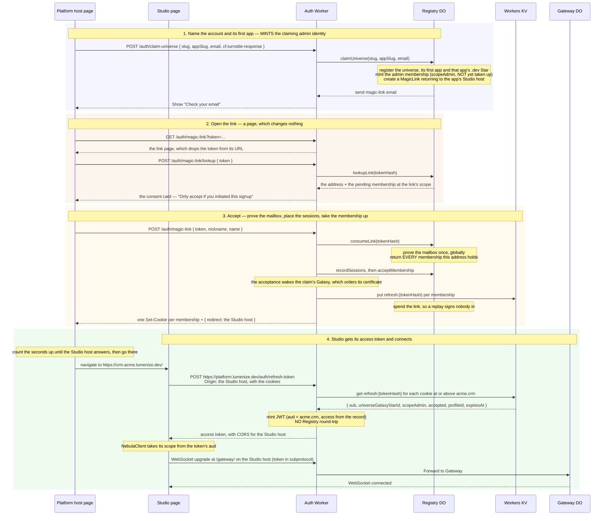
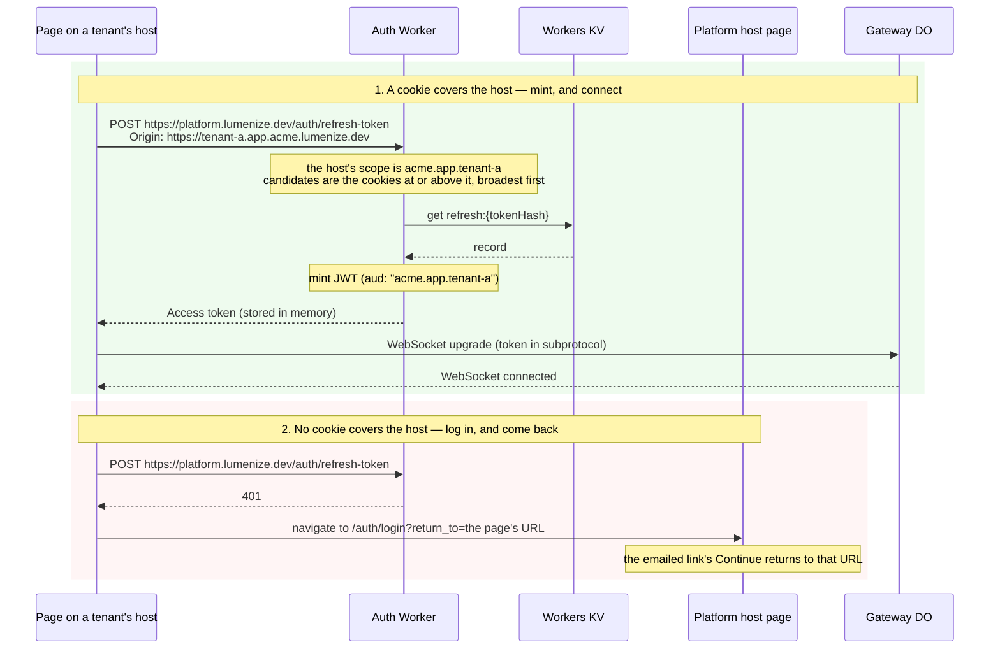
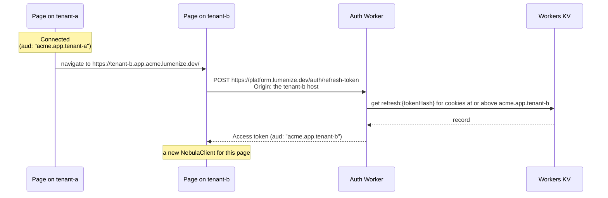
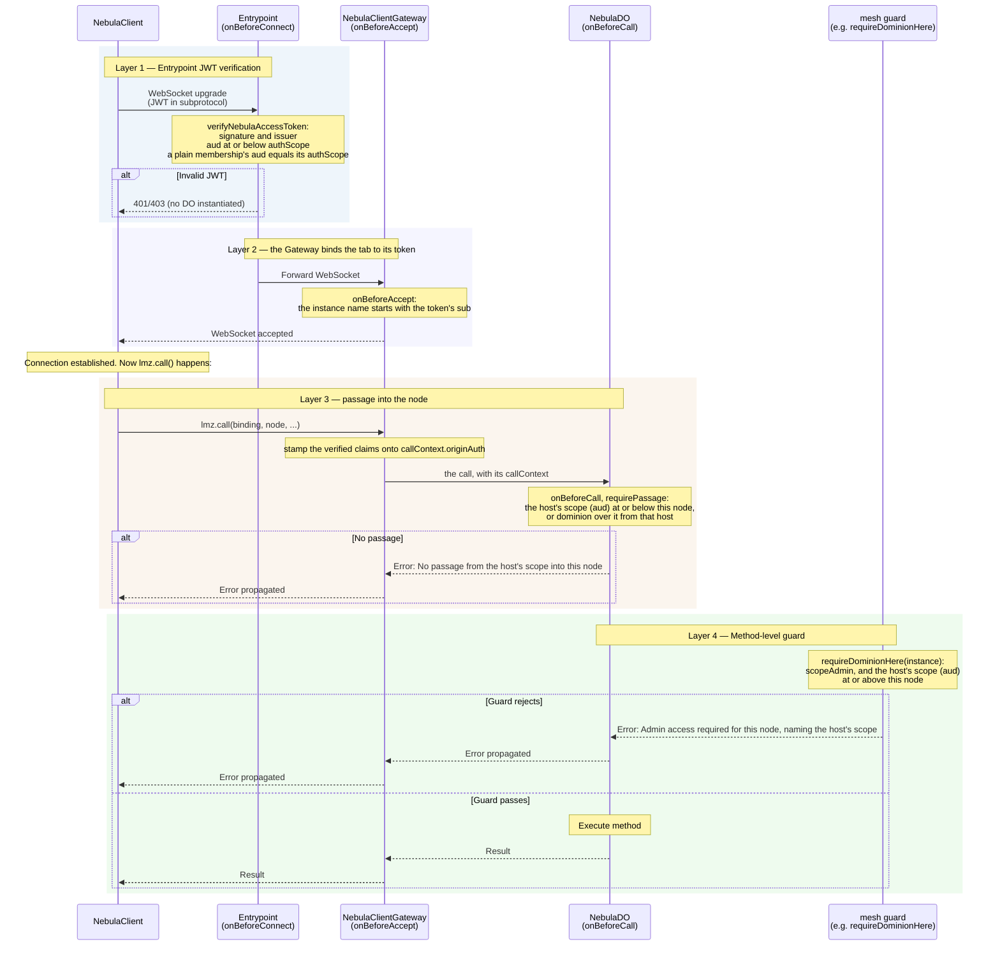
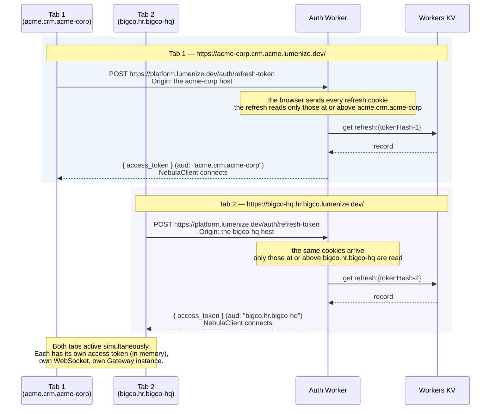

# Auth flows

Nebula uses [nebula-auth](/docs/auth) for passwordless authentication. Every scope is served from its own host, and every session lives on one host, the platform host. An access token carries two scopes: **`authScope`**, the membership whose refresh cookie minted it, and **`aud`**, the scope of the page's host. This page shows the end-to-end sequences from the UI perspective.

:::info[Where the pieces live]

There is **no per-scope auth DO**. Identity and all durable auth state live in one **singleton Registry DO** (the identity authority + single writer). The session routes run in the **default Worker** (`routeNebulaAuthRequest`) on the platform host: `email-magic-link`, the link page's `magic-link/lookup` and `magic-link`, `refresh-token`, `home-summary`, `pending-membership`, `accept-membership` and `logout`. What a session does — inviting, creating and deleting scopes, impersonating — is a mesh call to **`NebulaAuthFacade`**. The refresh record lives in **Workers KV** (`refresh:{tokenHash}`), read at the edge on refresh, with **one Registry read only on a KV miss**. Identity is keyed by a registry-minted surrogate **`sub`** (never the email). Diagrams reference `NebulaClient`, the client-side class that manages connections.

:::

## Hosts

A scope's host spells it with the labels reversed, so `https://tenant1.crm.acme.lumenize.dev/` is the scope `acme.crm.tenant1`. The app `acme.crm` is Studio, at `https://crm.acme.lumenize.dev/`, and the account `acme` has its page at `https://acme.lumenize.dev/`. A page acts only at the scope its host spells.

The platform host, `https://platform.lumenize.dev/`, is where login, Home and a link's page live, and every `/auth/*` route answers there and nowhere else. `https://lumenize.dev/` redirects to it.

- **Each membership has its own cookie**, `__Host-refresh-token.{scope}`, set `HttpOnly; Secure; SameSite=Lax; Path=/` on the platform host alone.
- **The refresh is the one route a page on another host calls.** A page sends `POST https://platform.lumenize.dev/auth/refresh-token` with `credentials: 'include'` and no body. The refresh reads the page's host from `Origin`, and answers CORS for that origin alone.
- **Every other `POST` under `/auth/` comes from a page on the platform host**: a browser's request is refused unless its `Sec-Fetch-Site` is `same-origin`, and one without that header is refused when its `Origin` names another origin.

## Who can create a scope (identity is minted only at mint points)

Login **never mints** a membership. A magic-link login *verifies* an already-existing one — recording that the mailbox is proved and that this membership has been taken up — and finds nothing to sign in to if none exists — this is what closes stranger-self-join. Memberships are minted only at mint points:

- **Universe** — open self-signup: `claim-universe` mints the claiming admin identity (`scopeAdmin=true`), the universe, and its first app with that app's `.dev` Star.
- **Galaxy** — a universe admin creates it through the facade's `createGalaxy`, which writes it together with its `.dev` Star; both are **parent-managed** (no local admin stamped — the parent admin's own scope is at or above them, so their token reaches them). The new Galaxy orders its host's certificate, and the host answers only once that is issued, two and a half to four minutes later, so the universe page counts the seconds up and enters Studio when the host answers.
- **Star** — a tenant Star is claimed by its own open self-signup, `claim-star`, which mints its claimer's admin membership at the Star.
- **Invite** — an admin invites an email into an existing scope; issuance pre-creates the invitee's membership (`scopeAdmin=false`, not yet taken up) and emails a magic link that lives 7 days, and Accept on its page records the take-up. Proving the mailbox is a property of the **address**, so someone who already proved it in another scope does not re-prove it here — only the new membership's take-up is recorded.

## First-time login (self-signup — founding a Universe)

A new user arrives with no refresh cookie and no identity yet. They name an account and its first app (`claim-universe`), which mints the claiming admin identity and emails a magic link. The link opens a page that changes nothing; its Accept proves the mailbox, sets the cookies, orders the first app's certificate, and lands the person in Studio once the app's host answers.

```mermaid
sequenceDiagram
    participant P as Platform host page
    participant S as Studio page
    participant W as Auth Worker
    participant R as Registry DO
    participant KV as Workers KV
    participant GW as Gateway DO

    rect rgba(220, 220, 255, 0.3)
        Note over P,R: 1. Name the account and its first app — MINTS the claiming admin identity
        P->>W: POST /auth/claim-universe { slug, appSlug, email, cf-turnstile-response }
        W->>R: claimUniverse(slug, appSlug, email)
        Note over R: register the universe, its first app and that app's .dev Star<br/>mint the admin membership (scopeAdmin, NOT yet taken up)<br/>create a MagicLink returning to the app's Studio host
        R-->>W: send magic-link email
        W-->>P: Show "Check your email"
    end

    rect rgba(240, 220, 200, 0.3)
        Note over P,R: 2. Open the link — a page, which changes nothing
        P->>W: GET /auth/magic-link?token=...
        W-->>P: the link page, which drops the token from its URL
        P->>W: POST /auth/magic-link/lookup { token }
        W->>R: lookupLink(tokenHash)
        R-->>W: the address + the pending membership at the link's scope
        W-->>P: the consent card — "Only accept if you initiated this signup"
    end

    rect rgba(255, 235, 200, 0.3)
        Note over P,KV: 3. Accept — prove the mailbox, place the sessions, take the membership up
        P->>W: POST /auth/magic-link { token, nickname, name }
        W->>R: consumeLink(tokenHash)
        Note over R: prove the mailbox once, globally<br/>return EVERY membership this address holds
        W->>R: recordSessions, then acceptMembership
        Note over W: the acceptance wakes the claim's Galaxy, which orders its certificate
        W->>KV: put refresh:{tokenHash} per membership
        Note over R: spend the link, so a replay signs nobody in
        W-->>P: one Set-Cookie per membership + { redirect: the Studio host }
    end

    rect rgba(200, 240, 200, 0.3)
        Note over S,GW: 4. Studio gets its access token and connects
        Note over P: count the seconds up until the Studio host answers, then go there
        P->>S: navigate to https://crm.acme.lumenize.dev/
        S->>W: POST https://platform.lumenize.dev/auth/refresh-token<br/>Origin: the Studio host, with the cookies
        W->>KV: get refresh:{tokenHash} for each cookie at or above acme.crm
        KV-->>W: { sub, universeGalaxyStarId, scopeAdmin, accepted, profileId, expiresAt }
        Note over W: mint JWT (aud = acme.crm, access from the record)<br/>NO Registry round-trip
        W-->>S: access token, with CORS for the Studio host
        Note over S: NebulaClient takes its scope from the token's aud
        S->>W: WebSocket upgrade at /gateway/ on the Studio host (token in subprotocol)
        W->>GW: Forward to Gateway
        GW-->>S: WebSocket connected
    end
```

:::note[Joining an existing scope]

An invite's email links to the same page, `GET /auth/magic-link?token=…`. Its consent card names who invited them rather than warning them off, Accept takes the membership up, and the link returns them to the invited scope's host. A plain login (`email-magic-link`) never creates a membership: its page offers "Continue as {address}", proves the address, and hands back whatever that address already holds.

:::

## Returning user

A user with a valid refresh cookie (not expired, not revoked) opens a page. The cookie is `HttpOnly`, so the client can't check for it — it makes the refresh call and lets the browser send the cookies.

```mermaid
sequenceDiagram
    participant T as Page on a tenant's host
    participant W as Auth Worker
    participant KV as Workers KV
    participant P as Platform host page
    participant GW as Gateway DO

    rect rgba(200, 240, 200, 0.3)
        Note over T,GW: 1. A cookie covers the host — mint, and connect
        T->>W: POST https://platform.lumenize.dev/auth/refresh-token<br/>Origin: https://tenant-a.app.acme.lumenize.dev
        Note over W: the host's scope is acme.app.tenant-a<br/>candidates are the cookies at or above it, broadest first
        W->>KV: get refresh:{tokenHash}
        KV-->>W: record
        Note over W: mint JWT (aud: "acme.app.tenant-a")
        W-->>T: Access token (stored in memory)
        T->>GW: WebSocket upgrade (token in subprotocol)
        GW-->>T: WebSocket connected
    end

    rect rgba(255, 220, 220, 0.3)
        Note over T,P: 2. No cookie covers the host — log in, and come back
        T->>W: POST https://platform.lumenize.dev/auth/refresh-token
        W-->>T: 401
        T->>P: navigate to /auth/login?return_to=the page's URL
        Note over P: the emailed link's Continue returns to that URL
    end
```

Home, at `https://platform.lumenize.dev/`, lists every membership the browser's cookies hold. It reads them by cookie through `POST /auth/home-summary`, never by token, and each row links to the host that can act on it. An account claimed from the signup page with a ticket is accepted here, and Home's move into its new app waits on the same count-up as the link page.

:::tip[Bookmarked URLs]

A URL names its scope by its host, so a bookmark or a shared link lands on the page and view it names. If no cookie in that browser covers the host, the login it is sent to returns there.

:::

:::note[Refresh is a KV read]

The refresh token gets a fixed 30-day TTL at login — there is no per-refresh rotation and no slide, so `refresh-token` is a Workers-KV read plus a JWT mint, with **zero writes**. On a KV miss the Worker falls back once to the Registry's strongly-consistent index, which mints and heals the KV record; a miss on both answers with the cookie expired. `logout` deletes the KV record + its index entry; because KV is eventually consistent, revocation propagates within the KV window plus the short access-token TTL.

:::

## Moving between scopes

Moving to another scope is navigating to its host. A page's host is its scope, so each page has its own `NebulaClient`, and a client never changes scope. Each access token has a single `aud`, and the new page refreshes for its own.

```mermaid
sequenceDiagram
    participant A as Page on tenant-a
    participant B as Page on tenant-b
    participant W as Auth Worker
    participant KV as Workers KV

    Note over A: Connected<br/>(aud: "acme.app.tenant-a")
    A->>B: navigate to https://tenant-b.app.acme.lumenize.dev/
    B->>W: POST https://platform.lumenize.dev/auth/refresh-token<br/>Origin: the tenant-b host
    W->>KV: get refresh:{tokenHash} for cookies at or above acme.app.tenant-b
    KV-->>W: record
    W-->>B: Access token (aud: "acme.app.tenant-b")
    Note over B: a new NebulaClient for this page
```

:::note[When refresh fails]

If no cookie in the browser covers the new host, the refresh answers 401 and the page goes to the platform host's login with `return_to` naming it. The emailed link's Continue returns the person there.

:::

### An admin's one cookie covers every page beneath it

A **Galaxy or Universe admin** holds a single membership covering their scope *and every scope beneath it*, so one cookie mints on every page in that subtree. An admin of the Galaxy `acme.app` holds `__Host-refresh-token.acme.app`, and the refresh finds it at or above each of these hosts:

| Page | `aud` minted | `authScope` |
| --- | --- | --- |
| Studio, `https://app.acme.lumenize.dev/` | `acme.app` | `acme.app` |
| A child Star, `https://tenant-a.app.acme.lumenize.dev/` | `acme.app.tenant-a` | `acme.app` |
| Another child Star, `https://tenant-b.app.acme.lumenize.dev/` | `acme.app.tenant-b` | `acme.app` |

When the browser holds several cookies at or above a host, the refresh picks the broadest **admin** membership among them, else the membership at the host itself. A browser holding an admin's cookie above a scope therefore gets that admin's token on every page beneath it, so two people working in one account use two browsers. (A Universe admin is the same one tier up: one cookie, `__Host-refresh-token.acme`, minting on any Galaxy or Star beneath.)

**What a token can do is set by the page, not the cookie.** Passage and dominion read `aud`, the scope of the page's host, and take only the admin bit from the membership. So the token minted on `tenant-a`'s page administers `acme.app.tenant-a` and what lies beneath it, reaches `acme.app` and `acme` above it by passage alone, and reaches `acme.app.tenant-b` beside it not at all. To administer the Galaxy, the admin opens Studio, the Galaxy's own page. That keeps a page's code, which on a Star's host is the app's own code, inside that host's subtree whoever is visiting.

### A persona's page

Studio shows the app as one of its personas sees it, say Manny, by framing his page: `https://manny--dev.crm.acme.lumenize.dev/`. That host names the persona and the Star it lives in, `acme.crm.dev`. Its refresh answers with **Manny's own token**, not the visitor's:

- **Only an admin of the `dev` Star opens it.** The browser must hold a cookie whose accepted membership has dominion over `acme.crm.dev` — a Galaxy or Universe admin's, or the `.dev` admin membership an app's admin invite co-mints. A plain member of the Star, or an invitee who has not accepted, gets 401.
- **Only the `dev` Star has personas.** `manny--staging.crm.acme.lumenize.dev` gets 401.
- **Manny's token is a plain membership at the Star**: `authScope` and `aud` both `acme.crm.dev`, no `scopeAdmin` and no `act`. His `sub` and `profileId` are one version-5 UUID of `acme.crm.dev/manny`, so every refresh derives the same id and nothing stores it.
- **The refresh records who opened it**, from that cookie's record, since Manny's token names nobody else.

:::note[Opening a scope's page ≠ acting as another user]

Opening a Star's page gives the admin a token whose **`aud`** is that Star, but the **`sub` stays the admin's own** — actions are attributed to the admin, with their admin rights cascading down from that Star. Impersonating another user (carrying a different `sub`) is a **separate** mechanism — the admin-only `NebulaAuthFacade.impersonate(sub)`, which mints a token whose `sub` is that person, whose `act.sub` is the caller, and whose `aud` is the caller's own page, which must be the subject's own scope.

:::

## Security layers during connection

Every `NebulaClient` connection passes through four security layers before any `lmz.call()` reaches a Nebula DO. This diagram shows what happens at each layer for a single connection attempt. (These are the mesh **connection** layers, independent of the token flow above.)

```mermaid
sequenceDiagram
    participant C as NebulaClient
    participant EP as Entrypoint<br/>(onBeforeConnect)
    participant GW as NebulaClientGateway<br/>(onBeforeAccept)
    participant DO as NebulaDO<br/>(onBeforeCall)
    participant M as mesh guard<br/>(e.g. requireDominionHere)

    rect rgba(200, 220, 240, 0.3)
        Note over C,EP: Layer 1 — Entrypoint JWT verification
        C->>EP: WebSocket upgrade<br/>(JWT in subprotocol)
        Note over EP: verifyNebulaAccessToken:<br/>signature and issuer<br/>aud at or below authScope<br/>a plain membership's aud equals its authScope
        alt Invalid JWT
            EP-->>C: 401/403 (no DO instantiated)
        end
    end

    rect rgba(220, 220, 255, 0.3)
        Note over EP,GW: Layer 2 — the Gateway binds the tab to its token
        EP->>GW: Forward WebSocket
        Note over GW: onBeforeAccept:<br/>the instance name starts with the token's sub
        GW-->>C: WebSocket accepted
    end

    Note over C: Connection established. Now lmz.call() happens:

    rect rgba(240, 220, 200, 0.3)
        Note over C,DO: Layer 3 — passage into the node
        C->>GW: lmz.call(binding, node, ...)
        Note over GW: stamp the verified claims onto callContext.originAuth
        GW->>DO: the call, with its callContext
        Note over DO: onBeforeCall, requirePassage:<br/>the host's scope (aud) at or below this node,<br/>or dominion over it from that host
        alt No passage
            DO-->>GW: Error: No passage from the host's scope into this node
            GW-->>C: Error propagated
        end
    end

    rect rgba(200, 240, 200, 0.3)
        Note over DO,M: Layer 4 — Method-level guard
        Note over M: requireDominionHere(instance):<br/>scopeAdmin, and the host's scope (aud)<br/>at or above this node
        alt Guard rejects
            M-->>DO: Error: Admin access required for this node, naming the host's scope
            DO-->>GW: Error propagated
            GW-->>C: Error propagated
        else Guard passes
            Note over DO: Execute method
            DO-->>GW: Result
            GW-->>C: Result
        end
    end
```

## Multi-tab (Coach Carol scenario)

Coach Carol manages multiple client organizations. She opens each in a separate browser tab, each on its own host. Every refresh cookie sits on the platform host, and each tab's refresh reads only the cookies at or above its own host — and because refresh is a keyed Workers-KV read (one record per refresh token), there is no per-scope DO for the tabs to contend on.

```mermaid
sequenceDiagram
    participant T1 as Tab 1<br/>(acme.crm.acme-corp)
    participant T2 as Tab 2<br/>(bigco.hr.bigco-hq)
    participant W as Auth Worker
    participant KV as Workers KV

    rect rgba(200, 220, 240, 0.3)
        Note over T1,KV: Tab 1 — https://acme-corp.crm.acme.lumenize.dev/
        T1->>W: POST https://platform.lumenize.dev/auth/refresh-token<br/>Origin: the acme-corp host
        Note over W: the browser sends every refresh cookie<br/>the refresh reads only those at or above acme.crm.acme-corp
        W->>KV: get refresh:{tokenHash-1}
        KV-->>W: record
        W-->>T1: { access_token } (aud: "acme.crm.acme-corp")<br/>NebulaClient connects
    end

    rect rgba(220, 220, 255, 0.3)
        Note over T2,KV: Tab 2 — https://bigco-hq.hr.bigco.lumenize.dev/
        T2->>W: POST https://platform.lumenize.dev/auth/refresh-token<br/>Origin: the bigco-hq host
        Note over W: the same cookies arrive<br/>only those at or above bigco.hr.bigco-hq are read
        W->>KV: get refresh:{tokenHash-2}
        KV-->>W: record
        W-->>T2: { access_token } (aud: "bigco.hr.bigco-hq")<br/>NebulaClient connects
    end

    Note over T1,T2: Both tabs active simultaneously.<br/>Each has its own access token (in memory),<br/>own WebSocket, own Gateway instance.
```

Key properties:
- **One cookie jar, read per host** — every refresh cookie sits on the platform host at `Path=/`, and the refresh keeps only those at or above the asking page's host
- **Independent access tokens** — stored in memory per tab, not shared
- **Independent WebSockets** — each `NebulaClient` has its own Gateway connection
- **No cross-talk** — updates arrive only on the correct tab's connection
