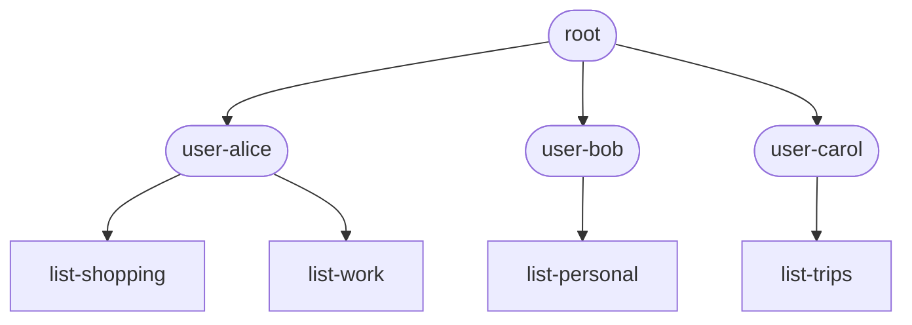
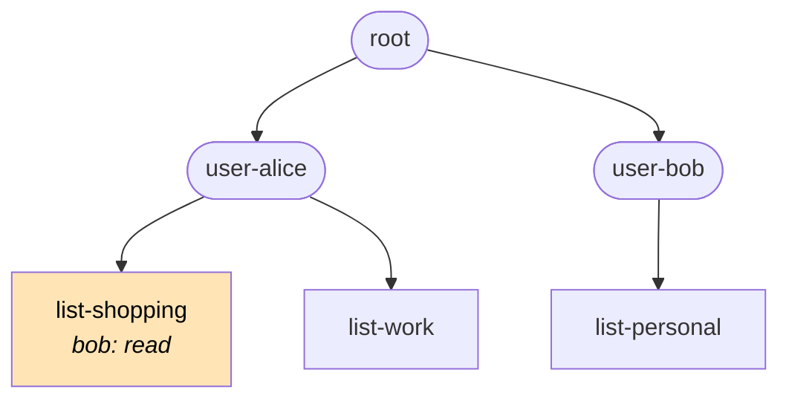
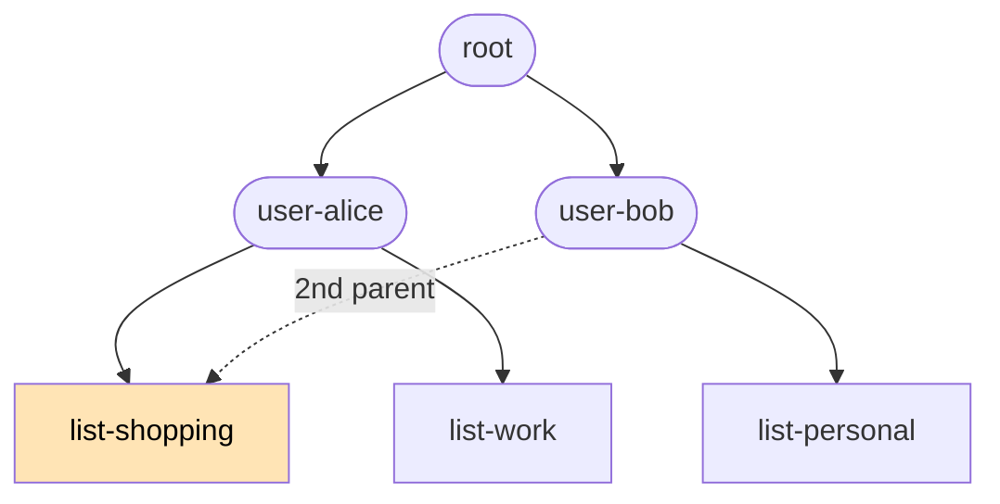
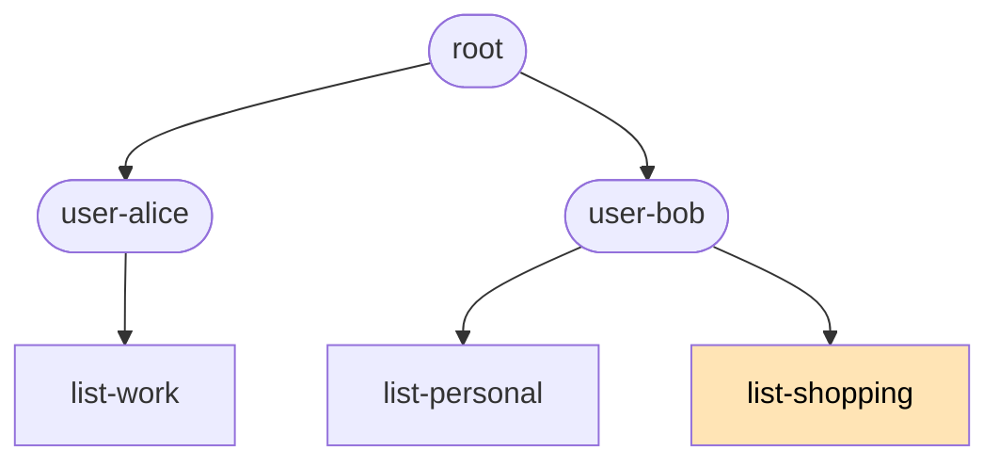

Resources are the heart of this system. They are both simple and powerful. You use them when developing your app in Nebula Studio. Your users use them when they interact with your app because they are the only place for them to store anything.

From your UI's perspective, each resource is a JavaScript object — fully supporting everything the structured-clone algorithm supports: `Map`, `Date`, cycles, etc. The framework handles the conversion to/from a storable representation transparently. You write to the resource the same way you'd write any in-memory JavaScript object, and the rich types round-trip correctly.

Each resource also carries a client-generated `eTag` (UUID) attached on every write — the eTag does double duty as both the optimistic-concurrency token and the idempotency key for safe retries. The shape of each resource type is defined by your ontology — a TypeScript `.d.ts`-style file that Nebula compiles into a runtime parser-validator. See [TS Runtime Parser-Validator](../ts-runtime-parser-validator/index.md) for how the ontology becomes the validator.

Think of Nebula's resource layer as a document database with inter-resource relationships, real-time sync, and structural access control:

- **Document database** — each resource is a JavaScript object addressed by `(type, id)`.
- **With references** — fields can point to other resources by id; the ontology declares which fields are references and to what type.
- **Real-time sync** — clients subscribe to resources they care about; mutations fan out to all subscribers automatically.
- **Structural access control** — every resource is attached at create time to a node in your app's **org/permission tree**. Each node has a per-user permissions table; permissions cascade additively from ancestors. See [Access control](#access-control) below.

## Addressing resources

Two encodings, isomorphic — same segments, different syntax per context.

**1. In Vue templates (JavaScript expressions):**

```html @skip-check
<span>{{ store.resources.todo['task-42'].value.title }}</span>
<span>{{ store.resources.todo[id].value.title }}</span>
```

Bracket notation handles any `resourceId` shape (hyphens, ULIDs, UUIDs). Dot notation works for identifier-safe IDs.

**2. In code (tuple at the top level):**

```js @skip-check
client.resources.subscribe('todo', 'task-42');   // returns a Disposable handle (not a Promise) — see api-reference
await client.resources.transaction({
  'task-42': { op: 'put', typeName: 'todo', value: { title: 'New title', /* ... */ } },
});
const snap = await client.resources.read('todo', 'task-42');
```

**3. REST (slash-delimited, coming soon):**

```
GET  /resources/todo/task-42
POST /resources/todo/task-42
```

`resourceType` and `resourceId` are restricted to `[A-Za-z0-9_-]` — no periods (would break path parsing), no slashes (would break URL parsing). ULIDs, UUIDs, and conventional slugs all fit.

### Reserved state-path prefixes

All paths below live on the Vue-reactive `store` (the alternate access point, `client`, is for method calls and non-reactive identity — see [Coding your UI § `store` vs `client`](./coding-your-ui.md#store-vs-client--what-goes-where)). Two top-level prefixes under `store` are framework-reserved:

- **`store.resources.*`** — synced resource snapshots, written by the framework on every server push. `store.resources.{type}.{id}.value` holds the resource value; `store.resources.{type}.{id}.meta` holds the eTag, change metadata, etc.
- **`store.lmz.*`** — everything else framework-owned. Today: connection state (`store.lmz.connection.state`, `store.lmz.connection.connected`, `store.lmz.connection.lastConnectedAt`) and the org/permission tree (`store.lmz.orgTree`, delivered on its own channel; mutate via `client.orgTree.*`). Future framework-meta paths land here too.

Every other top-level segment is yours. Common conventions:

- `store.ui.*` — transient UI state (modal open/closed, form drafts, conflict tracking, anything reactive but not synced)
- `store.app.*` — application-wide local state (active view, current user prefs, etc.)
- Anything else — completely free

The factory pre-seeds `store.ui` and `store.app` as empty objects (conveniences, not reserved — the framework never writes to them after seeding). Beyond that, the framework only touches `store.resources.*` and `store.lmz.*`. User-developers write to the rest however they want.

## Access control

Every resource is attached to a node in your app's **org/permission tree**. The attachment happens at create time: `OperationDescriptor.create` carries a `nodeId: number` field naming the node the new resource lives under. After creation, the attachment can be changed with `op: 'move'`.

### What "org" means here

"Org tree" pulls in two directions:

1. **Mimicking your organization's structure.** For an internal HR or project-management tool, the tree might literally mirror your business: company → divisions → teams → individuals. People in higher-up subtrees get grants that cascade to everything below.
2. **Organizing data for permissioning.** Equally common: the tree has nothing to do with your business and is just a way to group resources so permissions can be granted in bulk. A consumer SaaS app might use it to give every user their own subtree, with no real-world "org" anywhere in sight.

Both uses get the same mechanics. The "org" in "org tree" reads more as a verb (to organize) than a noun.

### Permissions table and resolution

Each node carries a per-user permissions table — `sub` (the subject claim from the user's JWT, a bare UUID minted by nebula-auth) → `'admin' | 'write' | 'read'`. Grants are matched by exact string equality against the JWT `sub`. Effective permission for `(sub, nodeId)` is the **highest grant found on any ancestor path** from the resource's attached node up to root.

```typescript @skip-check
// Conceptual — actual API surface lives on client.orgTree. Keys are bare-UUID
// JWT subs (aliceSub etc. shown as variables for readability).
node.permissions = new Map([
  [aliceSub, 'admin'],
  [bobSub,   'write'],
]);
```

Three properties follow:

- **Permissions cascade additively.** A grant on a parent applies to every descendant. Lower nodes can grant more, never less. To narrow access, attach the resource to a deeper node where only the right users have grants on the ancestors.
- **The whole tree — structure *and* the full permissions table — is universally visible.** Every connected client gets the entire tree at `store.lmz.orgTree.value`, including every node's grants (`sub → tier`). Visibility isn't restricted because the permission UX wants every client to resolve, locally, *who to ask*: climb from a node you can't reach to the nearest ancestor with an `admin` grant and request access from them — no server round-trip. Resource **values** are still gated by permission at every read and write; the **structure and the grant table** are universal.
  - **Grant keys are opaque user IDs** — `sub` is a bare UUID, not a name or email — so the table exposes *who-can-do-what by ID*, not by identity. Mapping a `sub` to a person needs a separate lookup the tree doesn't carry.
  - **Every node's `label`/`slug` is visible to every client** — the whole node set ships to everyone, not just nodes you can reach (it has to: requesting access to a node you *can't* reach means seeing what it is). So labels, not the opaque grant keys, are the real identity surface — a node labeled `user-alice` whose admin grant is some `sub` lets anyone deduce who that `sub` is. **Accepted known risk:** higher-permissioned users are discoverable, and the protection relied upon is **tenant segmentation** (members already share an organization). Apps that want to reduce it further can use opaque per-person slugs and render human names only to those who should see them — but that's optional hardening, not required.
  - **The `permissions` map shows DAG grants only — it is not the complete admin picture.** Galaxy- and Universe-level scope admins have effective admin on the whole tree, but that's a property of their JWT (`claims.access.admin`), not a node grant, so they do **not** appear in the map. Treat the map as "who was explicitly granted what," and check `claims.access.admin` separately for scope admins (see [Coding your UI § Gating admin-only UI](./coding-your-ui.md#gating-admin-only-ui)).
- **Permission checks run on every transaction.** The server resolves the effective permission for the calling user against each affected resource's attached node before applying any op. A failed check returns `{ kind: 'permission-denied' }` for that resource in the per-type [`onTransactionResourceResolution`](#per-resource-behavior--the-ontransactionresourceresolution-handler) handler. Tier by op: `create` needs `write` on the target `nodeId`; `put` / `delete` need `write` on the resource's attached node; `move` needs `write` on **both** the source and destination nodes; `read` / `subscribe` need `read` on the attached node.
- **Read permission is checked at subscribe time, not per fanout.** Revoking a subscriber's grant doesn't sever a live subscription instantly — it takes effect on their next reconnect / resubscribe or the next deploy (which clears subscriptions). Acceptable for the optimistic-UX model; instant per-fanout revocation is out of scope.

### Worked example: sharing in a todo-list app

Suppose you're building a todo app. Each user has many lists; some are private; some get shared with other users. The natural starting tree:



Alice has `admin` on `user-alice`; that grant cascades to both her lists and to every todo attached under them. Bob has `admin` on `user-bob` only — by default he can't see anything in Alice's subtree.

Now Alice wants to share `list-shopping` with Bob. There are **two ways** to express that — each illustrates a property of the underlying structure.

#### Approach 1: Grant a permission on the shared node — for limited-access sharing

This is the right approach when Alice wants to give Bob **limited** access — typically read-only. She grants `bob: read` (or `write` — her choice) on the `list-shopping` node:



Bob's effective permission on `list-shopping` is now exactly the tier Alice picked — independent of whatever rights he has on his own subtree. The list stays in Alice's subtree; Alice remains the owner; Bob has the narrow access she granted him.

**Use this when:**
- You want to share **read-only** — let someone view but not edit.
- You want to share `write` while keeping `admin` (control over deletion, sharing, etc.) to yourself.
- The relationship is asymmetric: one clear owner, one collaborator with limited rights.

**Tradeoff:** the shared list stays in the owner's subtree, so the sharee's UI has to surface it via a "shared with me" view that pulls from outside their natural subtree.

#### Approach 2: Add a second parent — for co-ownership

This is the right approach when Alice and Bob should be **true co-owners** of `list-shopping`: `user-bob` becomes a second parent of the list.

Adding a parent edge is an access grant in structural clothing — everyone with grants on or above the new parent gains cascaded access to the child's subtree — so `addEdge` requires `write` on the new parent **and `admin` on the child** (the same tier `setPermission` demands). Neither party holds both (Alice has no `write` on `user-bob`; Bob starts with no `admin` on the list), and that's the point: co-ownership takes both the owner's consent and the recipient's acceptance. The flow is a two-step share-accept:

1. **Alice offers** — grants Bob `admin` on the list (Approach 1 mechanics, at the top tier): `setPermission(listShoppingId, bobSub, 'admin')`.
2. **Bob accepts** — adds the edge into his own subtree: `addEdge(userBobNodeId, listShoppingId)`. He holds `write` on `user-bob` and, since step 1, `admin` on the list.
3. **Optional cleanup** — the direct grant is now redundant (Bob's `admin` on `user-bob` cascades to the list through the new edge): `revokePermission(listShoppingId, bobSub)` keeps the permissions table minimal.



After cleanup, no direct grant on `list-shopping` remains. Effective-permission resolution climbs **all** ancestor paths and takes the maximum: Bob has `admin` via `user-bob`, Alice via `user-alice`. **Both users have full admin over the list.**

The flexibility to give one node multiple parents is what makes the underlying structure technically a **DAG** (directed acyclic graph) rather than a strict tree. The "tree" in "org/permission tree" is a friendly shorthand; the actual graph type is a DAG, with all the extra modeling power that brings.

**Co-ownership is real, not nominal.** If Alice later "removes the list from her account" — which in UI terms means deleting her parent edge — the list doesn't disappear:



`list-shopping` still exists under `user-bob`, who retains full admin. Symmetric: if Bob removes his edge instead, Alice keeps full admin. **Either party can leave; the other keeps everything.**

**Use this when:**
- You want both parties to have the same rights — e.g., a shared household to-do list both partners can edit and reshare equally.
- You want either party to be able to leave the relationship without disrupting the other.
- You want the shared item to appear in the second user's natural subtree, with no "shared with me" framing.
- You want to give a whole group access by attaching a single edge — e.g., add `team-eng` as a second parent of every team project, and every member's grants on `team-eng` cascade in automatically.

**Tradeoffs:**
- You can't grant narrower-than-admin access this way. The sharee gets whatever they have on their own subtree, which is usually admin. For read-only sharing, Approach 1 is the right tool.
- Mental model is harder: the same node appears in two places.
- Cycles are still forbidden — if Alice tried to make `list-shopping` a parent of `user-bob`, the cycle detector at [dag-ops.ts](https://github.com/lumenize/lumenize/blob/main/apps/nebula/src/dag-ops.ts) would reject it.

#### When to use which

| Goal | Approach 1 (grant) | Approach 2 (second parent) |
|---|---|---|
| Read-only sharing | ✓ the right tool | ✗ — sharee gets full admin |
| Share `write` while keeping `admin` for yourself | ✓ the right tool | ✗ |
| True co-ownership (both have admin, either can leave) | awkward to express | ✓ the right tool |
| Either party can leave without taking the resource with them | ✗ — owner's delete is the resource's delete | ✓ — leaving = deleting only your edge |
| Resource appears in sharee's natural subtree | ✗ | ✓ |
| Grant to a whole group via a single edge | ✗ — per-resource grants | ✓ — one parent edge per resource |

The two approaches **compose freely** — a real app uses both. Grants for "show this list read-only to my accountant"; second-parent edges for "this shared household list belongs to all the roommates equally."

See [Coding your UI § Worked example: rendering the built-in tree](./coding-your-ui.md#worked-example-rendering-the-built-in-tree) for the client-side patterns that render this structure (including the **multi-parent rendering** case — a node with two parents shows up under each one in the tree view).

## Optimistic concurrency

### What's an eTag?

Every resource snapshot carries an `eTag` — a UUID generated by whichever client most recently wrote the resource. The eTag travels with the data into your local state at `store.resources.{type}.{id}.meta.eTag`. When your front end submits a transaction, it sends two things: the eTag of the snapshot it based its edit on (`eTag`), and a freshly-generated UUID for the new snapshot (`newETag`).

The server uses both:

- **Concurrency check** — if the current stored eTag matches your `eTag`, your write wins (and the new snapshot gets your `newETag`). If it doesn't, another client wrote first — your transaction conflicts and the resolver fires.
- **Idempotency** — if the current stored eTag matches your `newETag`, that means your prior transaction landed but you didn't get the response (network drop mid-flight, etc.) and now you're retrying. Server returns idempotent success rather than spuriously conflicting with your own prior write.

You never construct or compare eTags yourself. The framework reads the cached `eTag` from state when emitting a transaction, generates a fresh `newETag` via `crypto.randomUUID()`, and sends both to the server. Same UUID does both jobs — no separate idempotency-key field.

### Per-resource behavior — the `onTransactionResourceResolution` handler

Per-resource behavior is configured by registering a handler per resource type. The framework calls this handler once per resource per transaction with that resource's current `TransactionResourceResolution`. The handler does two jobs in one place — decide conflict resolutions, and react to terminal outcomes:

```js @skip-check
client.resources.onTransactionResourceResolution('todo', (rid, resolution) => {
  switch (resolution.kind) {
    // Non-terminal: handler returns a ConflictResolverVerdict.
    case 'conflict-pending':
      return { kind: 'use-server' };                  // example: server-wins (= framework default)

    // Terminal: handler return is ignored. React however you like.
    case 'committed':         /* navigate, clear draft */ break;
    case 'use-server':        /* server's value painted; default red flash fired */ break;
    case 'human-in-the-loop': /* stash for review-later UI */ break;
    case 'validation-failed': /* surface resolution.errors */ break;
    case 'permission-denied': /* show "not authorized" */ break;
    case 'retries-exhausted': /* show error */ break;
  }
});
```

**You don't need to register a handler.** The framework has sensible defaults:

- Committed writes get a `lumenize-commit-success` class (green outline animation) on bound elements for ~1 second.
- Reverted writes (`'use-server'`, `'validation-failed'`, `'permission-denied'`, `'retries-exhausted'`) get `lumenize-conflict-revert` (red outline animation).
- `'conflict-pending'` defaults to the server-wins verdict (`{ kind: 'use-server' }`) when no handler is registered.

```css @skip-check
.lumenize-commit-success {
  animation: flash-green 1s ease-out;
}
.lumenize-conflict-revert {
  animation: flash-red 1s ease-out;
}
@keyframes flash-green {
  0%   { outline: 2px solid var(--color-success); }
  100% { outline: 2px solid transparent; }
}
@keyframes flash-red {
  0%   { outline: 2px solid var(--color-error); }
  100% { outline: 2px solid transparent; }
}
```

Register a handler when you want to override or extend the defaults — typically to merge text fields differently than server-wins, to navigate on commit, to surface validation errors next to fields, or to stash conflicts for a review-later UI.

Three conflict verdicts cover the `'conflict-pending'` branch. Each example below shows the minimum handler body needed; only the `case 'conflict-pending':` arm differs.

#### `'use-server'` verdict (the framework default — server wins)

No code needed. Without a handler (or with one that returns nothing from `'conflict-pending'`), the framework applies `'use-server'`: the user's local edit gets replaced with the server's authoritative value, and the `lumenize-conflict-revert` flash fires on bound elements.

The flash signals "your input was reverted" without any modal or prompt. Use the default for fields where the data race is rare and the cost of the user re-typing is low (enums, booleans, IDs, short labels).

#### `'use-this'` verdict — automatic merge

Return `{ kind: 'use-this', value: merged }` and the framework submits a new transaction at the server's current eTag with your merged value. Use for fields where the right merge can be computed without asking the user.

```js @skip-check
client.resources.onTransactionResourceResolution('todo', (rid, resolution) => {
  if (resolution.kind === 'conflict-pending') {
    const { local, server, base } = resolution;
    return {
      kind: 'use-this',
      value: {
        title:       local.value.title,                                                      // mine wins (short string)
        status:      server.value.status,                                                    // theirs wins (enum)
        description: textMerge(server.value.description, local.value.description, base.value.description),  // base = common ancestor (NOT server)
        assignees:   [...new Set([...local.value.assignees, ...server.value.assignees])],    // set-union by hand
      },
    };
  }
});
```

If the re-submit *also* conflicts (another client wrote again in the meantime), the handler fires again with `'conflict-pending'` and a fresh server snapshot. The chain is bounded by `maxRetries` (default 5); on cap, the resource lands at `'retries-exhausted'`.

Per-type or per-call override:

```js @skip-check
client.resources.onTransactionResourceResolution('todo', handler, { maxRetries: 10 });
// or per-call — a map keyed by resourceId:
await client.resources.transaction(ops, { onTransactionResourceResolution: { 'task-42': handler }, maxRetries: 3 });
```

The per-call override is a **map keyed by `resourceId`**: each entry **layers in front of** its own resource's per-type handler (it does not replace it), and any resource not in the map falls through to its per-type handler automatically — so a per-call handler can't shadow a sibling it didn't name. See [API reference § Precedence](./api-reference.md#resourcesontransactionresourceresolution).

#### `'use-this'` verdict — async modal

Same verdict, async handler. Show a `<dialog>`, wait for the user's choice, return the verdict. The transaction queue parks while the handler awaits; when it resolves, the framework submits the new transaction.

Register the handler once in `nebula.ts` (after the factory call); it stashes both versions on the reactive store so the modal template can read them declaratively.

```typescript @skip-check
// nebula.ts (continuing from the bootstrap example — `client`, `store` already created)
client.resources.onTransactionResourceResolution('todo', async (rid, resolution) => {
  if (resolution.kind === 'conflict-pending') {
    const { local, server } = resolution;
    store.ui.conflict = { local, server };

    const modal = document.getElementById('conflict-modal') as HTMLDialogElement;
    const choice = await new Promise<string>((resolve) => {
      modal.addEventListener('close', () => resolve(modal.returnValue), { once: true });
      modal.showModal();
    });
    store.ui.conflict = undefined;

    return choice === 'mine'
      ? { kind: 'use-this', value: local.value }
      : { kind: 'use-server' };
  }
});
```

Put the `<dialog>` once in your root component's template (typically `App.vue`):

```vue @skip-check
<!-- App.vue — shown only the modal fragment; the rest of App.vue is your UI. -->
<template>
  <!-- ...your other markup... -->
  <dialog id="conflict-modal" class="modal">
    <form method="dialog" class="modal-box">
      <h3 class="font-bold text-lg">Someone else edited this</h3>
      <div class="mt-4 space-y-2">
        <p><strong>Your version:</strong> {{ store.ui.conflict?.local?.value?.title }}</p>
        <p><strong>Server's version:</strong> {{ store.ui.conflict?.server?.value?.title }}</p>
      </div>
      <div class="modal-action">
        <button value="mine" class="btn btn-primary">Keep mine</button>
        <button value="theirs" class="btn">Use server's</button>
      </div>
    </form>
  </dialog>
</template>
```

Stashing the conflict on the reactive `store` lets the modal template read it declaratively — closure variables would force imperative DOM updates. The `store.ui.*` prefix isn't synced; it's local-only transient state, separate from `store.resources.*`.

This resource's transaction queue parks while the modal is open. There's no artificial timeout on how long the modal can stay open — if the user takes five minutes to decide, that's fine. While the modal is open, the user can keep editing — writes to *other* resources flow through their own per-resource queues unaffected; only further writes to *this same* resource buffer behind the parked transaction (and re-submit on its resulting eTag).

If the new transaction *also* conflicts (someone else wrote again between the user picking and the submission landing), the handler fires again with `'conflict-pending'` and the latest server snapshot. The transaction's outcome chain stays pending across all retries.

#### `'human-in-the-loop'` verdict (non-blocking — defer to the app)

When you don't want the transaction queue parked while a conflict is pending — the user is mid-edit elsewhere, the conflict isn't urgent — return `{ kind: 'human-in-the-loop' }` and the framework hands off entirely:

- That resource's `TransactionResourceResolution` becomes `{ kind: 'human-in-the-loop', snapshot }` (handler fires again with the terminal outcome).
- Optimistic local state stays painted (the user keeps seeing what they typed).
- No new transaction submitted by the framework.
- Transaction queue unblocks immediately; subsequent writes flow without waiting.

Your app stashes the conflict somewhere and surfaces it on its own schedule. Typical pattern: a banner that shows pending conflicts, the user clicks "Review" when they're ready, your code walks the stash and submits resolution transactions.

```typescript @skip-check
// nebula.ts (handler runs once at module load; alongside the factory call)
client.resources.onTransactionResourceResolution('document', (rid, resolution) => {
  switch (resolution.kind) {
    case 'conflict-pending':
      // Stash the conflict for later review.
      if (!store.app.conflicts) store.app.conflicts = {};
      store.app.conflicts[resolution.server.meta.eTag] = {
        resourceType: 'document',
        resourceId: rid,
        local: resolution.local,
        server: resolution.server,
      };
      return { kind: 'human-in-the-loop' };
    case 'committed':
      // The eventual review-later submission committed — clear this conflict.
      // (Match by some app-defined key; here we clear all eTags pointing at rid.)
      for (const eTag of Object.keys(store.app.conflicts ?? {})) {
        if (store.app.conflicts[eTag].resourceId === rid) {
          delete store.app.conflicts[eTag];
        }
      }
      break;
  }
});
```

```vue @skip-check
<!-- ConflictBanner.vue (or just folded into App.vue) -->
<script setup lang="ts">
import { store, client } from './nebula';
import { showYourReviewUI } from './your-review-ui';  // app-defined

async function reviewConflicts() {
  const conflicts = store.app.conflicts ?? {};

  // Walk each conflict, collect the user's chosen value into one batch.
  // NOTE: we pass `eTag` EXPLICITLY (skipping the framework's auto-derive)
  // because the right baseline here is the server snapshot at conflict-stash
  // time, not the current local store eTag (which may have moved on since).
  // This is the canonical case for explicit eTag override; see
  // api-reference.md § Explicit eTag override.
  const ops: Record<string, { op: 'put'; typeName: string; eTag: string; value: unknown }> = {};
  for (const [, conflict] of Object.entries(conflicts)) {
    const choice = await showYourReviewUI(conflict);
    ops[conflict.resourceId] = {
      op: 'put',
      typeName: conflict.resourceType,
      eTag: conflict.server.meta.eTag,                  // stashed baseline, not auto-derived
      value: choice,
    };
  }

  // Submit all resolutions as one atomic transaction. The per-type handler
  // registered in nebula.ts fires per resource — clears the stash on
  // 'committed', re-stashes on a re-conflict (returns 'human-in-the-loop' again).
  await client.resources.transaction(ops);
  // Nothing to inspect here unless the transaction-wide outcome is
  // infrastructure-error / timeout / ontology-stale (handled separately).
}
</script>

<template>
  <div
    v-if="Object.keys(store.app.conflicts ?? {}).length > 0"
    class="alert alert-warning"
  >
    {{ Object.keys(store.app.conflicts).length }} pending conflicts.
    <button @click="reviewConflicts" class="btn btn-sm">Review</button>
  </div>
</template>
```

The handler is the single point of truth for per-resource state — conflicts stashed on entry, cleared on commit. The await-site code doesn't need to inspect per-resource outcomes; the handler already did.

#### When to use which verdict

- **`'use-server'`** — most fields most of the time. Safe default.
- **`'use-this'` (sync)** — automatic merge per field (text-merge, set-union, last-write-wins per field, etc.).
- **`'use-this'` (async)** — user must pick *right now*, framework handles submission. Modal-style UX. The most common choice for "give the user agency on a conflict."
- **`'human-in-the-loop'`** — conflicts can be deferred. Banner + review-later UX. The user keeps working uninterrupted.

#### Text fields specifically — don't leave the default

For any field a user is actively typing into (long-form text, descriptions, comments, document bodies), the framework-default `'use-server'` is the wrong choice. Here's why:

1. The user is typing into `<input v-model="store.resources.doc[id].value.body">`. Each keystroke fires an optimistic local update; the synced-state middleware debounces transaction submission.
2. While the user is mid-sentence, **another client commits a write to the same resource.** The server broadcasts the new snapshot — but the synced-state middleware **holds** the incoming snapshot while this resource has pending optimistic writes, so the input doesn't snap mid-keystroke.
3. The debounced transaction then arrives at the server with the now-stale eTag → conflict → the resolver sees the local state, the buffered server snapshot, and `base`.
4. Under the default `'use-server'`, the user's typing is rolled back to the other client's value **at resolution time** — held off mid-keystroke, but still lost.

This is the data race; debouncing and fanout-holding narrow it but don't resolve it. The reliable fix is text-merge. Annotating the field [`@longform`](./ontology.md#annotations) auto-registers exactly the handler below — most apps never write it by hand. Write your own only when you need custom merge logic; here's what the auto-registered handler does:

```js @skip-check
import { textMerge } from '@lumenize/nebula/frontend';   // 3-way (LCS-based) merge helper

client.resources.onTransactionResourceResolution('doc', (rid, resolution) => {
  if (resolution.kind === 'conflict-pending') {
    return {
      kind: 'use-this',
      value: {
        ...resolution.server.value,                                          // start from server snapshot (keeps its other-field changes)
        body: textMerge(resolution.server.value.body, resolution.local.value.body, resolution.base.value.body),  // base = common ancestor
      },
    };
  }
});
```

For typing-into-text-fields, **custom merge is almost always the right answer**, not `'use-server'`. The framework default exists because it's safe for non-text fields (enums, booleans, IDs) and because every resource type needs *some* default. Register an explicit handler for text-bearing types.

What "right merge" looks like depends on the data:
- **Short single-line text** (titles, labels): typical pattern is `local wins` — short strings rarely have meaningful concurrent edits worth merging. `value: { ...server.value, title: local.value.title }`.
- **Long-form text** (descriptions, comments, document bodies): three-way merge — the shipped `textMerge` helper (LCS-based). It preserves non-overlapping edits but can garble overlapping ones — true conflict-free collaborative editing needs a CRDT (out of scope for now).
- **Structured content** (markdown, code): three-way merge at the line level, OR fall back to async `'use-this'` with a modal showing both versions.

Set fields (assignees, tags) typically want set-union; enums want last-write-wins (server is fine); IDs want last-write-wins (server is fine).

### Awaiting `transaction()` at the call-site

**Three nouns, one `.kind` discriminant — anchor them once:** `TransactionOutcome` = the whole transaction's fate (what `await transaction()` resolves with); `TransactionResourceResolution` = one resource's fate within it (what the per-type handler receives); `ConflictResolverVerdict` = what you *return* from a `'conflict-pending'` resolution to steer it. Outcome and Resolution are reported *to* you; Verdict is your reply.

Two patterns, depending on whether you call `transaction()` yourself.

**Fire-and-forget** — when `v-model` triggers a transaction via the synced-state middleware, your code never calls `transaction()` directly. The framework owns the round-trip: per-type handler reacts to each resource, `onShouldRefreshUI` handles ontology-staleness, optimistic state paints regardless. No `await` to write, no `switch` to add.

**Explicit transactions** — when you call `client.resources.transaction(ops)` yourself (programmatic save, batch resolution, action handlers), `await` is right when you need to react to transaction-wide failures (infrastructure, timeout, ontology-stale). **Per-resource outcomes are NOT handled here** — they're handled in the per-type [`onTransactionResourceResolution`](./api-reference.md#resourcesontransactionresourceresolution) handler.

`transaction()` **always resolves** with a `TransactionOutcome` — never rejects. Infrastructure failures (network drops, mesh crashes) come back as `{ kind: 'infrastructure-error', error }`. The top-level shape has five kinds; the await-site's one decision — "do I resubmit?" — is answered by `outcome.retryable`:

```js @skip-check
const outcome = await client.resources.transaction(ops);
switch (outcome.kind) {
  case 'committed':
    // Every op landed (after any below-the-bucket conflict resolution). The per-type
    // handler has already fired for each resource (navigation, draft-clearing,
    // validation-error display, etc.). outcome.resources has the per-resource breakdown
    // if you need it, but most callers don't.
    break;

  case 'rejected':
    // The server processed it but nothing committed, for a per-op reason. outcome.retryable
    // is the resubmit verdict: an exhausted conflict → true; permission/validation → false.
    // The per-type handler has already surfaced each op's reason from outcome.resources
    // ('permission-denied' → request access via the orgTree, 'validation-failed' → fix input,
    // 'human-in-the-loop' → optimistic paint stays; the app owns the follow-up).
    if (outcome.retryable) showToast('Save problem — retry?');
    break;

  case 'timeout':
  case 'infrastructure-error':
    // Transaction-wide failure; optimistic state rolled back (connection-gated — a mere
    // disconnect never lands here). An idempotent resubmit (same newETag) can land.
    showToast('Connection problem — retry?');
    if (outcome.kind === 'infrastructure-error') console.error(outcome.error);
    break;

  case 'ontology-stale':
    // The client's app version is stale; onShouldRefreshUI usually fires (page reload).
    // Optimistic state untouched. Nothing extra to do here.
    break;
}
```

For most form-save flows where the per-type handler does the work, the entire `switch` can collapse to:

```js @skip-check
const outcome = await client.resources.transaction(ops);
if (outcome.kind !== 'committed') {
  showToast('Save problem — retry?');
}
```

The per-type handler has already done navigation / draft-clearing on `'committed'` and surfaced validation errors / not-authorized messages on `'validation-failed'` / `'permission-denied'`. The await-site is only on the hook for transaction-wide failures.

If you need aggregate decisions at the await-site (e.g., "only navigate if EVERY resource committed, not just some"), iterate `outcome.resources`:

```js @skip-check
if (outcome.kind === 'committed') {
  const allCommitted = Object.values(outcome.resources)
    .every(r => r.kind === 'committed');   // an op may have resolved to 'use-server' — committed, but your value was reverted
  if (allCommitted) {
    store.app.activeView = 'list';
  }
}
```

Why discriminated unions over `try`/`catch`? Studio-generated UIs are LLM-authored. Switching on every variant forces every terminal state to be handled explicitly — a bare `try`/`catch` would swallow the discrimination. Several per-resource outcomes (`'use-server'`, `'human-in-the-loop'`) are *normal* terminal states, not errors; conflating them with "something broke" loses signal. Including infrastructure failures in the resolution lets the LLM-authored consumer write one switch instead of remembering that one code path uses exceptions.

### Custom flash visuals

:::note[Deferred to v4]

DOM flash ships in v4 — 5.3.7 has no element-flash mechanism (it needs a binding-discovery step Vue doesn't provide for free; a compiler-injected directive is the leading v4 candidate). The `flashClass` / `flashDuration` options below are reserved so the API stays stable; they have no effect yet.

:::

Both default classes — `lumenize-commit-success` (green) on commit and `lumenize-conflict-revert` (red) on rollback — are configurable per type (once flash lands):

```js @skip-check
client.resources.onTransactionResourceResolution('todo', handler, {
  flashClass: {
    committed: 'my-success-flash',     // or null to disable framework flash on commit
    rolledBack: 'my-warn-flash',       // or null to disable framework flash on rollback
  },
  flashDuration: 1500,                 // ms
});
```

For richer UX (apply CSS to a parent, fire a JS animation, combine flash with an alert), the handler's `'conflict-pending'` branch receives a `context.bindings` map of DOM elements bound to each path under the resource:

```js @skip-check
client.resources.onTransactionResourceResolution('todo', (rid, resolution) => {
  if (resolution.kind === 'conflict-pending') {
    // resolution.context.bindings is Map<path, HTMLElement[]>
    // (deferred-post-5.3.7 — empty Map in 5.3.7; see api-reference.md § Handler bindings)
    resolution.context.bindings.forEach((els, path) => {
      els.forEach(el => el.closest('.card')?.classList.add('alert-conflict'));
    });
    return { kind: 'use-server' };
  }
});
```

The default flash still fires unless `flashClass: null` was set at registration.
