# Architecture & Failure Modes

This document provides detailed flow diagrams for all scenarios in `@lumenize/proxy-fetch`, including happy paths, failure modes, and race conditions.

## Core Architecture Principles

1. **Origin DO (user's DO) = Complete Control**: Your DO decides how to handle errors, if/when to retry, manages alarms, etc.
2. **Executor (WorkerEntrypoint) = Performs Fetch**: FetchExecutor makes the actual fetch to the 3rd party and reports back directly to Origin DO
3. **@lumenize/alarms = Timeout Watchdog**: Built-in alarm system monitors timeouts and delivers timeout errors if worker doesn't respond
4. **No result storage in Origin DO**: Results are delivered directly via continuation chains - no storage for deduplication (performance/simplicity trade-off)
5. **Type-based safety**: In rare race conditions (see Race 1 below), handler may be called twice - first with `ResponseSync` (success), then with `TimeoutError`. Handlers with early error returns are naturally safe.
6. **Timeout ambiguity**: A timeout error doesn't mean the fetch didn't execute - it may have partially succeeded

## What Handler Receives (Precise Categories)

| What Handler Receives | Type | From | Meaning |
|---------------------|------|------|---------|
| Network error | `Error` | Executor | External API unreachable (ECONNREFUSED, DNS, etc. failure) |
| Abort/timeout error | `Error` | Executor | Fetch took too long (AbortController fired) |
| Parsing error | `Error` | Executor | ResponseSync couldn't be deserialized |
| **Delivery timeout** | `Error` | **Alarm** | ⚠️ **Ambiguous state. Fetch may have all/partially occured!** |
| Success response | `ResponseSync` | Executor | HTTP 2xx (use `.json()`, `.text()`, or `.arrayBuffer()` - no await!) |
| HTTP error | `ResponseSync` | Executor | HTTP 4xx/5xx (use `.json()`, `.text()`, or `.arrayBuffer()` - no await!) |

**Key Distinctions**: 
- If Origin DO receives an `Error`, check the message:
  - Contains "delivery timeout" → From Alarm (ambiguous state - check external system!)
  - Anything else → From Executor (fetch definitely failed)
- If Origin DO receives a `ResponseSync`, use **synchronous body methods**: `.json()`, `.text()`, `.arrayBuffer()` (no await!)

## Why ResponseSync?

Your handlers are **synchronous** (no `async`), so they can't do `await response.json()`. `ResponseSync` provides **synchronous body access methods** because the body has already been read:

```typescript @skip-check
// ❌ This won't work - handlers are sync!
handleResult(result: ResponseSync | Error) {
  if (!(result instanceof Error)) {
    const data = await result.json(); // ERROR: Can't await in sync function
  }
}

// ✅ This works - synchronous body methods!
handleResult(result: ResponseSync | Error) {
  if (!(result instanceof Error)) {
    const data = result.json();        // Synchronous - no await!
    const text = result.text();        // Synchronous - no await!
    const buffer = result.arrayBuffer(); // Synchronous - no await!
    
    console.log('User:', data.name);
  }
}
```

**How it works**:
1. Executor calls `fetch()` and gets a real `Response`
2. Executor converts to `ResponseSync`: `await ResponseSync.fromResponse(response)`
   - This reads the body once (based on Content-Type)
   - Stores it in serializable format (string, ArrayBuffer, or plain object)
3. Origin DO's synchronous handler receives `ResponseSync`
4. Handler calls `.json()`, `.text()`, or `.arrayBuffer()` **without await**

## Basic Usage

```typescript @skip-check
import '@lumenize/proxy-fetch';  // Registers as NADIS service

class MyDO extends LumenizeBase {
  fetchUserData(userId: string) {
    // Fire and forget - result comes to handler later
    const reqId = this.svc.proxyFetch(  // No `await`
      `https://api.example.com/users/${userId}`,
      this.ctn().handleResult(/* result */)  // result implicitly last-parameter
    );
    
    // Returns immediately with reqId
    // Result arrives later to handler
    return reqId;
  }
  
  handleResult(result: ResponseSync | Error) {
    if (result instanceof Error) {
      if (result.message.includes('delivery timeout')) {
        // From Alarm - check external system state!
        console.error('Timeout - fetch may have succeeded:', result);
      } else {
        // From Executor - fetch definitely failed
        console.error('Fetch failed:', result);
      }
    } else {
      // ResponseSync - synchronous body access!
      if (result.ok) {
        const data = result.json(); // Synchronous - no await!
        console.log('Success:', result.status, data);
      } else {
        console.error('HTTP error:', result.status);
        const errorText = result.text(); // Also synchronous
        console.error('Error body:', errorText);
      }
    }
  }
}
```

## Alternative Syntax for Handler

The default is for the result to be implicitly added as the last parameter, but we got you
covered if you prefer a more explicit way to know where in the call signature the result 
will be delivered:

```typescript @skip-check
const reqId = this.svc.proxyFetch(  // No `await`
  `https://api.example.com/users/${userId}`,
  this.ctn().handleResult(this.ctn().$result)
);
```

## Providing Extra Context to Handler on Callback

Your handler signatures can be whatever you want. This is particularly useful if you want
the handler to have some extra context/data when it later receives the result.

You can do this with the last-parameter convention:

```typescript @skip-check
const reqId = this.svc.proxyFetch(  // No `await`
  `https://api.example.com/users/${userId}`,
  this.ctn().handleResult({ userId }, /* result */)
);
```

Or with the explicit $result marker syntax. The nice thing about the marker syntax in
this case is that you can put the result into any parameter slot you wish. So here the
result is the first parameter instead of the implicit last:

```typescript @skip-check
const reqId = this.svc.proxyFetch(  // No `await`
  `https://api.example.com/users/${userId}`,
  this.ctn().handleResult(this.ctn().$result, { userId })
);
```

## Advanced Options

You can customize the behavior by passing options:

```typescript @skip-check
const reqId = this.svc.proxyFetch(
  'https://api.example.com/users',
  this.ctn().handleResult(/* result */),
  {
    timeout: 60000,  // 60 second timeout for external fetch (default: 30000)
    executorBinding: 'FETCH_EXECUTOR',  // Custom executor binding
  }
);
```

## Origin DO-Controlled Retry Logic

Since the Origin DO decides retry behavior, here's a fully-functional example.

**Important**: Design your handlers to be **idempotent** (safe to call multiple times). In rare race conditions (see Race 1 below), a handler may be called twice with different results. Use idempotency keys, upserts, or duplicate detection as appropriate for your use case.

```typescript @skip-check
class MyDO extends LumenizeBase {
  fetchUserWithRetry(userId: string, maxRetries = 3) {
    // Store retry metadata
    const metadata = {
      url: `https://api.example.com/users/${userId}`,
      attempt: 0,
      maxRetries
    };
    
    this.svc.proxyFetch(
      metadata.url,
      this.ctn().handleRetryableResult(metadata, /* result */)
      // Result implicitly goes as last parameter
    );
  }
  
  handleRetryableResult(
    metadata: { url: string; attempt: number; maxRetries: number },
    result: ResponseSync | Error  // Result comes last (implicit)
  ) {
    if (result instanceof Error) {
      // Network error or delivery timeout - consider retry
      if (metadata.attempt < metadata.maxRetries) {
        console.log(`Attempt ${metadata.attempt + 1} failed, retrying...`);
        
        // Retry by making another proxyFetch call
        this.svc.proxyFetch(
          metadata.url,
          this.ctn().handleRetryableResult({
            ...metadata,
            attempt: metadata.attempt + 1
          })
        );
      } else {
        // Max retries exhausted
        console.error('All retries exhausted:', result);
      }
    } else if (!result.ok && result.status >= 500) {
      // 5xx error - maybe retry
      if (metadata.attempt < metadata.maxRetries) {
        console.log(`5xx error, retrying...`);
        
        this.svc.proxyFetch(
          metadata.url,
          this.ctn().handleRetryableResult({
            ...metadata,
            attempt: metadata.attempt + 1
          })
        );
      } else {
        console.error('Max retries exhausted on 5xx:', result);
      }
    } else if (result.status === 404) {
      // 404 - don't retry, resource doesn't exist
      console.log('Resource not found, not retrying');
    } else {
      // Success!
      console.log('Success:', result.status);
    }
  }
}
```

## Happy Path

### Version 1: Single Origin DO Participant (Simplified)

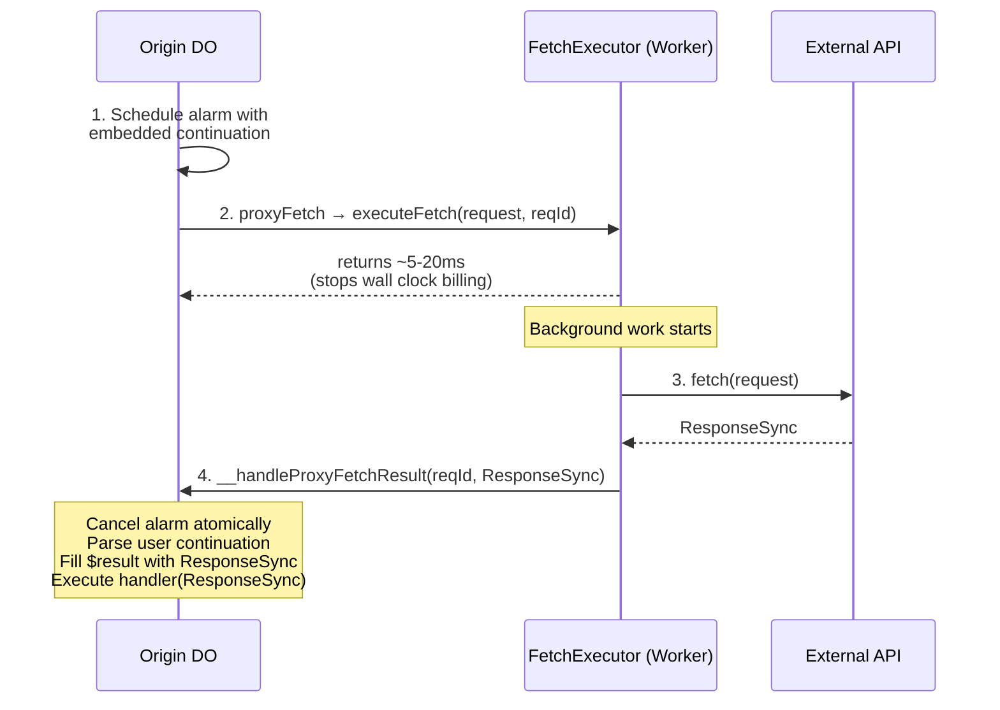

### Version 2: Two Origin DO Participants (Detailed Timing)

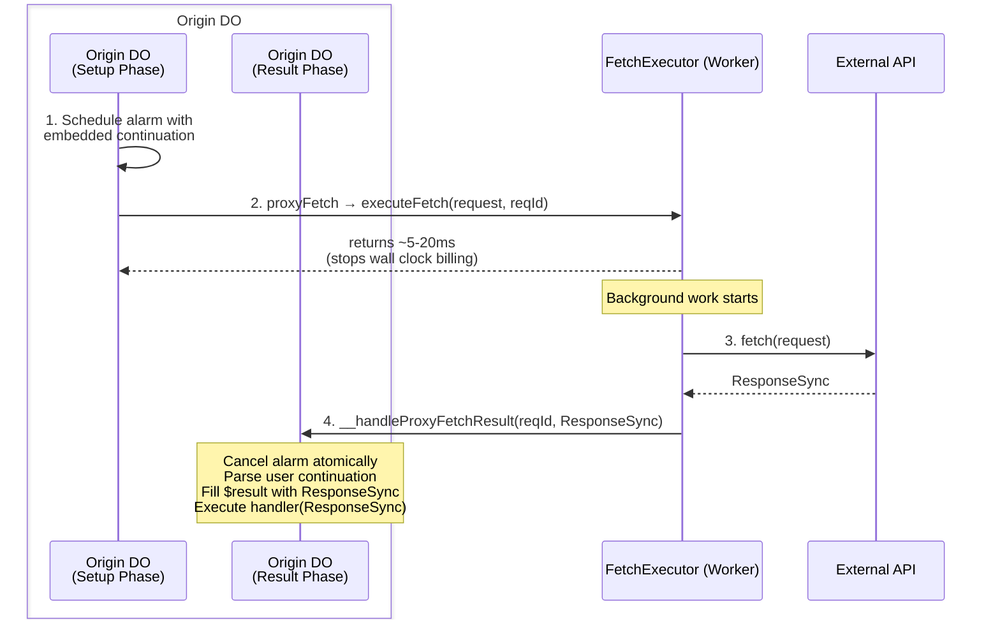

Total Timeline: 80ms-30s
Blocking Time: microseconds
**Wall Clock Billing: 5-20ms**

## Failure Scenarios

### Scenario 1: Network Error (Executor Detects)

#### Version 1: Single Origin DO Participant

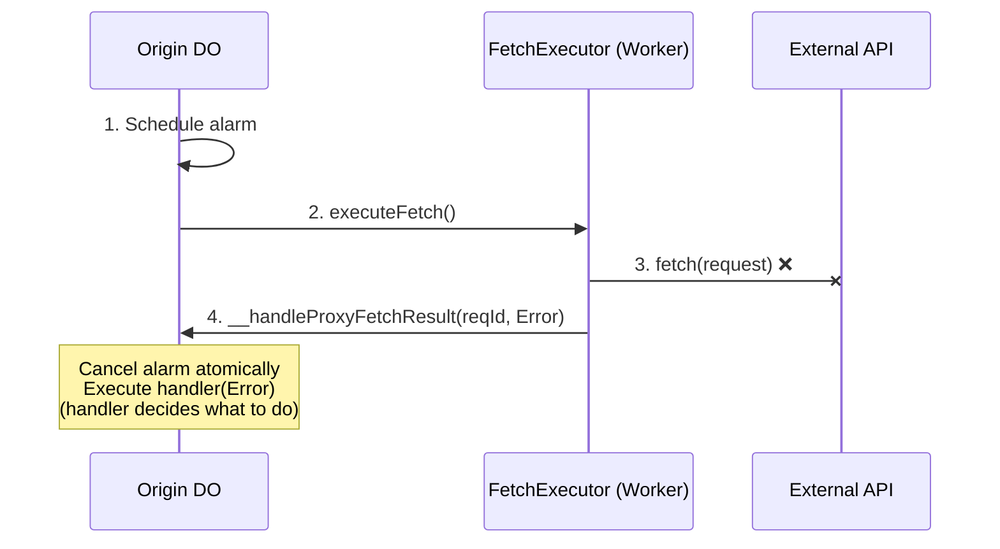

#### Version 2: Two Origin DO Participants

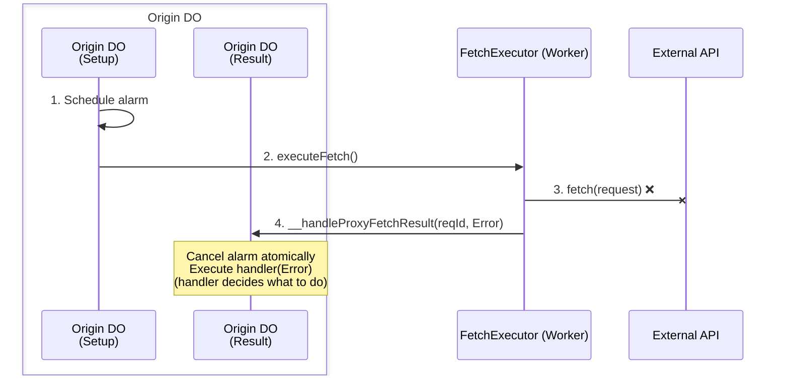

**Key**: Origin DO's alarm is cancelled because the executor delivered a result. Origin DO handler decides whether to retry.

### Scenario 2: HTTP Error (5xx, 4xx)

#### Version 1: Single Origin DO Participant

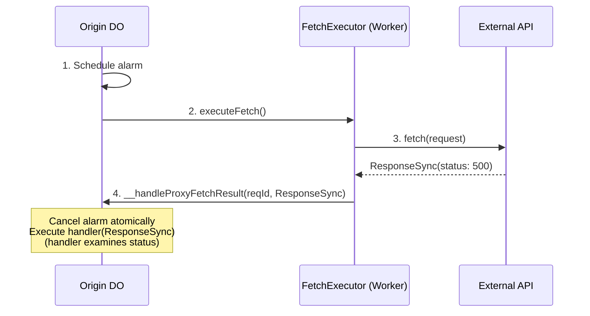

#### Version 2: Two Origin DO Participants

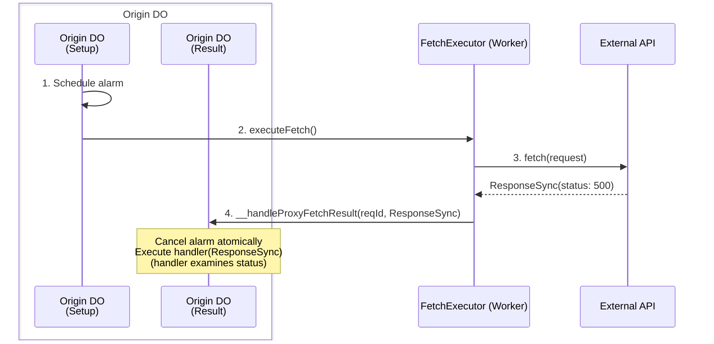

**Key**: HTTP errors are delivered as `ResponseSync` objects (not `Error`). Origin DO examines `response.ok`, `response.status`, etc. and decides how to handle.

### Scenario 3: Fetch Timeout (AbortController)

#### Version 1: Single Origin DO Participant

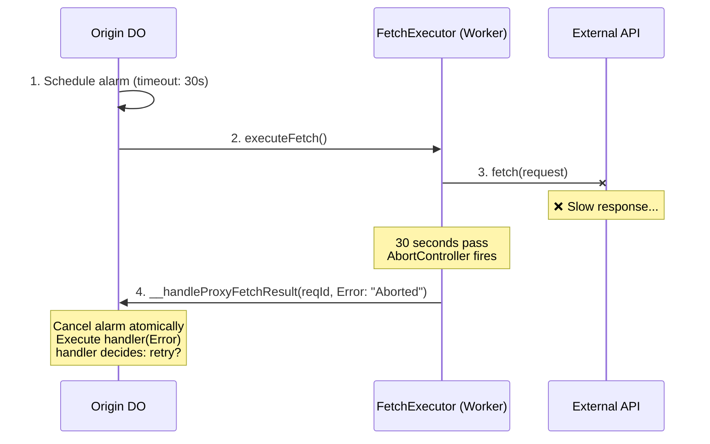

#### Version 2: Two Origin DO Participants

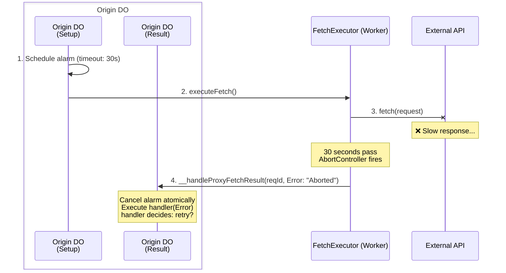

### Scenario 4: Delivery Timeout (Alarm Fires)

#### Version 1: Single Origin DO Participant

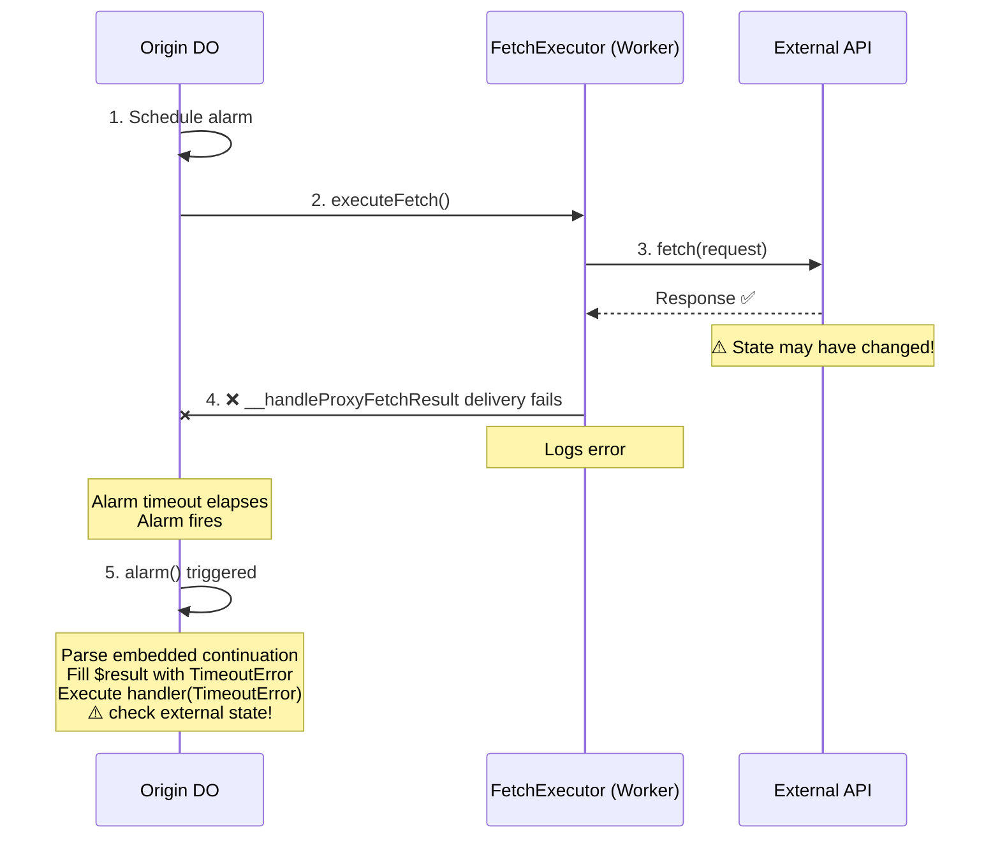

#### Version 2: Two Origin DO Participants

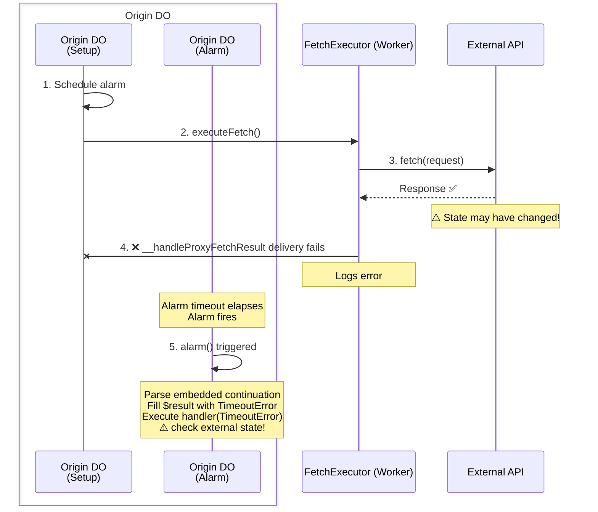

**Critical**: The timeout error message indicates ambiguity:
```typescript @skip-check
new Error(
  `Fetch delivery timeout: Unable to confirm result delivery. ` +
  `WARNING: The external fetch may have fully/partially executed and ` +
  `modified state on the 3rd party system. Check the external ` +
  `system's state before retrying to avoid duplicate operations.`
)
```

**Key**: The alarm fires and delivers a timeout error. Origin DO must decide whether to:
- Check external system state (idempotent GET)
- Retry if operation is idempotent (PUT with idempotency key)
- NOT retry if best effort is all that is required

Note, the network failure here is illustrative. The failure could be anywhere along the 
path back including failure of the FetchExecutor during or immediately after it receives 
the Response but before it can deliver it to Origin DO's handler.

## Race Conditions

### Race 1: ResponseSync, then Timeout (POSSIBLE - Handler Called Twice)

This race is extremely unlikely but IS possible if:
- Result delivery to Origin DO succeeds, BUT
- Origin DO crashes/restarts before cancelling the alarm

#### Version 1: Single Origin DO Participant

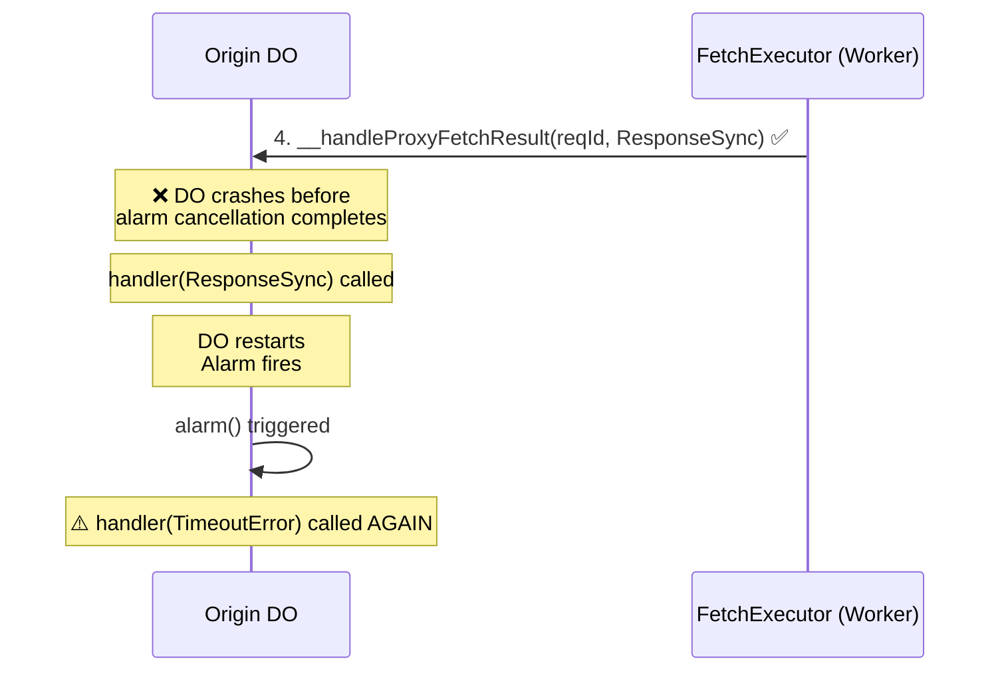

#### Version 2: Two Origin DO Participants

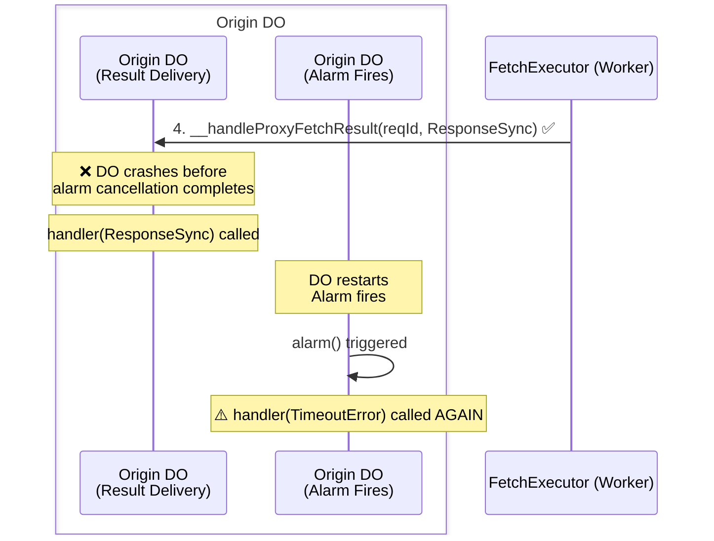

**Critical**: In this race, the handler is called **twice**:
1. First with `ResponseSync` (actual result from fetch)
2. Then with `TimeoutError` (alarm fired before cancellation persisted)

**Natural Protection**: Most handlers are **already safe** because of type differences:

```typescript @skip-check
handleResult(result: ResponseSync | Error) {
  if (result instanceof Error) {
    console.warn('Timeout - operation may have succeeded');
    return; // Early return - no destructive action
  }
  
  // Process success - only happens once (first call)
  const data = result.json();
  this.saveToDatabase(data);
}
```

This pattern is safe because:
- ✅ First call (ResponseSync) → processes data normally
- ✅ Second call (TimeoutError) → early return, no side effects
- ✅ Destructive operations only happen on success path

**Only risky if** your handler performs destructive actions on BOTH success AND error:

```typescript @skip-check
// ❌ UNSAFE: Destructive actions in both branches
handleResult(result: ResponseSync | Error) {
  if (result instanceof Error) {
    this.incrementErrorCounter(); // ❌ Happens on second call
    this.sendErrorEmail();        // ❌ Duplicate email
  } else {
    this.saveToDatabase(result.json()); // ✅ Only first call
  }
}
```

**Best practices for error handling**:
- Log errors (safe - duplicate logs are minor)
- Avoid destructive error actions (counters, alerts, database writes)
- Use idempotency keys if you must perform destructive error handling
- Check if error contains "delivery timeout" (second call) vs other errors (first call)

**Why no automatic deduplication?** The current architecture doesn't store pending fetches in Origin DO (for performance and simplicity). This race is extremely rare in practice, and type-based natural protection handles most cases safely.

### Race 2: Timeout, then ResponseSync (IMPOSSIBLE)

This race cannot happen in the current design:

#### Version 1: Single Origin DO Participant

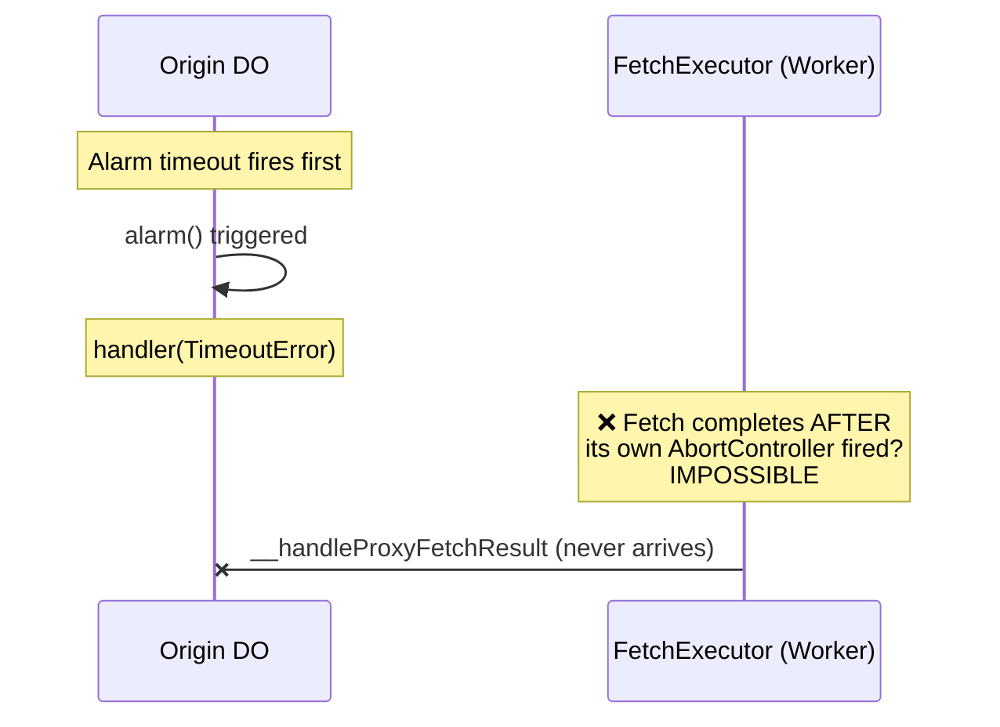

#### Version 2: Two Origin DO Participants

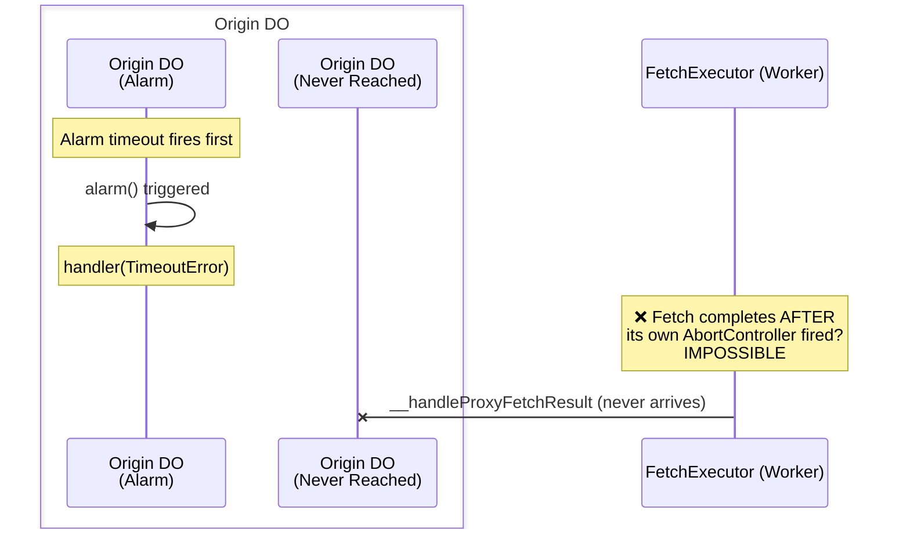

**Why it's impossible**:
- The `timeout` option sets AbortController timeout for the fetch
- If fetch completes, it delivers result BEFORE alarm timeout
- If fetch is aborted, it can't complete afterward (AbortController guarantees this)
- There's no scenario where alarm times out first AND fetch still succeeds

**Timeout Behavior Summary**:
- `timeout` option → AbortController timeout for external fetch (default: 30s)
- Alarm timeout → Same as fetch timeout (no extra buffer needed)
- Alarm only fires if worker never delivers a result (success or error)
