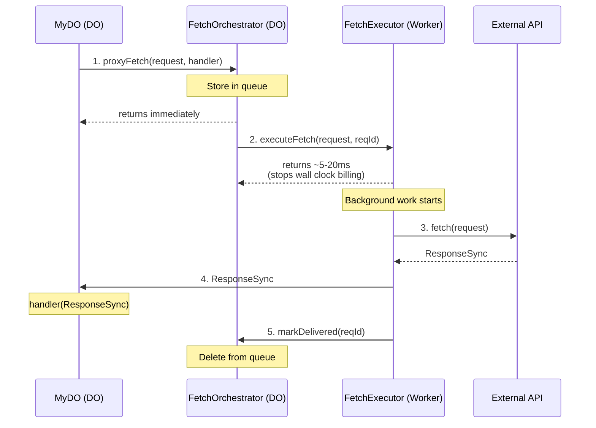
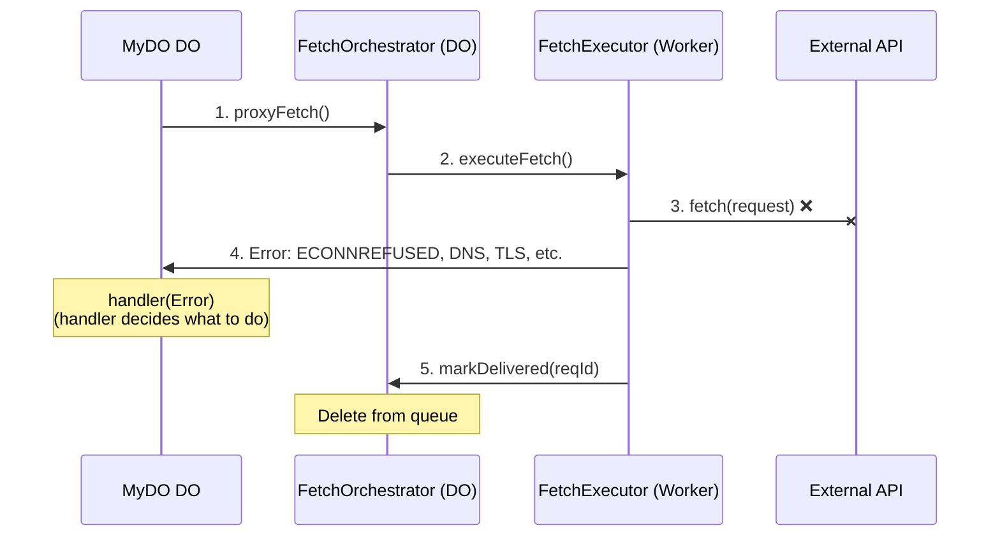
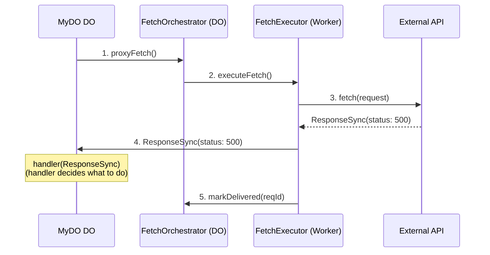
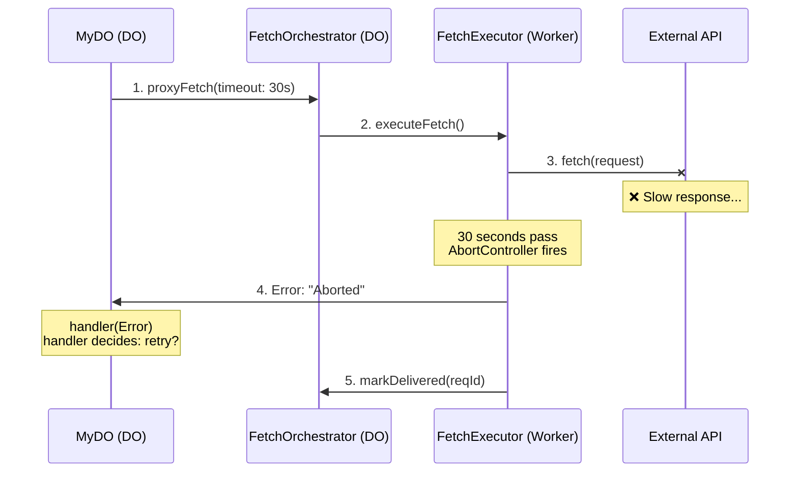
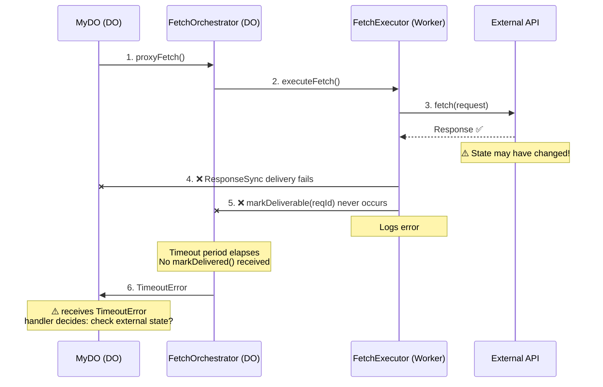
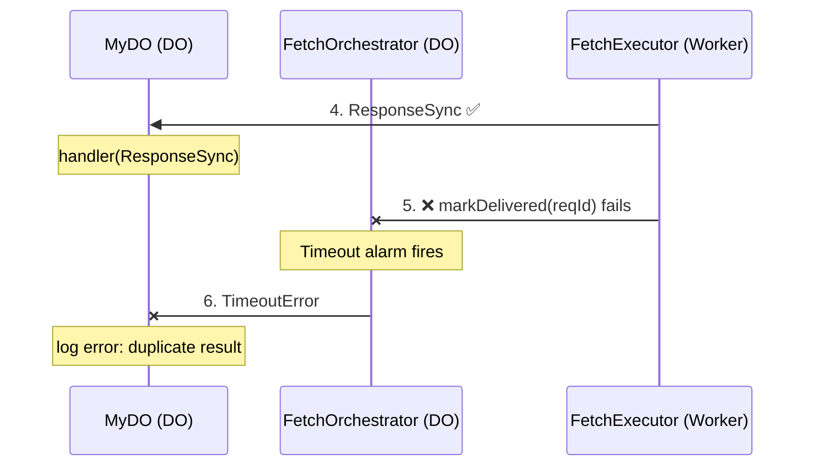
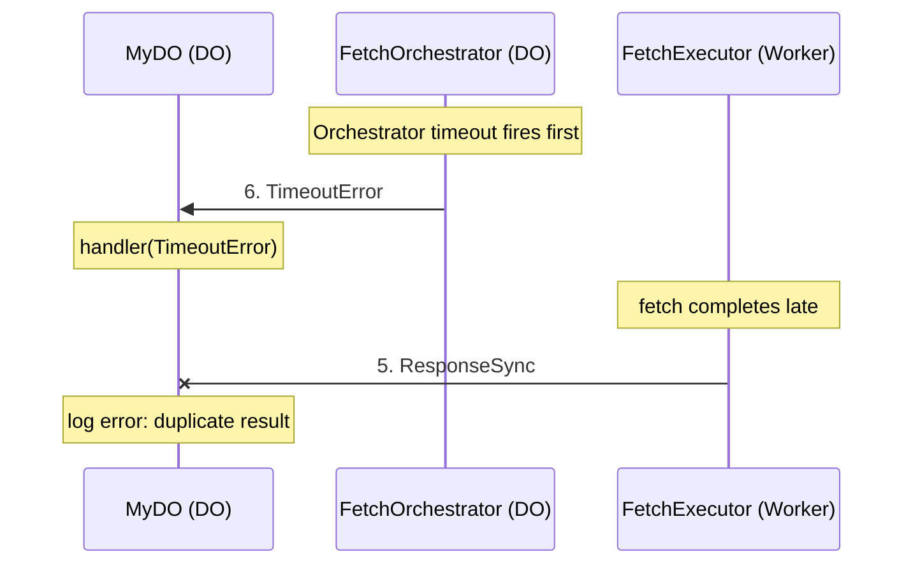

# Architecture & Failure Modes

This document provides detailed flow diagrams for all scenarios in `@lumenize/proxy-fetch`, including happy paths, failure modes, and race conditions.

## Core Architecture Principles

1. **MyDO (user's DO) = Failure Decision Maker**: MyDO DO decides how to handle errors, if/when to retry, etc. based on business logic
2. **Orchestrator (DO) = Timeout Watchdog Only**: FetchOrchestrator dispatches to FetchExecutor once and monitors timeout
3. **Executor (WorkerEntryPoint) = Performs Fetch**: FetchExecutor makes the actual fetch to the 3rd party and reports back directly to MyDO.
4. **Only One MyDO Handler Call Per Fetch**: First result (Timeout Error from Orchestrator or ResponseSync/Error from Executor) that makes it back to the MyDO will be the only one delivered to the user's handler. Duplicates arriving later are logged as errors
5. **Timeout ambiguity**: A timeout error doesn't mean the fetch didn't execute - it may have partially succeeded

## What Handler Receives (Precise Categories)

| What Handler Receives | Type | From | Meaning |
|---------------------|------|------|---------|
| Network error | `Error` | Executor | External API unreachable (ECONNREFUSED, DNS, etc. failure) |
| Abort/timeout error | `Error` | Executor | Fetch took too long (AbortController fired) |
| Parsing error | `Error` | Executor | ResponseSync couldn't be deserialized |
| **Delivery timeout** | `Error` | **Orchestrator** | ⚠️ **Ambiguous state. Fetch may have all/partially occured!** |
| Success response | `ResponseSync` | Executor | HTTP 2xx (use `.json()`, `.text()`, or `.arrayBuffer()` - no await!) |
| HTTP error | `ResponseSync` | Executor | HTTP 4xx/5xx (use `.json()`, `.text()`, or `.arrayBuffer()` - no await!) |

**Key Distinctions**: 
- If MyDO receives an `Error`, check the message:
  - Contains "delivery timeout" → From Orchestrator (ambiguous state - check external system!)
  - Anything else → From Executor (fetch definitely failed)
- If MyDO receives a `ResponseSync`, use **synchronous body methods**: `.json()`, `.text()`, `.arrayBuffer()` (no await!)

## Why ResponseSync?

Your handlers are **synchronous** (no `async`), so they can't do `await response.json()`. `ResponseSync` provides **synchronous body access methods** because the body has already been read:

```typescript @skip-check
// ❌ This won't work - handlers are sync!
handleResult(result: ResponseSync | Error) {
  if (!(result instanceof Error)) {
    const data = await result.json(); // ERROR: Can't await in sync function
  }
}

// ✅ This works - synchronous body methods!
handleResult(result: ResponseSync | Error) {
  if (!(result instanceof Error)) {
    const data = result.json();        // Synchronous - no await!
    const text = result.text();        // Synchronous - no await!
    const buffer = result.arrayBuffer(); // Synchronous - no await!
    
    console.log('User:', data.name);
  }
}
```

**How it works**:
1. Executor calls `fetch()` and gets a real `Response`
2. Executor converts to `ResponseSync`: `await ResponseSync.fromResponse(response)`
   - This reads the body once (based on Content-Type)
   - Stores it in serializable format (string, ArrayBuffer, or plain object)
3. MyDO's synchronous handler receives `ResponseSync`
4. Handler calls `.json()`, `.text()`, or `.arrayBuffer()` **without await**

## Basic Usage

```typescript @skip-check
import '@lumenize/proxy-fetch';  // Registers as NADIS service

class MyDO extends LumenizeBase {
  fetchUserData(userId: string) {
    // Fire and forget - result comes to handler later
    const reqId = this.svc.proxyFetch(  // No `await`
      `https://api.example.com/users/${userId}`,
      this.ctn().handleResult(/* result */)  // result implicitly last-parameter
    );
    
    // Returns immediately with reqId
    // Result arrives later to handler
    return reqId;
  }
  
  handleResult(result: ResponseSync | Error) {
    if (result instanceof Error) {
      if (result.message.includes('delivery timeout')) {
        // From Orchestrator - check external system state!
        console.error('Timeout - fetch may have succeeded:', result);
      } else {
        // From Executor - fetch definitely failed
        console.error('Fetch failed:', result);
      }
    } else {
      // ResponseSync - synchronous body access!
      if (result.ok) {
        const data = result.json(); // Synchronous - no await!
        console.log('Success:', result.status, data);
      } else {
        console.error('HTTP error:', result.status);
        const errorText = result.text(); // Also synchronous
        console.error('Error body:', errorText);
      }
    }
  }
}
```

## Alternative Syntax for Handler

The default is for the result to be implicitly added as the last parameter, but we got you
covered if you prefer a more explicit way to know where in the call signature the result 
will be delivered:

```typescript @skip-check
const reqId = this.svc.proxyFetch(  // No `await`
  `https://api.example.com/users/${userId}`,
  this.ctn().handleResult(this.ctn().$result)
);
```

## Providing Extra Context to Handler on Callback

Your handler signatures can be whatever you want. This is particularly useful if you want
the handler to have some extra context/data when it later receives the result.

You can do this with the last-parameter convention:

```typescript @skip-check
const reqId = this.svc.proxyFetch(  // No `await`
  `https://api.example.com/users/${userId}`,
  this.ctn().handleResult({ userId }, /* result */)
);
```

Or with the explicit $result marker syntax. The nice thing about the marker syntax in
this case is that you can put the result into any parameter slot you wish. So here the
result is the first parameter instead of the implicit last:

```typescript @skip-check
const reqId = this.svc.proxyFetch(  // No `await`
  `https://api.example.com/users/${userId}`,
  this.ctn().handleResult(this.ctn().$result, { userId })
);
```

## Advanced Options

You can customize the behavior by passing options:

```typescript @skip-check
const reqId = this.svc.proxyFetch(
  'https://api.example.com/users',
  this.ctn().handleResult(/* result */),
  {
    timeout: 60000,  // 60 second timeout for external fetch (default: 30000)
    executorBinding: 'FETCH_EXECUTOR',  // Custom executor binding
    orchestratorBinding: 'FETCH_ORCHESTRATOR',  // Custom orchestrator
    orchestratorInstanceName: 'singleton'  // Orchestrator instance name
  }
);
```

**orchestratorInstanceName**: By default, the system uses a single instance of the 
FetchOrchestrator, whose location is determined by Cloudflare heuristics. This single 
instance can handle surpisingly high volume so it's rare that you would overload one. 
However, you may want more control over where in the world they are. To achieve 
this, you can pre-create instances in locales and control which one is used for any 
particular fetch.

## MyDO-Controlled Retry Logic

Since MyDO decides retry behavior, here's a fully-functional example:

```typescript @skip-check
class MyDO extends LumenizeBase {
  fetchUserWithRetry(userId: string, maxRetries = 3) {
    // Store retry metadata
    const metadata = {
      url: `https://api.example.com/users/${userId}`,
      attempt: 0,
      maxRetries
    };
    
    this.svc.proxyFetch(
      metadata.url,
      this.ctn().handleRetryableResult(metadata, /* result */)
      // Result implicitly goes as last parameter
    );
  }
  
  handleRetryableResult(
    metadata: { url: string; attempt: number; maxRetries: number },
    result: ResponseSync | Error  // Result comes last (implicit)
  ) {
    if (result instanceof Error) {
      // Network error or delivery timeout - consider retry
      if (metadata.attempt < metadata.maxRetries) {
        console.log(`Attempt ${metadata.attempt + 1} failed, retrying...`);
        
        // Retry by making another proxyFetch call
        this.svc.proxyFetch(
          metadata.url,
          this.ctn().handleRetryableResult({
            ...metadata,
            attempt: metadata.attempt + 1
          })
        );
      } else {
        // Max retries exhausted
        console.error('All retries exhausted:', result);
      }
    } else if (!result.ok && result.status >= 500) {
      // 5xx error - maybe retry
      if (metadata.attempt < metadata.maxRetries) {
        console.log(`5xx error, retrying...`);
        
        this.svc.proxyFetch(
          metadata.url,
          this.ctn().handleRetryableResult({
            ...metadata,
            attempt: metadata.attempt + 1
          })
        );
      } else {
        console.error('Max retries exhausted on 5xx:', result);
      }
    } else if (result.status === 404) {
      // 404 - don't retry, resource doesn't exist
      console.log('Resource not found, not retrying');
    } else {
      // Success!
      console.log('Success:', result.status);
    }
  }
}
```

## Happy Path



Total Timeline: 80ms-30s
Blocking Time: microseconds
**Wall Clock Billing: 5-20ms**

## Failure Scenarios

### Scenario 1: Network Error (Executor Detects)



**Key**: Orchestrator considers this **delivered** because MyDO received something. MyDO decides whether to retry.

### Scenario 2: HTTP Error (5xx, 4xx)



**Key**: HTTP errors are delivered as `ResponseSync` objects (not `Error`). MyDO examines `response.ok`, `response.status`, etc. and decides how to handle.

### Scenario 3: Fetch Timeout (AbortController)



### Scenario 4: Delivery Timeout



**Critical**: The timeout error message indicates ambiguity:
```typescript @skip-check
new Error(
  `Fetch delivery timeout: Unable to confirm result delivery. ` +
  `WARNING: The external fetch may have fully/partially executed and ` +
  `modified state on the 3rd party system. Check the external ` +
  `system's state before retrying to avoid duplicate operations.`
)
```

**Key**: Orchestrator only sends timeout. MyDO must decide whether to:
- Check external system state (idempotent GET)
- Retry if operation is idempotent (PUT with idempotency key)
- NOT retry if best effort is all that is required

Note, the network failure here is illustrative. The failure could be anywhere along the 
path back including failure of the FetchExecutor during or immediately after it receives 
the Response but before it can deliver it to MyDO's handler.

## Race Conditions

### Race 1: ResponseSync, then Timeout

The FetchOrchestrator timeout is 10 seconds beyond the fetch timeout 
(default or user-set), so this race condition is impossible under normal operation. 
However, we wanted you to be aware of the risk, no matter how slim, and how the system 
will behave if this improbability occurs.



**How It Works**: The handler preprocessor checks if the `reqId` has already been processed. If yes, it logs an error and ignores the duplicate.

### Race 2: Timeout, then ResponseSync



**Key**: First result wins.


**Timeout Behavior**:
- The `timeout` option controls how long the external fetch is allowed to run (AbortController)
- The Orchestrator automatically adds 10 seconds (`alarmPollingPeriod + buffer`) to this timeout before sending a timeout error
- This ensures the fetch has time to complete AND report back before the Orchestrator gives up
