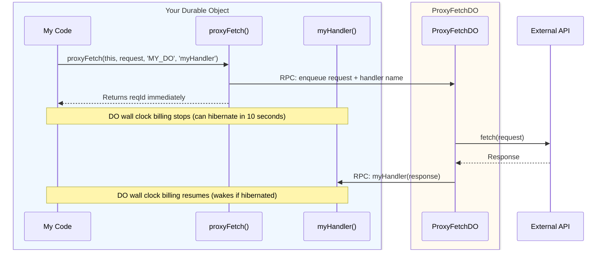

# Durable Object-Based Proxy Fetch

Uses a dedicated proxy DO to handle fetches.
- Simpler configuration than Queue variant
- Low latency penalty (~50-100ms)
- Max throughput under ideal conditions is 1,000 DOs doing 100,000 fetches per day each
  - Divide by 10 if peak burst throughput is 10x mean throughput

:::tip Auto-Selection
`proxyFetch()` automatically selects the DO variant when it detects a `PROXY_FETCH_DO` binding in your environment. If you have multiple proxy-fetch variants configured and want to explicitly use the DO variant, call `proxyFetchDO()` directly instead.
:::

## How It Works



## Documentation

The DO variant works identically to the [Queue variant](/docs/proxy-fetch/queue) with the same API, error handling, request patterns, and best practices. The only difference is the configuration.

## Configuration

### 1. Install

```bash @skip-check
npm install @lumenize/proxy-fetch
```

### 2. Configure Durable Object Binding

Add the ProxyFetchDO binding to your `wrangler.jsonc`:

```jsonc title="wrangler.jsonc" @check-example('packages/proxy-fetch/test/for-docs/wrangler.jsonc')
{
  "name": "lumenize-proxy-fetch",
  "main": "src/index.ts",
  "compatibility_date": "2025-09-12",
  "durable_objects": {
    "bindings": [
      {
        "name": "PROXY_FETCH_DO",
        "class_name": "ProxyFetchDO"
      },
      {
        "name": "MY_DO",
        "class_name": "MyDO"
      }
    ]
  },
  "migrations": [
    {
      "tag": "v1",
      "new_sqlite_classes": [
        "ProxyFetchDO",
        "MyDO"
      ]
    }
  ]
}
```

**Important:** `PROXY_FETCH_DO` binding name is required (this is what `proxyFetch()` 
looks for)

### 3. Set Up Your DO

Use the same API as the Queue variant:

```typescript title="src/my-do.ts" @check-example('packages/proxy-fetch/test/for-docs/src/index.ts')
import { DurableObject } from 'cloudflare:workers';
import { ProxyFetchDO } from '@lumenize/proxy-fetch';
import { proxyFetch } from '@lumenize/proxy-fetch';
import type { ProxyFetchHandlerItem } from '@lumenize/proxy-fetch';

// Re-export ProxyFetchDO - required for the binding to work
export { ProxyFetchDO };

/**
 * Your Durable Object that uses proxy-fetch
 */
export class MyDO extends DurableObject {
  constructor(ctx: DurableObjectState, env: Env) {
    super(ctx, env);
  }

  /**
   * Your business logic that needs to call external API
   */
  async myBusinessProcess(): Promise<string> {
    // Send to ProxyFetchDO - returns reqId immediately
    const reqId = await proxyFetch(
      this,                    // DO instance
      `${this.env.TEST_ENDPOINTS_URL}/uuid?token=${this.env.TEST_TOKEN}`,
      'MY_DO',                 // DO binding name
      'myResponseHandler'      // Handler method name
    );
    
    // Response will arrive later via myResponseHandler()
    return reqId;
  }

  /**
   * Your response handler - called when response arrives
   */
  async myResponseHandler({
    response,
    error,
    reqId 
  }: ProxyFetchHandlerItem): Promise<void> {
    if (error) {
      console.error('Fetch failed:', error);
      this.ctx.storage.kv.put('last-error', error.message);
      return;
    }
    
    // Store success - response was received
    this.ctx.storage.kv.put('callback-received', reqId);
  }
  // ...
}
```

