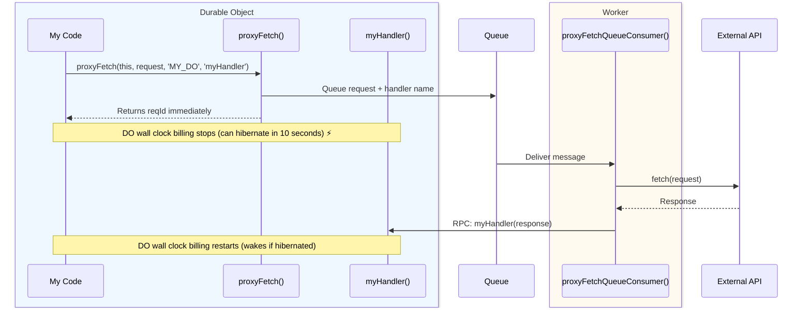

# Proxy Fetch

Make external API calls from Durable Objects without paying for wall-clock time. 
`@lumenize/proxy-fetch` offloads HTTP fetches to Workers (CPU billing) via 
Cloudflare Queues or a shared DO, stopping the accrual of wall clock time charges while 
waiting for responses.

## The Problem

Durable Objects are billed on **wall clock time**, not CPU time. When a DO makes an external `fetch()` call:
- DO wall clock billing continues during the fetch (awaiting external response)
- For slow external APIs (100ms-5s response times), costs add up quickly

**Example Cost Scenario:**
```
100,000 fetches/day × 200ms avg = 20,000 seconds/day per instance
Over 30 days => 600,000 seconds => 167 hours/month wall clock time per instance
1,000 instances => 167,000 hours/month
@ ~$0.006 per hour
======================================================================
~$1000/month waiting on external APIs
```

Note: The above cost calculations do not take into account the additional requests
charges incurred when using `@lumenize/proxy-fetch`. Those are smaller in comparison, 
but not zero.

## The Solution

**Key Insight:** Cloudflare Workers are billed on **CPU time**, not wall clock time 
(Proxy Fetch Queue variant)! Similarly, the wall clock charges of running one DO 24/7 to 
serve the fetch needs of 1,000 DOs is only ~$4/month (other Proxy Fetch variants)!

By satisfying external fetches somewhere else (Worker or shared DO):
- ✅ DO wall clock billing stops as soon as fetch is queued
- ✅ Worker makes fetch with CPU billing or shared DO that is running 24/7
- ✅ Response delivered back to DO via Workers RPC

## How It Works



## Variants

The `@lumenize/proxy-fetch` package provides four different approaches to making external API calls from Durable Objects:

### [Queue](/docs/proxy-fetch/queue)
Route fetch requests through Cloudflare Queues to Workers with CPU billing. Best for 
high-volume use cases where you can live with high latency penalty. 
**Currently available**.

### [Durable Object](/docs/proxy-fetch/durable-object)
Use a dedicated proxy DO to handle fetches. Simpler. Low latency penalty. 
Max throughput is 1,000 DOs doing 100,000 fetches per day each steady state. 
Divide by 10 if burst throughput is 10x mean throughput. **Currently available**.

### [Streaming](/docs/proxy-fetch/streaming)
Stream large responses back to your DO. **Coming soon**.

### [Agents](/docs/proxy-fetch/agents)
Proxy SSE MCP and LLM stutter-speak responses back to DO. **Coming soon**.

## Variant Comparison

| Feature | DO Variant | Queue Variant |
|---------|-----------|---------------|
| **Latency** | ~50-100ms | 200ms-3s (p90) |
| **Throughput** | ~100k req/day per DO | Cloud-scale |
| **Configuration** | ProxyFetchDO binding | Queue binding |
| **Billing** | ~$4/month (1 DO 24/7) + 3x req count | 2x req count |
| **Function to call** | `proxyFetch()` or `proxyFetchDO()` | `proxyFetch()` or `proxyFetchQueue()` |

All variants share the same API for error handling, fire-and-forget mode, and request 
patterns. See the [Queue variant docs](/docs/proxy-fetch/queue) for complete guidance and 
examples.
