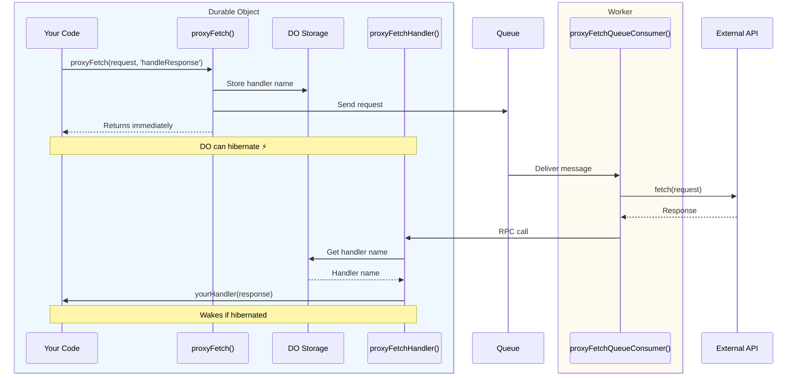

# Proxy Fetch

Make external API calls from Durable Objects without paying for wall-clock time. `@lumenize/proxy-fetch` offloads HTTP fetches to Workers (CPU billing) via Cloudflare Queues, letting your DOs hibernate while waiting for responses.

## The Problem

Durable Objects are billed on **wall clock time**, not CPU time. When a DO makes an external `fetch()` call:
- The DO cannot hibernate during the fetch (awaiting external response)
- Wall clock billing continues during network I/O
- For slow external APIs (100ms-5s response times), costs add up quickly

**Example Cost Scenario:**
```
1000 fetches/day × 1 second avg = 1000 seconds/day
30 days = 30,000 seconds = 8.3 hours/month wall clock time
Could cost several dollars just waiting on external APIs
```

## The Solution

**Key Insight:** Cloudflare Workers are billed on **CPU time**, not wall clock time!

By routing external fetches through a queue to a Worker, you:
- ✅ Return immediately from DO (no blocking)
- ✅ DO can hibernate while waiting
- ✅ Worker makes fetch with CPU billing only
- ✅ Response delivered back to DO via RPC

**Cost Comparison:**
```
Direct fetch in DO (wall clock):
- 1M requests × 1 second = 277 hours
- ~$16.67/month

Via proxy-fetch (CPU + queue):
- Queue: $0.40 per million operations
- Worker CPU: ~$0.02 per million CPU-milliseconds
- Total: ~$0.42/month
```

## How It Works



## Quick Start

### 1. Install

```bash @skip-check
npm install @lumenize/proxy-fetch
```

### 2. Configure Queue

Add queue configuration to your `wrangler.jsonc`:

```jsonc title="wrangler.jsonc" @skip-check
{
  "name": "my-worker",
  "main": "src/index.ts",
  "compatibility_date": "2025-09-12",
  
  "queues": {
    "producers": [
      {
        "queue": "proxy-fetch-queue",
        "binding": "PROXY_FETCH_QUEUE"
      }
    ],
    "consumers": [
      {
        "queue": "proxy-fetch-queue",
        "max_batch_size": 10,
        "max_batch_timeout": 5,
        "max_retries": 3
      }
    ]
  },
  
  "durable_objects": {
    "bindings": [
      {
        "name": "MY_DO",
        "class_name": "MyDO"
      }
    ]
  }
}
```

### 3. Set Up DO

Import the functions and implement your DO:

```typescript title="src/my-do.ts" @check-example('packages/proxy-fetch/test/test-worker-and-dos.ts')
import { DurableObject } from 'cloudflare:workers';
import { proxyFetchHandler } from '../src/proxyFetchHandler';
import { proxyFetch } from '../src/proxyFetch';
import type { ProxyFetchHandlerItem } from '../src/types';

export class MyDO extends DurableObject<Env> {
  /**
   * Your response handler - called when response arrives
   */
  async handleSuccess({ response, error }: ProxyFetchHandlerItem): Promise<void> {
    if (error) {
      console.error('Fetch failed:', error);
      // ...
      return;
    }
    
    // Process the response
    const data = await response!.json();
    // Store it, process it, whatever your business logic needs
    this.ctx.storage.kv.put('api-data', JSON.stringify(data));
    // ...
  }

  /**
   * Your business logic that needs to call external API
   */
  async fetchExternalData(): Promise<void> {
    // Send to queue - returns immediately, DO can hibernate
    await proxyFetch(
      this,                    // DO instance
      'https://api.example.com/data',  // URL or Request object
      'handleSuccess',         // Handler method name
      'MY_DO'                  // DO binding name
    );
    
    // Function returns immediately!
    // Response will arrive later via handleSuccess()
  }

  /**
   * Required: Receive responses from queue worker
   */
  async proxyFetchHandler(item: ProxyFetchHandlerItem): Promise<void> {
    return proxyFetchHandler(this, item);
  }
  
  // ...
}
```

### 4. Set Up Queue Consumer

In your worker, handle queue messages:

```typescript title="src/index.ts" @check-example('packages/proxy-fetch/test/test-worker-and-dos.ts')
import { proxyFetchQueueConsumer } from '../src/proxyFetchQueueConsumer';

export default {
  // ...
  
  async queue(batch: MessageBatch<any>, env: Env): Promise<void> {
    await proxyFetchQueueConsumer(batch, env);
  }
} satisfies ExportedHandler<Env>;
```

That's it! Now when you call `fetchExternalData()`, the fetch happens in a Worker while your DO is free to hibernate.

## Configuration Options

Control retry behavior and timeouts:

```typescript @skip-check
await proxyFetch(
  this,
  'https://api.example.com/data',
  'handleSuccess',
  'MY_DO',
  {
    timeout: 30000,        // Request timeout in ms (default: 30000)
    maxRetries: 3,         // Max retry attempts (default: 3)
    retryDelay: 1000,      // Initial retry delay in ms (default: 1000)
    maxRetryDelay: 10000,  // Max retry delay in ms (default: 10000)
    retryOn5xx: true       // Retry on 5xx errors (default: true)
  }
);
```

**Retry Behavior:**
- Network errors: Always retried
- 5xx errors: Retried if `retryOn5xx` is true
- 4xx errors: Never retried (client errors)
- Uses exponential backoff: `delay * 2^retryCount` capped at `maxRetryDelay`

## Advanced Usage

### Custom Request Objects

Pass full Request objects with headers, body, etc.:

```typescript @skip-check
const request = new Request('https://api.example.com/data', {
  method: 'POST',
  headers: {
    'Authorization': `Bearer ${this.env.API_TOKEN}`,
    'Content-Type': 'application/json'
  },
  body: JSON.stringify({ query: 'something' })
});

await proxyFetch(this, request, 'handleSuccess', 'MY_DO');
```

### Error Handling

Your handler receives both successful responses and errors:

```typescript @skip-check
async handleResponse({ response, error, retryCount, duration }: ProxyFetchHandlerItem): Promise<void> {
  if (error) {
    // Network error, timeout, or max retries exceeded
    console.error('Fetch failed:', error.message);
    this.ctx.storage.kv.put('last-error', error.message);
    return;
  }
  
  // Check HTTP status
  if (!response.ok) {
    console.error('HTTP error:', response.status, response.statusText);
    return;
  }
  
  // Success
  const data = await response.json();
  console.log(`Received after ${retryCount} retries, took ${duration}ms`);
  // Process data...
}
```

### Multiple Handlers

Use different handlers for different API calls:

```typescript @skip-check
export class MyDO extends DurableObject {
  async fetchUsers(): Promise<void> {
    await proxyFetch(this, '/api/users', 'handleUsers', 'MY_DO');
  }
  
  async fetchPosts(): Promise<void> {
    await proxyFetch(this, '/api/posts', 'handlePosts', 'MY_DO');
  }
  
  async handleUsers({ response }: ProxyFetchHandlerItem): Promise<void> {
    const users = await response.json();
    // Store users...
  }
  
  async handlePosts({ response }: ProxyFetchHandlerItem): Promise<void> {
    const posts = await response.json();
    // Store posts...
  }
  
  async proxyFetchHandler(item: ProxyFetchHandlerItem): Promise<void> {
    return proxyFetchHandler(this, item);
  }
}
```

## API Reference

### `proxyFetch()`

Send a fetch request to the queue for processing.

```typescript @skip-check
async function proxyFetch(
  doInstance: DurableObject,
  request: string | Request,
  handlerName: string,
  doBindingName: string,
  options?: ProxyFetchOptions
): Promise<void>
```

**Parameters:**
- `doInstance` - Your DO instance (`this`)
- `request` - URL string or Request object to fetch
- `handlerName` - Name of handler method to call with response
- `doBindingName` - DO binding name from wrangler.jsonc (e.g., 'MY_DO')
- `options` - Optional configuration (see ProxyFetchOptions below)

**Returns:** `Promise<void>` - Resolves immediately after queuing

### `proxyFetchHandler()`

Routes responses back to your handler method. Call this from your DO's `proxyFetchHandler()` method.

```typescript @skip-check
async function proxyFetchHandler(
  doInstance: DurableObject,
  item: ProxyFetchHandlerItem
): Promise<void>
```

**Parameters:**
- `doInstance` - Your DO instance (`this`)
- `item` - Response item from queue consumer

### `proxyFetchQueueConsumer()`

Queue consumer that processes fetch requests. Call this from your worker's `queue()` handler.

```typescript @skip-check
async function proxyFetchQueueConsumer(
  batch: MessageBatch,
  env: any
): Promise<void>
```

**Parameters:**
- `batch` - Queue message batch from Cloudflare
- `env` - Environment with DO bindings

### Types

#### `ProxyFetchOptions`

```typescript @skip-check
interface ProxyFetchOptions {
  timeout?: number;        // Request timeout in ms (default: 30000)
  maxRetries?: number;     // Max retry attempts (default: 3)
  retryDelay?: number;     // Initial retry delay in ms (default: 1000)
  maxRetryDelay?: number;  // Max retry delay in ms (default: 10000)
  retryOn5xx?: boolean;    // Retry on 5xx errors (default: true)
}
```

#### `ProxyFetchHandlerItem`

```typescript @skip-check
interface ProxyFetchHandlerItem {
  reqId: string;           // Unique request ID
  response?: Response;     // Response object (if successful)
  error?: Error;           // Error object (if failed)
  retryCount: number;      // Number of retries attempted
  duration: number;        // Total duration in milliseconds
}
```

## How the Pieces Fit Together

The three core functions work together to route requests through the queue:

1. **`proxyFetch()`** - Called from within your DO
   - Stores handler metadata in DO storage
   - Sends serialized request to queue
   - Returns immediately (non-blocking)

2. **`proxyFetchQueueConsumer()`** - Your worker's queue consumer
   - Deserializes requests from queue
   - Makes external fetch calls (CPU time billing)
   - Handles retries with exponential backoff
   - Routes responses back to DOs via RPC

3. **`proxyFetchHandler()`** - Called by queue consumer via RPC
   - Looks up handler name from storage
   - Calls your handler method with response/error
   - Cleans up storage

**The Flow:**
```
Your DO method
  └─> proxyFetch() 
        ├─> Storage: save handler metadata
        └─> Queue: send request
              └─> proxyFetchQueueConsumer()
                    ├─> Deserialize request
                    ├─> fetch() external API
                    ├─> Retry logic if needed
                    └─> proxyFetchHandler()
                          ├─> Storage: get handler name
                          ├─> Call: yourDO.yourHandler()
                          └─> Storage: cleanup
```

## Best Practices

### Handler Method Naming

Use descriptive handler names that indicate what type of response they handle:

```typescript @skip-check
// ✅ Good
await proxyFetch(this, url, 'handleUserData', 'MY_DO');
await proxyFetch(this, url, 'handlePaymentResponse', 'MY_DO');

// ❌ Less clear
await proxyFetch(this, url, 'handler1', 'MY_DO');
await proxyFetch(this, url, 'callback', 'MY_DO');
```

### Error Handling

Always handle both success and error cases in your handlers:

```typescript @skip-check
async handleResponse({ response, error }: ProxyFetchHandlerItem): Promise<void> {
  // Handle errors first
  if (error) {
    // Log, store error state, trigger fallback logic, etc.
    return;
  }
  
  // Check HTTP status
  if (!response.ok) {
    // Handle HTTP errors
    return;
  }
  
  // Process successful response
  const data = await response.json();
  // ...
}
```

### Storage Patterns

Store handler context if needed before calling proxyFetch:

```typescript @skip-check
async processUser(userId: string): Promise<void> {
  // Store context that handler will need
  this.ctx.storage.kv.put('current-user-id', userId);
  
  await proxyFetch(this, `/api/users/${userId}`, 'handleUserData', 'MY_DO');
}

async handleUserData({ response }: ProxyFetchHandlerItem): Promise<void> {
  // Retrieve context
  const userId = this.ctx.storage.kv.get('current-user-id');
  const data = await response.json();
  
  // Process with context
  this.ctx.storage.kv.put(`user:${userId}`, JSON.stringify(data));
}
```

### Queue Configuration

Adjust queue settings based on your needs:

```jsonc @skip-check
{
  "consumers": [
    {
      "queue": "proxy-fetch-queue",
      "max_batch_size": 10,      // Higher for throughput
      "max_batch_timeout": 5,    // Lower for latency
      "max_retries": 3           // Queue-level retries
    }
  ]
}
```

- `max_batch_size`: Higher = more throughput, but longer wait for small batches
- `max_batch_timeout`: Lower = faster processing, but smaller batches
- `max_retries`: Queue retries are separate from proxy-fetch retries

## Troubleshooting

### Handler Not Called

**Problem:** Your handler method isn't being invoked when response arrives.

**Solutions:**
1. Verify handler name matches method name exactly (case-sensitive)
2. Check DO binding name matches wrangler.jsonc
3. Ensure `proxyFetchHandler()` is implemented on your DO
4. Check logs for errors in queue consumer

### Requests Timing Out

**Problem:** Requests consistently timing out.

**Solutions:**
1. Increase timeout: `{ timeout: 60000 }` (60 seconds)
2. Check external API is reachable from Worker
3. Verify API endpoint works with `curl` or Postman

### Too Many Retries

**Problem:** Retrying too much, wasting resources.

**Solutions:**
1. Reduce `maxRetries`: `{ maxRetries: 1 }`
2. Disable 5xx retries: `{ retryOn5xx: false }`
3. Check why requests are failing (logs)

### Messages Stuck in Queue

**Problem:** Queue depth growing, messages not processing.

**Solutions:**
1. Check queue consumer is deployed
2. Verify `queue()` handler is implemented in worker
3. Check for errors in worker logs
4. Ensure DO bindings are correct

## Performance Considerations

### Latency

- Queue delivery: ~50-200ms (p90)
- External fetch: Depends on API
- RPC callback to DO: ~10-50ms

**Total overhead:** ~100-300ms beyond the actual API call time.

### Throughput

- Queue can handle millions of messages
- Worker scales automatically
- Batch processing for efficiency

### Cost Optimization

Use proxy-fetch when:
- ✅ External API calls are slow (>100ms)
- ✅ High volume of requests
- ✅ DO needs to stay responsive
- ✅ Cost is a concern

Don't use when:
- ❌ Extremely latency-sensitive (&lt;100ms requirement)
- ❌ Very low volume (a few calls per day)
- ❌ API is extremely fast (&lt;10ms)

## Migration from Direct Fetch

**Before (Direct fetch in DO):**
```typescript @skip-check
export class MyDO extends DurableObject {
  async fetchData(): Promise<void> {
    // DO blocked during fetch (wall clock billing)
    const response = await fetch('https://api.example.com/data');
    const data = await response.json();
    this.ctx.storage.kv.put('data', JSON.stringify(data));
  }
}
```

**After (Using proxy-fetch):**
```typescript @skip-check
export class MyDO extends DurableObject {
  async fetchData(): Promise<void> {
    // Returns immediately (no blocking)
    await proxyFetch(this, 'https://api.example.com/data', 'handleData', 'MY_DO');
  }
  
  async handleData({ response, error }: ProxyFetchHandlerItem): Promise<void> {
    if (error) {
      console.error('Fetch failed:', error);
      return;
    }
    
    const data = await response.json();
    this.ctx.storage.kv.put('data', JSON.stringify(data));
  }
  
  async proxyFetchHandler(item: ProxyFetchHandlerItem): Promise<void> {
    return proxyFetchHandler(this, item);
  }
}
```

**Key Differences:**
1. Add handler method that receives response
2. Add `proxyFetchHandler()` method to your DO
3. Set up queue configuration in wrangler.jsonc
4. Add queue consumer to worker
5. Logic splits into two methods (trigger + handler)

## What's Next?

- Check the [API Reference](#api-reference) for detailed type information
- See [Configuration Options](#configuration-options) for retry and timeout settings
- Review [Best Practices](#best-practices) for production use
