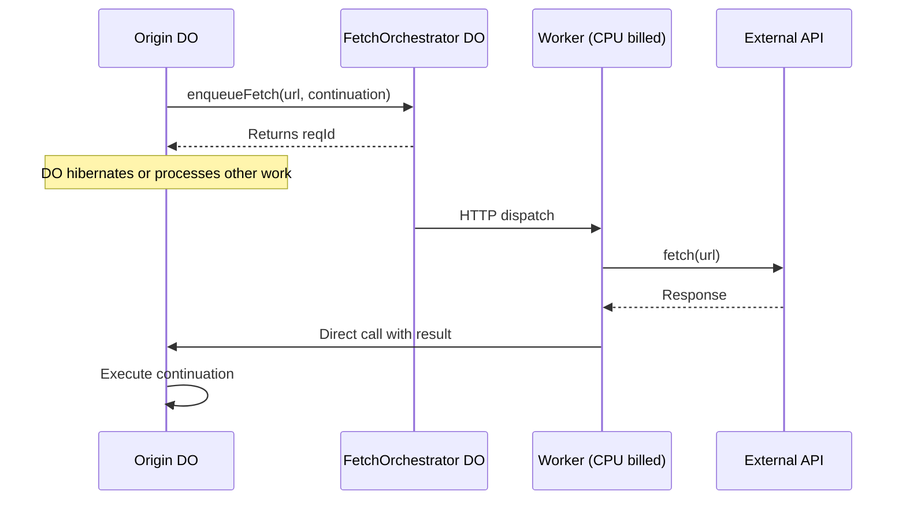

# Proxy Fetch

Make external API calls from Durable Objects without paying for wall-clock time. 
`@lumenize/proxy-fetch` uses a DO-Worker hybrid architecture where a Durable Object 
manages the queue and Workers perform CPU-billed fetch execution.

## The Problem

Durable Objects are billed on **wall clock time**, not CPU time. When a DO makes an external `fetch()` call:
- DO wall clock billing continues during the fetch (awaiting external response)
- For slow external APIs (100ms-5s response times), costs add up quickly

**Example Cost Scenario:**
```
100,000 fetches/day × 200ms avg = 20,000 seconds/day per instance
Over 30 days => 600,000 seconds => 167 hours/month wall clock time per instance
1,000 instances => 167,000 hours/month
@ ~$0.006 per hour
======================================================================
~$1000/month waiting on external APIs
```

Note: The above cost calculations do not take into account the additional requests
charges incurred when using `@lumenize/proxy-fetch`. Those are smaller in comparison, 
but not zero.

## The Solution

**Key Insight:** Cloudflare Workers are billed on **CPU time**, not wall clock time!

By offloading fetch execution to Workers:
- ✅ DO wall clock billing stops as soon as fetch is queued
- ✅ Worker makes fetch with CPU billing
- ✅ Response delivered back to DO via direct call
- ✅ Linear scalability up to 2000+ concurrent fetches

## Architecture



## Quick Start

```typescript
import { LumenizeBase } from '@lumenize/lumenize-base';
import { proxyFetchWorker } from '@lumenize/proxy-fetch';

class MyDO extends LumenizeBase<Env> {
  async fetchUserData(userId: string) {
    // Capture context in continuation - result injected as first parameter
    await proxyFetchWorker(
      this,
      `https://api.example.com/users/${userId}`,
      this.ctn().handleResult(userId)
    );
  }
  
  handleResult(result: Response | Error, userId: string) {
    if (result instanceof Error) {
      console.error('Fetch failed:', result.message);
      return;
    }
    
    console.log('Got user data:', userId, result.status);
  }
}
```

## Performance

See [Proxy Fetch Worker](/docs/proxy-fetch/proxy-fetch-worker) for detailed performance measurements:

**Production (Warm):**
- **71ms end-to-end** in production (after subtracting network overhead)
- **57ms added latency** after subtracting the actual fetch time
- **Linear scalability** up to 2000+ concurrent fetches
- **Super-linear efficiency** due to batching and parallelism

**Local Development:**
- **23ms end-to-end** (after subtracting network overhead)
- WebSocket-based real-time result delivery
- No artificial bottlenecks observed

## Documentation

- **[Proxy Fetch Worker](/docs/proxy-fetch/proxy-fetch-worker)** - Complete guide with setup, usage, and performance details
- **[API Reference](/docs/proxy-fetch/api)** - TypeDoc-generated API documentation

## FAQ

### Q: Where did `proxyFetchQueue` and `proxyFetchDO` go?

A: `proxyFetchWorker` is superior in every way, so we removed the old variants:

- **Better latency**: ~70ms vs 200-3000ms (queue) or ~100ms (DO)
- **Linear scalability**: Tested up to 2000+ concurrent fetches
- **CPU-based billing**: Workers billed on CPU time for fetch operations
- **Simpler deployment**: Single worker with HTTP endpoint

The old variants remain in git history if needed, but we recommend migrating to `proxyFetchWorker`.

### Q: Can I still use the old variants?

A: No, they've been removed from the package exports. If you absolutely need them, you can access them from git history (commits before v0.18.0), but we strongly recommend using `proxyFetchWorker` instead.

### Q: How do I migrate from the old variants?

A: The migration is straightforward:

**Before (proxyFetchQueue):**
```typescript
await proxyFetch(this, request, 'MY_DO', 'handleResult', { mode: 'queue' });
```

**Before (proxyFetchDO):**
```typescript
await proxyFetch(this, request, 'MY_DO', 'handleResult', { mode: 'do' });
```

**After (proxyFetchWorker):**
```typescript
await proxyFetchWorker(
  this,
  request,
  this.ctn().handleResult()
);
```

Key differences:
1. Use continuation syntax instead of string handler names
2. No need to specify DO binding or mode
3. Result is first parameter (by convention), context follows

See the [Proxy Fetch Worker docs](/docs/proxy-fetch/proxy-fetch-worker) for complete migration guidance.
