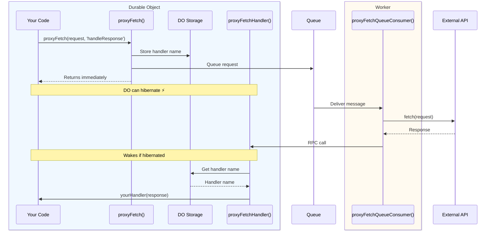

# Queue-Based Proxy Fetch

Route fetch requests through Cloudflare Queues to Workers with CPU billing.
- Automatically scales to cloud-scale
- High latency penalty (60ms to 2-3 seconds p90)

## How It Works



## Quick Start

### 1. Install

```bash @skip-check
npm install @lumenize/proxy-fetch
```

### 2. Configure Queue

Add queue configuration to your `wrangler.jsonc`:

```jsonc title="wrangler.jsonc" @check-example('packages/proxy-fetch/wrangler.jsonc')
{
  "name": "lumenize-proxy-fetch",
  "main": "test/test-worker-and-dos.ts",
  "compatibility_date": "2025-09-12",
  "durable_objects": {
    "bindings": [
      {
        "name": "MY_DO",
        "class_name": "MyDO"
      }
    ]
  },
  "queues": {
    "producers": [
      {
        "queue": "proxy-fetch-queue",
        "binding": "PROXY_FETCH_QUEUE"
      }
    ],
    "consumers": [
      {
        "queue": "proxy-fetch-queue",
        "max_batch_size": 10,
        "max_batch_timeout": 5,
        "max_retries": 3
      }
    ]
  },
  "migrations": [
    {
      "tag": "v1",
      "new_sqlite_classes": [
        "MyDO"
      ]
    }
  ]
}
```

### 3. Set Up DO

Import the functions and implement your DO:

```typescript title="src/my-do.ts" @check-example('packages/proxy-fetch/test/test-worker-and-dos.ts')
import { DurableObject } from 'cloudflare:workers';
import { proxyFetchHandler, proxyFetch } from '@lumenize/proxy-fetch';
import type { ProxyFetchHandlerItem } from '@lumenize/proxy-fetch';

export class MyDO extends DurableObject<Env> {
  /**
   * Your business logic that needs to call external API
   */
  async myBusinessProcess(): Promise<void> {
    // Send to queue - returns immediately, DO wall clock billing stops
    await proxyFetch(
      this,                    // DO instance
      'https://api.example.com/data',  // URL or Request object
      'myResponseHandler',         // Handler method name
      'MY_DO'                  // DO binding name
    );
    
    // Response will arrive later via myResponseHandler()
  }

  /**
   * Your response handler - called when response arrives
   */
  async myResponseHandler({ response, error }: ProxyFetchHandlerItem): Promise<void> {
    if (error) {
      console.error('Fetch failed:', error);
      // ...
      return;
    }
    
    // Process the response
    const data = await response!.json();
    // Store it, process it, whatever your business logic needs
    this.ctx.storage.kv.put('api-data', JSON.stringify(data));
    // ...
  }

  /**
   * Required boilerplate: Dispatches responses from queue worker to your handler
   */
  async proxyFetchHandler(item: ProxyFetchHandlerItem): Promise<void> {
    // Could have some logic here
    return proxyFetchHandler(this, item);
  }
  
  // ...
}
```

### 4. Set Up Queue Consumer

In your worker, handle queue messages:

```typescript title="src/index.ts" @check-example('packages/proxy-fetch/test/test-worker-and-dos.ts')
import { proxyFetchQueueConsumer } from '@lumenize/proxy-fetch';

export default {
  // ...
  
  // Required boilerplate
  async queue(batch: MessageBatch<any>, env: Env): Promise<void> {
    await proxyFetchQueueConsumer(batch, env);
  }
} satisfies ExportedHandler<Env>;
```

That's it! Now when you call `myBusinessProcess()`, the fetch happens in a Worker while your DO is free to hibernate.

## Configuration Options

Control retry behavior and timeouts:

```typescript @skip-check
await proxyFetch(
  this,
  'https://api.example.com/data',
  'myResponseHandler',
  'MY_DO',
  {
    timeout: 30000,        // Request timeout in ms (default: 30000)
    maxRetries: 3,         // Max retry attempts (default: 3)
    retryDelay: 1000,      // Initial retry delay in ms (default: 1000)
    maxRetryDelay: 10000,  // Max retry delay in ms (default: 10000)
    retryOn5xx: true       // Retry on 5xx errors (default: true)
  }
);
```

**Retry Behavior:**
- Network errors: Always retried
- 5xx errors: Retried if `retryOn5xx` is true
- 4xx errors: Never retried (client errors)
- Uses exponential backoff: `delay * 2^retryCount` capped at `maxRetryDelay`

## Request Objects

Pass full Request objects with headers, body, etc.:

```typescript @skip-check
const request = new Request('https://api.example.com/data', {
  method: 'POST',
  headers: {
    'Authorization': `Bearer ${this.env.API_TOKEN}`,
    'Content-Type': 'application/json'
  },
  body: JSON.stringify({ query: 'something' })
});

await proxyFetch(this, request, 'myResponseHandler', 'MY_DO');
```

## Error Handling

Your handler receives both successful responses and errors:

```typescript @skip-check
async myResponseHandler({
  response,
  error,
  retryCount,
  duration
}: ProxyFetchHandlerItem): Promise<void> {
  if (error) {
    // Network error, timeout, or max retries exceeded
    console.error('Fetch failed:', error.message);
    this.ctx.storage.kv.put('last-error', error.message);
    return;
  }
  
  // Check HTTP status
  if (!response.ok) {
    console.error('HTTP error:', response.status, response.statusText);
    return;
  }
  
  // Success
  const data = await response.json();
  console.log(`Received after ${retryCount} retries, took ${duration}ms`);
  // Process data...
}
```

## Multiple Handlers

Use different handlers for different API calls:

```typescript @skip-check
export class MyDO extends DurableObject {
  async fetchUsers(): Promise<void> {
    await proxyFetch(this, '/api/users', 'handleUsers', 'MY_DO');
  }
  
  async fetchPosts(): Promise<void> {
    await proxyFetch(this, '/api/posts', 'handlePosts', 'MY_DO');
  }
  
  async handleUsers({ response }: ProxyFetchHandlerItem): Promise<void> {
    const users = await response.json();
    // Store users...
  }
  
  async handlePosts({ response }: ProxyFetchHandlerItem): Promise<void> {
    const posts = await response.json();
    // Store posts...
  }
  
  async proxyFetchHandler(item: ProxyFetchHandlerItem): Promise<void> {
    return proxyFetchHandler(this, item);
  }
}
```

## How the Pieces Fit Together

The three core functions work together to route requests through the queue:

1. **`proxyFetch()`** - Called from within your DO
   - Stores handler metadata in DO storage
   - Sends serialized request to queue
   - Returns immediately (non-blocking)

2. **`proxyFetchQueueConsumer()`** - Your worker's queue consumer
   - Deserializes requests from queue
   - Makes external fetch calls (CPU time billing)
   - Handles retries with exponential backoff
   - Routes responses back to DOs via Workers RPC

3. **`proxyFetchHandler()`** - Called by queue consumer via Workers RPC
   - Looks up handler name from storage
   - Calls your handler method with response/error
   - Cleans up storage

## When To Use

Use proxy-fetch when:
- ✅ External API calls are slow (>100ms)
- ✅ High volume of requests
- ✅ Cost is a concern

Don't use when:
- ❌ Latency-sensitive
- ❌ Low volume (not worth the complexity)
- ❌ External API is fast (&lt;50ms)

## Best Practices

### Error Handling

Always handle both success and error cases in your handlers:

```typescript @skip-check
async handleResponse({ response, error }: ProxyFetchHandlerItem): Promise<void> {
  // Handle errors first
  if (error) {
    // Log, store error state, trigger fallback logic, etc.
    return;
  }
  
  // Check HTTP status
  if (!response.ok) {
    // Handle HTTP errors
    return;
  }
  
  // Process successful response
  const data = await response.json();
  // ...
}
```

### Storage Patterns

Store handler context if needed before calling proxyFetch:

```typescript @skip-check
async processUser(userId: string, session: any): Promise<void> {
  // Store session that handler will need
  this.ctx.storage.kv.put(userId, session);
  
  await proxyFetch(this, `/api/users/${userId}`, 'handleUserData', 'MY_DO');
}

async handleUserData({ response }: ProxyFetchHandlerItem): Promise<void> {
  // Extract userId from response header
  const userId = response!.headers.get('X-User-Id');

  // Retrieve session
  const session = this.ctx.storage.kv.get(userId);
  const data = await response.json();
  
  // Do something with data and session
  this.ctx.storage.kv.put(`user:${userId}`, { data, session });
}
```

### Queue Configuration

Adjust queue settings based on your needs:

```jsonc @skip-check
{
  "consumers": [
    {
      "queue": "proxy-fetch-queue",
      "max_batch_size": 10,      // Higher for throughput
      "max_batch_timeout": 5,    // Lower for latency
      "max_retries": 3           // Queue-level retries
    }
  ]
}
```

- `max_batch_size`: Higher = more throughput, but longer wait for small batches
- `max_batch_timeout`: Lower = faster processing, but smaller batches
- `max_retries`: Queue retries are separate from proxy-fetch retries

## Performance Considerations

### Latency

- Queue delivery: 60m to 2-3 seconds (p90)
- External fetch: Depends on API
- RPC callback to DO: Should be same location so minimal

### Throughput

- Queue can handle millions of messages
- Worker scales automatically
- Batch processing for efficiency (but adds latency)

## Migration from Direct Fetch

**Before (Direct fetch in DO):**
```typescript @skip-check
export class MyDO extends DurableObject {
  async fetchData(): Promise<void> {
    // DO blocked during fetch (wall clock billing)
    const response = await fetch('https://api.example.com/data');
    const data = await response.json();
    this.ctx.storage.kv.put('data', JSON.stringify(data));
  }
}
```

**After (Using proxy-fetch):**
```typescript @skip-check
export class MyDO extends DurableObject {
  async fetchData(): Promise<void> {
    // Returns immediately (no blocking)
    await proxyFetch(this, 'https://api.example.com/data', 'handleData', 'MY_DO');
  }
  
  async handleData({ response, error }: ProxyFetchHandlerItem): Promise<void> {
    if (error) {
      console.error('Fetch failed:', error);
      return;
    }
    
    const data = await response.json();
    this.ctx.storage.kv.put('data', JSON.stringify(data));
  }
  
  async proxyFetchHandler(item: ProxyFetchHandlerItem): Promise<void> {
    return proxyFetchHandler(this, item);
  }
}
```

**Key Differences:**
1. Add handler method that receives response
2. Add `proxyFetchHandler()` method to your DO
3. Set up queue configuration in wrangler.jsonc
4. Add queue consumer to worker
5. Logic splits into two methods (trigger + handler)
