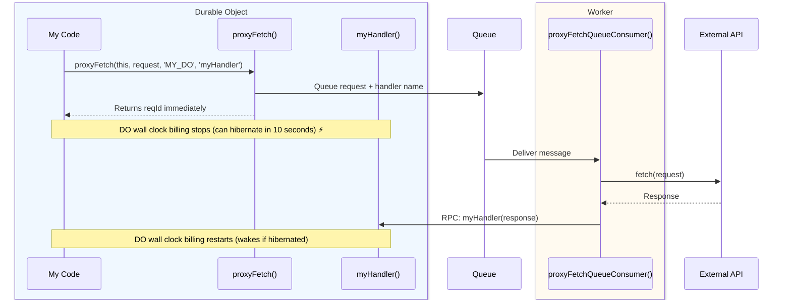

# Queue-Based Proxy Fetch

Route fetch requests through Cloudflare Queues to Workers with CPU billing.
- Automatically scales to cloud-scale
- High latency penalty (60ms to 2-3 seconds p90)

## How It Works



## Quick Start

### 1. Install

```bash @skip-check
npm install @lumenize/proxy-fetch
```

### 2. Configure Queue

Add queue configuration to your `wrangler.jsonc`:

```jsonc title="wrangler.jsonc" @check-example('packages/proxy-fetch/wrangler.jsonc')
{
  "name": "lumenize-proxy-fetch",
  "main": "test/test-worker-and-dos.ts",
  "compatibility_date": "2025-09-12",
  "durable_objects": {
    "bindings": [
      {
        "name": "MY_DO",
        "class_name": "MyDO"
      }
    ]
  },
  "queues": {
    "producers": [
      {
        "queue": "proxy-fetch-queue",
        "binding": "PROXY_FETCH_QUEUE"
      }
    ],
    "consumers": [
      {
        "queue": "proxy-fetch-queue",
        "max_batch_size": 10,
        "max_batch_timeout": 5,
        "max_retries": 3
      }
    ]
  },
  "migrations": [
    {
      "tag": "v1",
      "new_sqlite_classes": [
        "MyDO"
      ]
    }
  ]
}
```

### 3. Set Up DO

```typescript title="src/my-do.ts" @check-example('packages/proxy-fetch/test/test-worker-and-dos.ts')
import { DurableObject } from 'cloudflare:workers';
import { proxyFetch } from '@lumenize/proxy-fetch';
import type { ProxyFetchHandlerItem } from '@lumenize/proxy-fetch';

export class MyDO extends DurableObject<Env> {
  /**
   * Your business logic that needs to call external API
   */
  async myBusinessProcess(): Promise<void> {
    // Send to queue - returns reqId, DO wall clock billing stops
    const reqId = await proxyFetch(
      this,                    // DO instance
      'https://api.example.com/data',  // URL or Request object
      'MY_DO',                 // DO binding name
      'myResponseHandler'      // Handler method name (optional for fire-and-forget)
    );
    
    // Response will arrive later via myResponseHandler()
  }

  /**
   * Your response handler - called when response arrives
   */
  async myResponseHandler({
    response,
    error,
    reqId 
  }: ProxyFetchHandlerItem): Promise<void> {
    if (error) {
      console.error('Fetch failed:', error);
      return;
    }
    
    // Process the response
    const data = await response!.json();
    // Store it, process it, whatever your business logic needs
    this.ctx.storage.kv.put('api-data', data);
  }
  // ...
}
```

### 4. Set Up Queue Consumer

In your worker, handle queue messages:

```typescript title="src/index.ts" @check-example('packages/proxy-fetch/test/test-worker-and-dos.ts')
import { proxyFetchQueueConsumer } from '@lumenize/proxy-fetch';

export default {
  // ...
  
  // Required boilerplate
  async queue(batch: MessageBatch<any>, env: Env): Promise<void> {
    await proxyFetchQueueConsumer(batch, env);
  }
} satisfies ExportedHandler<Env>;
```

That's it! Now when you call `myBusinessProcess()`, the fetch happens in a Worker and DO 
wall clock billing stops.

## Configuration Options

Control retry behavior and timeouts:

```typescript @skip-check
const reqId = await proxyFetch(
  this,
  'https://api.example.com/data',
  'MY_DO',
  'myResponseHandler',
  {
    timeout: 30000,        // Request timeout in ms (default: 30000)
    maxRetries: 3,         // Max retry attempts (default: 3)
    retryDelay: 1000,      // Initial retry delay in ms (default: 1000)
    maxRetryDelay: 10000,  // Max retry delay in ms (default: 10000)
    retryOn5xx: true       // Retry on 5xx errors (default: true)
  }
);
```

**Retry Behavior:**
- Network errors: Always retried
- 5xx errors: Retried if `retryOn5xx` is true
- 4xx errors: Never retried (client errors)
- Uses exponential backoff: `delay * 2^retryCount` capped at `maxRetryDelay`

## Request Objects

Pass full Request objects with headers, body, etc.:

```typescript @skip-check
const request = new Request('https://api.example.com/data', {
  method: 'POST',
  headers: {
    'Authorization': `Bearer ${this.env.API_TOKEN}`,
    'Content-Type': 'application/json'
  },
  body: JSON.stringify({ query: 'something' })
});

await proxyFetch(this, request, 'MY_DO', 'myResponseHandler');
```

## Error Handling

Your handler receives both successful responses and errors:

```typescript @skip-check
async myResponseHandler({
  response,
  error,
  reqId,
  retryCount,
  duration
}: ProxyFetchHandlerItem): Promise<void> {
  if (error) {
    // Network error, timeout, or max retries exceeded
    console.error('Fetch failed:', error.message);
    this.ctx.storage.kv.put('last-error', error.message);
    return;
  }
  
  // Check HTTP status
  if (!response.ok) {
    console.error('HTTP error:', response.status, response.statusText);
    return;
  }
  
  // Success
  const data = await response.json();
  console.log('%o', { reqId, retryCount, duration });  // duration in ms
  // Process data...
}
```

## Multiple Handlers

Use different handlers for different API calls:

```typescript @skip-check
export class MyDO extends DurableObject {
  async fetchUsers(): Promise<void> {
    await proxyFetch(this, '/api/users', 'MY_DO', 'handleUsers');
  }
  
  async fetchPosts(): Promise<void> {
    await proxyFetch(this, '/api/posts', 'MY_DO', 'handlePosts');
  }
  
  async handleUsers({ response }: ProxyFetchHandlerItem): Promise<void> {
    const users = await response!.json();
    // Store users...
  }
  
  async handlePosts({ response }: ProxyFetchHandlerItem): Promise<void> {
    const posts = await response!.json();
    // Store posts...
  }
}
```

## Fire-and-Forget Mode

Omit the handler parameter for fire-and-forget requests (no callback).

This saves the request count charge for the additional Workers RPC call and saves
a miniscule amount of wall clock charges for the handler processing.

**Use cases:**
- Webhooks
- Logging and analytics
- Background tasks that don't affect business logic

**Note:** The queue consumer still processes the request, but skips the RPC callback if no handler is specified.

```typescript @skip-check
export class MyDO extends DurableObject {
  async logAnalytics(): Promise<void> {
    // Queue the request but don't wait for response
    const reqId = await proxyFetch(
      this,
      'https://analytics.example.com/event',
      'MY_DO'
      // No handler - fire and forget!
    );
    
    // Continue immediately, no callback when fetch completes
  }
}
```

## How the Pieces Fit Together

The two core functions work together to route requests through the queue:

1. **`proxyFetch()`** - Called from within your DO
   - Validates handler exists on DO instance (if provided)
   - Serializes request and queues it with handler name embedded
   - Returns reqId immediately (non-blocking)

2. **`proxyFetchQueueConsumer()`** - Put in your Worker `queue()` handler
   - Deserializes requests from queue
   - Makes external fetch calls (CPU time billing)
   - Handles retries with exponential backoff
   - Routes responses back to DOs via Workers RPC
   - Calls your handler directly: `stub[handlerName](handlerItem)`

## When To Use

Use proxy-fetch when:
- ✅ External API calls are slow (>100ms)
- ✅ High volume of requests
- ✅ Cost is a concern

Don't use when:
- ❌ Latency-sensitive
- ❌ Low volume (not worth the complexity)
- ❌ External API is fast (&lt;50ms)

## Best Practices

### Error Handling

Always handle both success and error cases in your handlers:

```typescript @skip-check
async myHandler({ response, error }: ProxyFetchHandlerItem): Promise<void> {
  // Handle errors first
  if (error) {
    // Log, store error state, trigger fallback logic, etc.
    return;
  }
  
  // Check HTTP status
  if (!response.ok) {
    // Handle HTTP errors
    return;
  }
  
  // Process successful response
  const data = await response.json();
  // ...
}
```

### Storage Patterns

Store context before calling proxyFetch if your handler needs it:

```typescript @skip-check
async processUser(userId: string, sessionData: any): Promise<void> {
  // Store context that handler will need
  this.ctx.storage.kv.put(`session:${userId}`, sessionData);
  
  // Include userId in the request URL or body so handler can retrieve context
  await proxyFetch(
    this,
    `/api/users/${userId}`,
    'MY_DO',
    'handleUserData'
  );
}

async handleUserData({ response, error }: ProxyFetchHandlerItem): Promise<void> {
  if (error) return;
  
  const data = await response!.json();
  const userId = data.id; // Extract from response
  
  // Retrieve stored context
  const session = this.ctx.storage.kv.get(`session:${userId}`);
  
  // Process with both response data and stored context
  this.ctx.storage.kv.put(`user:${userId}`, { data, session });
}
```

### Using reqId for Request Correlation

Use `reqId` to correlate responses with stored context:

```typescript @check-example('packages/proxy-fetch/test/test-worker-and-dos.ts')
/**
 * Example: Using reqId to correlate with stored context
 */
async fetchUserWithContext(userId: string): Promise<void> {
  const reqId = await proxyFetch(
    this,
    `https://api.example.com/users/${userId}`,
    'MY_DO',
    'handleUserWithContext'
  );
  
  // Store context associated with this specific request
  this.ctx.storage.kv.put(`context:${reqId}`, {
    userId,
    requestedAt: Date.now(),
    source: 'user-sync'
  });
}

/**
 * Handler that retrieves context using reqId
 */
async handleUserWithContext({
  response,
  error,
  reqId
}: ProxyFetchHandlerItem): Promise<void> {
  // Retrieve the context we stored using reqId
  const context = this.ctx.storage.kv.get(`context:${reqId}`)  //... 
  if (!context) {
    console.error(`No context found for reqId: ${reqId}`);
    return;
  }
  
  if (error) {
    console.error(`[${reqId}] Fetch failed for user ${context.userId}:`, error);
    // Store error with context
    this.ctx.storage.kv.put(`error:${context.userId}`, {
      error: error.message,
      reqId,
      context
    });
    // Clean up context
    this.ctx.storage.kv.delete(`context:${reqId}`);
    return;
  }
  
  const userData = await response!.json();
  console.log(`[${reqId}] Processed user ${context.userId} in ${Date.now() - context.requestedAt}ms`);
  
  // Store result with both API data and our context
  this.ctx.storage.kv.put(`user:${context.userId}`, {
    userData,
    fetchedFrom: context.source,
    reqId
  });
  
  // Clean up context now that we're done
  this.ctx.storage.kv.delete(`context:${reqId}`);
}
```

**Why this pattern works:**
- Calls to `proxyFetch()` return a unique `reqId` 
- Store temporary context using `reqId` as the key
- The payload delivered to your handler includes `reqId`
- Handler retrieves context using the same `reqId`
- Clean up context after processing

### Queue Configuration

Adjust queue settings based on your needs:

```jsonc @skip-check
{
  "consumers": [
    {
      "queue": "proxy-fetch-queue",
      "max_batch_size": 10,      // Higher for throughput
      "max_batch_timeout": 5,    // Lower for latency
      "max_retries": 3           // Queue-level retries
    }
  ]
}
```

- `max_batch_size`: Higher = more throughput, but longer wait for small batches
- `max_batch_timeout`: Lower = faster processing, but smaller batches
- `max_retries`: Queue retries are separate from proxy-fetch retries

## Performance Considerations

### Latency

- Queue delivery: 60ms to 2-3 seconds (p90)
- External fetch: Depends on API
- RPC callback to DO: Should be same location so minimal

### Throughput

- Queue can handle millions of messages
- Worker scales automatically
- Batch processing for efficiency (but adds latency)

## Migration from Direct Fetch

**Before (Direct fetch in DO):**
```typescript @skip-check
export class MyDO extends DurableObject {
  async fetchData(): Promise<void> {
    // DO blocked during fetch (wall clock billing)
    const response = await fetch('https://api.example.com/data');
    const data = await response.json();
    this.ctx.storage.kv.put('data', data);
  }
}
```

**After (Using proxy-fetch):**
```typescript @skip-check
export class MyDO extends DurableObject {
  async fetchData(): Promise<void> {
    await proxyFetch(this, 'https://api.example.com/data', 'MY_DO', 'handleData');
    // Returns immediately (no blocking)
  }
  
  async handleData({ response, error }: ProxyFetchHandlerItem): Promise<void> {
    //...
    const data = await response!.json();
    this.ctx.storage.kv.put('data', data);
  }
}
```

**Key Differences:**
1. Add handler method that receives response
2. Logic splits into two methods (trigger + handler)
3. Set up queue configuration in wrangler.jsonc
4. Add queue consumer to worker
5. `proxyFetch` returns reqId (string) instead of Promise&lt;Response>
